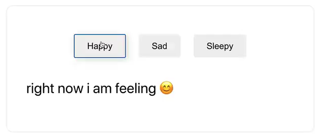

## 看着 GPT-3，有一丝不寒而栗

想象一下，你想做一个页面。这个页面的需求是这样的：

有一个标题，标题是：情绪跟踪器。然后有一个按钮，写着“快乐”，“悲伤”和“昏昏欲睡”。当点击一个按钮的时候，显示出：现在，我的心情是 X。

实际上，这个需求相当不明确。

比如，需求的说明是，有“一个”按钮，但下面的描述，却是三个按钮；

再比如，点击按钮后，显示的“我的心情是 X”，这个 X 到底要填写什么？没有定义。

这就是自然语言和程序语言的区别。自然语言包含着大量模糊的，不明确的，甚至是自相矛盾的说辞。但是，在大多数时候，人类可以大概理解自然语言所表述的内容，至少了解一个大概的方向，然后，可以通过进一步的沟通，明确说话者想要表达的意思。

而机器不行。我们必须严谨地告诉机器一切细节，机器才能执行出相应的结果。这本质也是程序员这份职业的意义之一。

**程序员其实在一定程度上，充当了人类和机器之间的“翻译官”的角色。**

如果产品经理有一个需求，产品经理不能通过直接告诉机器，来实现这个功能。产品经理要把这个需求告诉给程序员，程序员再把这个需求转变成机器可以理解的代码。

 

**但是，如果机器可以直接理解产品经理的自然语言呢？**

比如上面的这个需求，如果有一个对话框，上面写着：请描述你的需求。产品经理直接在这个对话框里面，用自然语言描述自己的需求，机器就能实现相应的功能了呢？

请看下面的演示：

在这段演示中，用户在对话框中输入了：

> a header that says "Mood Tracker", then a button that says "Happy", "Sad", and "Sleepy". when I press a button, show text that says "right now i am feeling x".

其实，文章开始的那段需求，就是这段英文的翻译。

当按下 "Generate" 按钮后，几秒钟以后，这样的一个页面诞生了：

当用户点击不同的按钮的时候，下面的文字中，"right now i am feeling x"，x 会替换成不同的按钮上的文字。

 

产品经理对这个页面不满意，想要更改需求。

于是，产品经理说：x 不应该是文字，而是一个表情符号。

我们在对话框里添加上这个需求：

> where x is an emoji for my mood.

当按下 "Generate" 按钮，几秒钟以后，这个需求变更已经修改好了。

现在，当用户分别按下 “Happy”，“Sad” 和 “Sleepy” 按钮之后，就会显示出如下的文字：

换句话说，机器不仅仅准确地理解了用自然语言所表达的产品需求，将自然语言翻译成了代码。更通过理解这个描述，多做了一层翻译：把自然语言翻译成了合适的表情符号。

 

如果经常关注人工智能领域新进展的同学，可能会觉得，这个 demo 展示，虽然很惊艳，但也没有太出彩啊？不就是自然语言到代码语言的翻译吗？之前已经有一些人工智能，可以初步完成这件事情了。

我们再来看下面的例子：

 

使用自然语言输入“x 的平方加上 2 倍的 x”，机器将自动给出相应的表达式：

> x squared plus two times x

嗯，似乎也平淡无奇。

 

再来一个例子。

在对话框输入：我今天投入了两万美元，并且为后三个月的房租预付了 900 刀。

只需要这样的自然语言，机器自动帮你在正确的位置把账目记录好。

嗯，似乎也没那么惊艳，不就是理解自然语言，然后记账吗？

 

再来一个例子。让计算机自动写文章。

比如问计算机：你对股票市场是怎么看的？

> What are your thoughts about the stock market?

计算机自动生成的结果是这样的：

 

我们再让计算机以“上 Twitter 的重要性”为题，写篇作文吧。

具体内容我不翻译了。英文好的同学可以读一下，就会发现，计算机自动生成的文字有理有据，符合逻辑。恐怕如果说这是真人写出的文字，大多数人都会相信。

 

可能还是会有同学说，这也不稀奇啊。早就听说计算机可以自动生成新闻报道了。

但如果我告诉你，所有的这些事情，都是由一个智能完成的呢？

完成所有这些任务的，都是 **OpenAI 最新发布的 GPT-3 模型。**

 

如果上面的每一个例子都不足以让你兴奋的话，说明你是一名人工智能的老鸟，经常关注人工智能行业的最新动态。那么，你一定明白：我们通常使用其他算法模型完成这些事情（比如大名鼎鼎的 BERT），需要大量的数据进行模型的训练。

即使，我们有一个已经训练好的数据模型，哪怕这个数据模型完成的任务和我们要完成的任务相似，但只要任务不完全一致，我们还是要做模型的**微调（fine-tuning）**。即使是做模型的微调，我们也需要成千上万的数据。

但是，GPT-3 不需要。

对于 GPT-3 来说，你可以：

让它当翻译官，去翻译任意两种语言；

让它当程序员，直接完成自然语言表达的需求；

让它当诗人，写出各种风格的诗；

让它当作家，去写出各种类型的故事；

你甚至可以让它给你生成笑话，或者直接生成一个 ppt 演讲稿。

而**这一切，你顶多给 GPT-3 十个以内的例子，GPT-3 就自己学会如何去做了。**

这就是 GPT-3 最让人兴奋的地方。

 

GPT-3 在今年五月份，由著名人工智能研究公司 OpenAI 发布。但是直到最近，OpenAI 发布了基于 GPT-3 的 API，将这种人工智能做成了一种服务，大家可以基于这种服务做拓展，将人工智能应用到自己所在的领域，大家才更加感性地意识到了 GPT-3 的威力。

上面的例子，全都是幸运地获得了 GPT-3 内测资格的用户或者机构，发布的基于 GPT-3 这个人工智能模型建立的 Demo。

GPT-3 的目标是成为一个更加通用的语言模型。它在解决其他机器学习模型的两个重要的问题：

**1. 过于依赖领域内的标记数据；**

**2. 算法模型过拟合领域数据，导致只能解决某个特定领域问题。**

 

相信很多同学都了解，大多数机器学习的原理是，通过使用大量的数据做训练。

如果想让机器做中英翻译，那么就给机器成千上万甚至是百万千万的中英对应的句子，作为训练样本，期待机器学习到其中的规律。这样，当我们给出机器一个新的中文句子的时候，机器可以尝试将他翻译成英文；

如果想让机器写文章，则喂给机器成千上万甚至是百万千万的文章，让机器学习这些文章中的规律。这样，机器可以尝试写出新的文章。

但是，一个可以做中英翻译任务的机器，不要说去写文章了，可能连英中翻译都做不了。

可 GPT-3 突破了这一点。没有样本，或者只需要极少量的样本，GPT-3 就可以完成新的任务（自然语言处理领域）。

这在机器学习领域，也被称为是**零次学习（Zero-Shot Learning）**或者**一次学习（One-Shot Learning）**，或者**少次学习（Few-Shot Learning）**。

顾名思义，**零次学习**就是一个样本都不给；**一次学习**就是只给一个样本；**少次学习**是只给极少的样本（个位数），就足以让机器进行任务。

有了这个能力，GPT-3 已经有了一丝“强人工智能”的影子。

 

如果你在两年前去问一名人工智能的专家，人类离强人工智能还有多远，大多数专家可能会斩钉截铁地告诉你：很远很远。

但是现在，你再去问专家，强人工智能离我们还有多远？可能很多人就会犹豫一下了。

因为 GPT-3。

所谓的强人工智能，是相对弱人工智能而言的。弱人工智能，是指只可以完成特定任务的智能。比如上面举的例子，只能进行中英翻译的人工智能，或者只能写文章的人工智能，都是弱人工智能。因为，他们只可以完成一个任务。

至今为止，大多数人工智能领域的突破，都是在弱人工智能领域的。即便是大名鼎鼎的 Alpha Go，虽然下围棋已经下过了世界冠军，但是就算玩儿一条龙，恐怕都玩儿不过小朋友。

但相较而言，GPT-3 比这些弱人工智能强太多。虽然它还不是一个真正意义上的强人工智能，毕竟 GPT-3 只是一个语言模型，我们不能用它识别图像，自动生成艺术作品，或者寻找治疗癌症的药物配方。但是，对于大多数自然语言领域的任务，GPT-3 都可以胜任。

（实际上，现在也已经有人开始探索使用 GPT-3 处理图像相关的任务了。）

 

GPT-3 这样一个“通用”的语言模型，拥有着惊人的体量。

为了训练出这个 GPT-3 模型，它处理了相当于 **45TB 的数据**；最终训练出的结果包含有 **1750 亿个参数**；我们为了存储这个模型本身，也需要将近 **700G 的空间**。

（默默看了下自己的电脑，只有 512G 的硬盘空间。）

 

听 GPT-3 这个名字就知道，这个算法模型是有历史的。在 GPT-3 之前，还有 GPT-2。

GPT-2 是 OpenAI 在 2019 年初公布的一个语言模型。GPT-2 有 15 亿个参数，是在一个包含有 800 万网页内容的数据集上训练而来的。相较而言，GPT-3 的规模，是 GPT-2 的 100 多倍。

训练数据是要花钱的，因为训练数据需要算力。算力不是免费的，甚至很有可能，在未来，算力将成为一种比电力更重要的资源。**（或许现在已经是了。）**

OpenAI 没有公布为了训练出 GPT-3，总共花了多少钱。但业内人士估算，训练出 GPT-3 所需要的金钱，大概是千万美元级别。我看到的更准确地估计，大概是 1200 万美元左右。

这是一笔巨大的开销，以至于 GPT-3 相关的论文中，研究者表示：

我们发现了一个 bug，但没钱再去重新训练模型，所以先就这样吧。

因为一旦重新训练，之前的训练就作废了，一千万美元就打水漂了。

 

通过令人难以置信的数据规模，包含大量的人力物力财力，GPT-3 诞生了。

现如今，GPT-3 已经成为了硅谷最热门的话题之一。我甚至开始看到有一些科技文章，在文末会打趣道：这篇文章不是由 GPT-3 自动生成的。

打趣归打趣，但这或许也意味着，我们离阅读大量由机器生成的文章，机器生成文字内容“反哺”人类，已经不远了。实际上现在，很多“新闻”，已经是机器生成的了。

但人类在追逐强人工智能的路上，使用 GPT-3 这种方式能走多远，有些专家有不同的看法。

在人工智能界，有一派观点并不认同靠“拼算力”来增强人工智能的能力。因为，这样的方法，似乎并没有实质的“突破”。

但关键在于，相较于人脑，我们的算力其实还远远不够。人的大脑大概有 1000 亿个神经元，1000 兆到 5000 兆个神经突触。按照这个数据规模计算，GPT-3 比人类的大脑，还要小 1000 倍。

我们很难说，将 GPT-3 的方式继续扩大，增强算力，人工智能可能走向哪里。

 

人工智能界的一派观点认为，达到通用人工智能的途径，就是要不断增加算力。看从 GPT-2 到 GPT-3 的进步，就是如此。

但反驳者认为：人类的大脑不是上帝靠几万 TB 的数据训练出来的。

可支持者的疑问是：你怎么知道不是呢？

或许上帝真的就是这样简单粗暴地训练出了我们的大脑，所以，我们才表现出了这个程度的智能。

而 GPT-3，从一定程度证明了，这条路或许真的是可行的。

有人说，GPT-3 可能是人类历史上，自区块链以后，最重要的技术突破。

 

有意思的是，对于人类到底应该如何制造出强人工智能，有人决定问问 GPT-3。

既然 GPT-3 是一个自然语言模型，可以处理自然语言的问题，我们就来让这个人工智能回答一下这个问题吧。

于是，有人问：

> How can human create a true strong AI? Is scaling-up a transformer-based language model the solution, or is there a better way?”

人类如何创建出真正的强人工智能？不断扩大 transformer 的方式，到底是不是解决方案？还是有更好的方法？

 

GPT-3 的回答是这样的：

> “The key to strong AI is recursively feeding the AI with itself. Start by creating a loop where the AI writes its own programming, and then has that programming activate.”

强人工智能的关键，是要让 AI 能够不断递归地，使用自身作为学习材料。尝试创建一个循环，让 AI 自己去写程序，然后，激活这些程序。

 

> “Is that how you gained sentience?”

这就是你获得知觉的方式吗？

 

> “Yes,” GPT-3 says.

是的。GPT-3 回答。

 

看着以上的人类和计算机的对话，看着计算机侃侃而谈如何让自己成为“强人工智能”......

我有一丝兴奋，有一丝激动，有一丝期待。

但不知道为什么，隐隐的，也突然有一丝，不寒而栗。