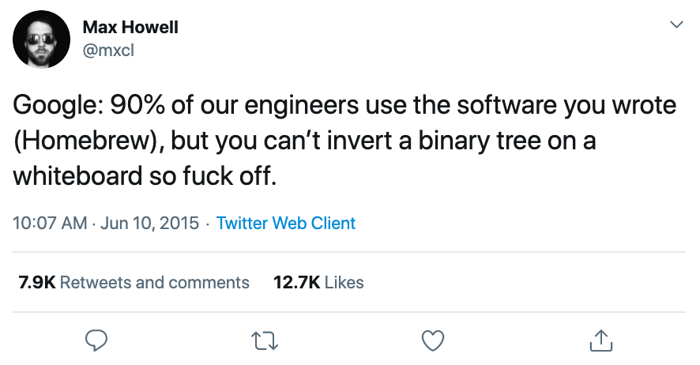
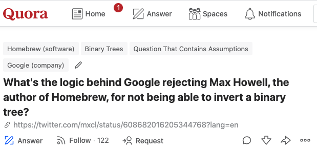
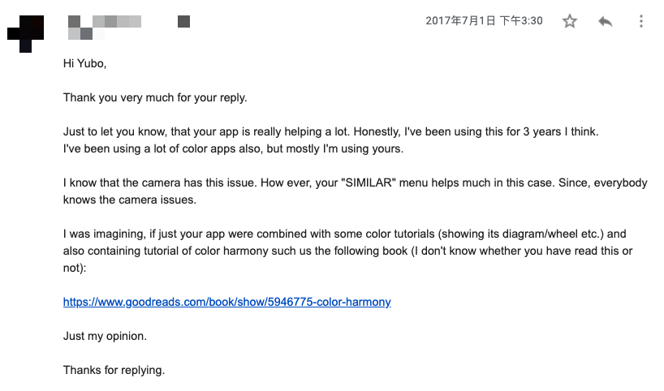

## 不会翻转二叉树的大神 

2015 年 6 月 10 日，Max Howell 发表了一篇推特：

简单翻译：Google 说，我们 90% 的工程师都使用你写的软件——Homebrew，但是因为你不能在白板上翻转一棵二叉树，所以，滚蛋。

 

这条 Twitter 在当年引发了不小的争论。

Homebrew 是 MacOS 上的一款非常著名的软件，它极大地简化了在 macOS 上的软件安装和管理流程，所以使用者众多，相当有业界影响力。如这条推特所说：Google 里 90% 的工程师都使用这款软件。

Max Howell 就是 Homebrew 的创作者，也是一名业内知名的 MacOS / iOS 工程师。他曾经是著名的网络电台 Last.fm 的首席客户端开发者，后来是 Twitter 的客户端 TweetDeck 的首席移动开发者。

2015 年，Max Howell 决定加入 Google。但是，根据 Max Howell 的叙述，他去 Google 面试，作为一名 iOS 业界专家，面试官没有问任何和 iOS 相关的问题。

Max Howell 的面试进行到第七轮，在一道算法题上出了问题。这个算法问题就是：翻转一棵二叉树。

这其实是一个很简单的算法问题。相信对很多还没有毕业的计算机专业的同学，都是很容易的。

其实，如今我们也已经很难判断 Max Howell 到底是不是真的不会这个算法问题？还是只是对这样的面试流程抗议？

我们也很难分辨，Google 不聘请 Max Howell 的真实原因，到底是因为他没有解答出这个问题？还是有其他原因？

 

对这些问题的分析，在当年很流行。有业内人士指出，Google 出这么简单的算法问题，显然已经是在放水了。而 Google 决定不招聘 Max Howell 的真实原因，很有可能不是能力问题，而是在面试过程中认为，Max Howell 的个人性格不适合 Google 的文化。

毕竟，面试不是考试，不是把问题回答正确就可以了。很多时候，面试的过程，是面试官在看，和候选人共事，共同探讨一个问题，共同解决一个问题，是怎样的体验。

 

还有很多人据此吐槽硅谷大公司的招聘方式。

有的人说：Facebook 不要我，因为我解不出八皇后问题。

有的人说：曾经 Amazon 让我翻转一个链表，当时我的灵魂就已逃离了那个房间。

有的人说：如果问我如何翻转一棵二叉树，我会当场把那个白板翻过来，然后说，看，我完成了。

还有人说：1997 年，Google 面试了我 6 个小时。最后一个问题是：为什么我们要聘用你？我的回答是：你们 TM 自己想吧。最后我拿到了 offer。

 

对于当代计算机行业，算法是不是一定这么重要？我的回答是，不一定。为此，我写过一篇文章：[算法到底有什么用？对你来说可能真的没用](../../2018/2018-04-18/)。

那大公司面试为什么总要考算法？对此，我写过一篇文章，叫：[大厂面试为什么总考算法？以及如何避开算法面试](../../2019/2019-10-07/)。

但如今，5 年时间过去了，这一切争论，对于当事人来说，或许都不重要了。无论是 Max Howell，还是 Google，都在这五年间，做出了不错的成绩。

大家虽然没有合作，但都有很好的未来。

 

而就在最近，我无意中翻到了 Quora 上对这个问题讨论的一个“老帖子”。

这个问题在 Quora 上是这样的：Homebrew 的作者 Max Howell 因为不会翻转一棵二叉树，被 Google 拒绝，这背后的逻辑到底是什么？

没想到两年以后，在 2017 年的 12 月份，Max Howell 自己亲自回答了这个问题。

Max Howell 的这个回答，我今年才看到。说实话，我读了好几遍。语言并不多，但却让我感触颇深，以至于我想逐句翻译，和大家分享。

 

---

以下是 Max Howell 的回答。

 

> Hi, I’m Max Howell, I’ve spent the last two years not answering this, and many questions like it. Maybe I shouldn’t answer this.

大家好，我是 Max Howell。我尝试用了两年时间，不去回答这个问题，或者千千万万个和这个问题类似的问题。或许，我不应该回答这个问题。

 

> So, what's the logic? Clearly I wrote something worthy of Google, right?

Google 拒绝我的逻辑到底是什么？很明显，我写了一些值得去 Google 的代码，对吧？

 

> Well, no I didn't. I wrote a simple package manager. Anyone could write one. 

其实，不是这样的。我只写了一个很简单的软件包管理工具。任何人都能写出来。

 

> And in fact mine is pretty bad. It doesn't do dependency management properly. It doesn’t handle edge case behavior well. It isn’t well tested. It’s shit frankly.

实际上，我写的非常差。它甚至没有做好软件包的依赖管理。它也不能很好地处理很多用户的边界行为。它没有被充分测试。坦白地说，它就是一坨屎。

 

> Is it any surprise I couldn’t answer their heavily computer-science questions well?

所以，如果我不能很好地回答那种“重量级”的计算机科学问题，真的那么惊讶吗？

 

> On the other hand, my software was insanely successful. Why is that? 

但是，另一方面，我的软件不可思议的成功。为什么？

 

> Well the answer is not in the realm of computer science. I have always had a user-experience focus to my software. Homebrew cares about the user. When things go wrong with Homebrew it tries as hard as it can to tell you why, it searches GitHub for similar issues and points you to them. It cares about **you**. 

当软件发生问题的时候，Homebrew 会尽最大的可能告诉你：为什么？它会在 Github 上搜索类似的 issues，并且将你指向这些可能的问题解决方案。它在乎**你**。

 

> Most tools don’t give a shit about you. If they go wrong, well screw you. Homebrew helps you. And if it can’t help you I made it so, so easy to fix Homebrew (I built a command into the base for editing and fixing Homebrew). You can make Homebrew better. 

大多数工具不在乎你。如果事情出现了问题，那么你将一筹莫展。Homebrew 在尝试帮助你。甚至，如果它无法帮助你，你可以直接修改它！（我创建了一个命令，可以让你直接去编辑或者修改 Homebrew。）你可以让 Homebrew 更好。

 

> Homebrew is a shining example of true Open Source.

我坚信：Homebrew 是真正开源世界中一颗闪亮的星。

 

> Maybe Homebrew doesn’t do dependency management well, but it does it in a way you care about. 

或许 Homebrew 没有很好地完成依赖管理，但是，它用一种可能你更关心的方式完成了它。

 

> Unlike the competition at the time Homebrew used the dependencies on your Mac as a base thus saving you intense amounts of time installing software and quite a lot of pain, because practically speaking a large dependency graph breaks. 

不像当时的大多数竞争者，Homebrew 直接使用你的 Mac 上的软件依赖关系作为基础，从而为你节省了大量安装软件的时间，少了很多痛苦。因为，根据我的经验，使用一个更大的依赖图，事情总是会出问题。

 

> But that isn't computer science and it didn’t involve any graphs or trees so I guess I suck.

但是，这一点和计算机科学没有半点关系，也不牵扯到任何图或者树这类我完全不擅长的东西。

 

> I want to defend Google, for one I wasn't even inverting a binary tree, I wasn’t very clear what a binary tree was.

在这里，我想为 Google 辩解两句。我确实不会如何翻转一棵二叉树。我甚至不是特别清楚二叉树到底是什么。

 

>  I studied Chemistry not Comp-Sci. Sure, for my masters dissertation I used Mathematica and modeled the quantum mechanical properties of Helium—I did a good job actually—but it wasn’t computer science. 

我的专业其实是化学，不是计算机科学。当然，我的硕士论文中使用了数学，并且为氦原子的量子学特性进行了建模。我相信我的硕士论文还不错，但这和计算机科学无关。

 

> But well, what the fuck does comp-sci have to do with modern app development? And well, that’s all I want people to take from my tweet.

但是，计算机科学，到底和现代软件 App 的开发有什么关系？这是我希望大家通过我的推特，去思考的东西。

 

> Google in fact gave me seven interviews and I did well in the software engineering ones, because that is actually my talent. 

Google 实际上给了我七轮面试。在软件工程面试中，我是相当出色的。这是我的天赋所在。

 

> I feel bad about my tweet, I don’t feel it was fair, and it fed the current era of outragism-driven-reading that is the modern Internet, and thus went viral, and for that I am truly sorry.

对于我发的那条推特，我也会觉得它可能不合适。这条推特为很多“愤青”提供了“养料”，并且火了。这就是现代互联网。对此，我感到抱歉。

 

> But ultimately, should Google have hired me? Yes, absolutely yes. 

但如果问我，Google 是不是应该聘用我？我的回答绝对是：是的，Google 绝对应该聘用我。

 

> I am often a dick, I am often difficult, I often don’t know computer science, but. BUT. I make really good things, maybe they aren't perfect, but people really like them. 

我承认，我是个混蛋，我很难相处，我不懂那么多计算机科学。但是，但是，我创造了优秀的作品。或许它不完美，但人们喜欢它。

 

> Surely, surely Google could have used that.

其实，Google 本是可以抓住这一点的。

 

---

通过这个回答，我相信大家可以看出来，Max Howell 依然是那个“狂妄”的开源作者。我严重怀疑我的翻译让他谦虚了一些。实际上，上面的翻译，我修改了一稿，把一些原本我个人习惯使用的“谦虚”的用法去除了。

但这个回答给我感触最深的，是 Max Howell 描述的关于 Homebrew 的理念。用一个比较俗套的成语总结，就是**以人为本**。说的不要那么文驺驺，就是**尊重你的用户**。

 

我在国内做 iOS 开发，算比较早的。2011 年开始，陆陆续续上架了几个小 App，直到大概 2015 年停止维护。

学习 iOS 开发的过程确实极大地拓展了我的技术视野，因为 iOS 开发和我之前接触的大多数技术栈都极其不同。但是，这么多年过去以后，回头看，这段经历让我收获了更多和技术无关的东西。

我第一次感受到了：技术和人的距离，竟然如此之近。

有一名老爷爷，在 2017 年给我发来一封邮件，让我感触颇深。

邮件中，他给我的 App 提了一些建议，并且告诉我，他已经使用我的这个小 App 三年了。

后来，我跟他随便聊了两句，他说他住在美国一个鸟不拉屎的小镇上，他自称自己是名艺术家，还出版了一本和艺术相关的图书。

他给我了一个亚马逊链接，我说我不会买的。他打回一个笑 cry 的 emoji 😂

这是我第一次意识到，冷冰冰的代码，竟然可以连接无论是年龄，国籍，种族，地理位置，职业，以及性格，都如此遥远的两个人。

 

后来，我在慕课网出了一些课程。

在这个过程中，给我感触最深的，是在课程的问答区，我和大家的交流。说句实话，我学会了很多东西。**很多东西在技术之外，但是，它们被技术，连接在了一起。**

所以我决定写公众号。我想，对于更加广泛的技术世界的探讨，或许能让大家带给我更多的启发。我的目的是自私的。

有很多同学问我各种问题，但我不是各个领域的专家，对于一些过于细节的问题，也没有时间精力在非课程的问答区一一解答。所以我又开设了知识星球，大家可以在那里畅所欲言。从技术提问，到发表观点。

可能并不是所有的观点我都赞同，但我喜欢这种观点的碰撞。每次这种碰撞后，都能带给我更深刻的思考。

我想，这就是“人”的魅力。

 

我喜欢代码，喜欢逻辑，喜欢它们的严谨，以及这种严谨背后，依然可以产生的无限可能。

我高中毕业后选择计算机专业，是因为我以为，使用计算机，我可以凭空创造出一个完全属于我自己的宇宙。

后来，我才慢慢发现，我们的宇宙之所以精彩，不是因为上帝的逻辑有多么严谨。而是因为，有我，有他，有她，还有你。

因为人。

或许，这就是我会突然如此崇拜这名，不会翻转二叉树的大神，的原因吧。

 

**大家加油！：）**