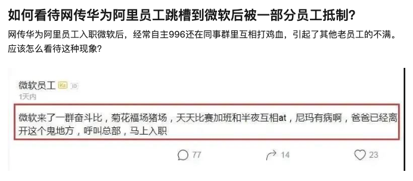
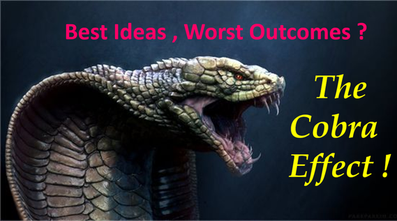

## 我不埋怨奋斗 B

最近，在我的一个课程群里，突然同学们聊起了奋斗 B。我想，大概是因为这样一则新闻：

大多数同学对奋斗 B 都是憎恨的态度。但是，我对此却一直保持中立的态度。

当然，这里还有一个对奋斗 B 如何定义的问题。

我对奋斗 B 的定义是：真正的在努力工作，不惜免费加班干活儿，超额完成工作任务的同学。

如果这样定义奋斗 B，那么责怪这样一个群体就显得非常奇怪。努力奋斗从来是中华民族的传统美德，奋斗从来不是可耻的，也不应该是可耻的。

但与此同时，我也非常理解这样的行为为大多数同学带来的内卷境地。这本身是一个复杂的社会问题。

 

但是，很多同学会马上告诉我，奋斗 B 这个词不是这个意思。

这些同学说，奋斗 B 是指：明明可以干完活儿准时下班，但偏偏假装自己很忙，刻意用更长的加班时间，来凸显自己的努力，给领导留下好印象的人。

这样做的结果就是，一个组的人都有意无意地“被迫”加班。奋斗 B 也因此招人恨。因为，他们其实并没有为企业带来更多的价值，不但自身工作效率低，还带坏了风气，让所有人都不得不加班。

这就很有意思了。如果事情真的是这样的话，那么在我看来，**管理者的责任，远远大于奋斗 B 的责任。**

因为，管理的一个重要目标，就是提高效率，鉴别出低效行为，并加以改善。可是这种低效的行为，却得到了管理者的“肯定”，乃至让组里的其他同学也需要效仿，来获得同样的“肯定”。

管理者没有有效鉴别出“低效”，反而鼓励了“低效”。是管理者衡量大家工作成绩的标准出了问题，大家才会去“迎合”这个“错误”的标准。

管理者错误的衡量标准是因，奋斗 B 的出现是果。与其骂奋斗 B，我倒觉得更应该骂管理者。

 

---

由于错误的衡量标准，导致管理上的事与愿违，并不鲜见。甚至在经济学领域，有一个专门的名词来阐述这一现象：**眼镜蛇效应。**

眼镜蛇效应这个名词来源于印度。在英国殖民时期，政府发现当时印度的首都德里存在大量眼镜蛇，严重影响了人们的生活。为了鼓励民众一起消灭“蛇害”，政府颁布了一条法令：每打死一条眼镜蛇，凭尸体可以领取一定的赏金。

这条法令的结果非但没有杜绝蛇害，反而让更多人开始饲养眼镜蛇，导致城市里的眼镜蛇数量更多了。

以蛇的尸体作为奖赏标准，不但不能减少蛇的数量，反而增加了蛇的数量。

 

同样的故事，在 1902 年的越南再次上演。当时，越南政府为了治理鼠害，发布了法令，每打死一只老鼠，居民可以割下老鼠的尾巴，凭老鼠尾巴领取赏金。

很快，政府官员就发现，城里流窜着大量没有尾巴的老鼠。因为民众在抓到老鼠后，不是杀死老鼠，而是割掉尾巴，将其放生，让它们继续繁殖，好有更多的老鼠来帮助他们领取赏金。

 

**眼镜蛇效应**并不是描述这一现象的唯一名词。在经济学领域，**Goodhart 定律**或者 **Campbell 定律**，都在描述或者可以引申出这层意思：

**标准是重要的。错误的标准将得到错误的结果。**

 

---

所以，很多时候，问题的关键，是标准。

比如有一阵子，社会上的新闻铺天盖地都在宣传，高中生都开始学习 Python 了。80 后颤抖吧；90 后颤抖吧；计算机专业的同学们颤抖吧。

比如这样的：

再比如这样的：

于是，就有同学来问我：波波老师，现在 Python 这么火，高中生都要学了，是不是做高中生的 Python 教育是个好机会，能赚大钱？

我说：我不认为专门针对高中生的 Python 教育有那么大的市场。

为什么？因为高考不考 Python。也就是高中生升学的标准里没有 Python。

什么时候高考决定要考 Python 了，什么时候专门针对高中生的 Python 教育才是一个机会。

或者，大家可以这么想：实际上，计算机教育一直是我国高中生的必修课程，甚至是会考必考的科目之一。在最近几年，各个省市只是把这个“必考科目”中的计算机语言，从老得不得了的 VB，换成了 Python 语言而已。

在此之前，针对高中生的 VB 教育市场火爆吗？如果不火爆，那么专门针对高中生的 Python 教育市场就没有理由火爆。

针对高中生的 VB 教育市场显然不火爆。为什么？不是因为 VB 过时了，是因为升学的标准——高考里没有 VB。如果高考考 VB，不管 VB 多老多过时，都会火得不得了。

 

---

我之前在北京创业的时候，采访过很多企业老板。其中有一个片段，我印象深刻。

这名企业老板非常自豪地向我们炫耀，自己是多么看重创新。每次员工开会，他都一定会强调：创新！创新！创新！按照他的话说：只有创新，企业才能继续前进，永远前进。

但是，当我们去采访这个企业的员工时，却听到了不同的故事。

有一名主管苦笑地告诉我们：老板确实天天喊创新，月月喊创新。但就在去年，我带领的地区尝试用新的销售方案，结果失败了，营收还没有以前好。但是另一个地区的主管中规中矩，依旧使用传统的方案，业绩超过了我们。

最后，他们全员拿到了年终奖的大红包，我们地区的年终奖却少得可怜。

所以，老板喊创新，听听就好了。该怎么来，还是要怎么来。毕竟，业绩才是指标。

 

我在那一瞬间恍然大悟。

创新不是喊出来的。要想让企业创新，就必须要想办法衡量创新。如果衡量标准仅仅是业绩，没有人会创新。

因为创新意味着风险，意味着失败，意味着收入可能还不如过去。

如果衡量标准不变，创新者因为创新，反而没有好果子吃；反倒是保守派，因为保守，最终拿了大红包。那么不管老板再怎么喊鼓励创新，本质其实都是在鼓励保守。

 

---

无独有偶，就在几个星期前，我和一名国内互联网大厂的产品经理大佬，进行了一段有意思的对话。

大家都知道，产品和技术是“死对头”。网上，关于产品压榨技术，向技术提出不合理需求的讨论络绎不绝。

于是，我就问这名产品大佬：到底你们产品的 KPI 是什么？让你们这么孜孜不倦地给技术同学“添麻烦”？

这名产品大佬来自全国前三的互联网企业。他的回答是：我们的 KPI，占比最大的是**营收**。

什么叫营收？就是产品经理通过对产品的改善，使得项目赚到了更多的钱。

但具体做出怎样的改变，可以达到“赚更多的钱”的目的？这就是每个产品经理的工作内容了。

我问：这里有没有什么方法论？可以尽可能向着更赚钱的方向改善产品？

产品大佬回答：应该有。但是国内的环境普遍对这种方法论的思考和讨论比较少。大家更愿意**“做出来试试看”**。因为对产品的“改善”乃至“改变”，也是产品的 KPI 之一。

这样导致的结果就是：每一名产品经理都希望能够去不断地实验新的功能，新的想法，来看是否能够创造新的营收。

爱迪生尝试了 6000 多种材料，进行了 7000 多次试验，最终终于发明了电灯。至少故事里是这么说的。产品经理都深谙这个道理。

所以，大多数产品经理，一旦有一个想法，就会迫不及待地让技术们去尝试实现，来看会不会产生更多的营收。

为了能够更多地试错，996 出现了。但很多时候，这不叫 996，而叫**小步快跑，快速迭代。**

 

作为一名技术人员，我显然看出了这里的不公平。产品经理一有想法就占用技术的时间去“试错”；但实验结果不好的话，技术的心血就“白费”了。

即便大家都是一个 team 的，但是，技术为产品的“莽撞盲目”买单，加班熬夜，最终却没有得到希望的结果，我相信不在少数

于是我问：难道对于产品来说，没有反向指标？

产品大佬问我：什么是反向指标？

我回答：如果产品经理不断改善产品，项目的营收却没有因此提高。那么这个产品经理相当于白白占用了大量的技术时间和资源，相当于他的工作效率是低下的。此时，应该对这名产品罚款。

我又补充道：换一个说法。如果一名产品经理，一年的时间提出了 500 个需求变更；但另一名产品经理，一年只提出了 50 个需求变更。两者最终在产品营收上，达到的效果是一样的，那么显然，后一名产品经理，是比前一名产品经理更优秀的。

因为，后一名产品经理占用了更少的技术资源和时间，达成了同样的成绩。在 KPI 考核上，难道不考虑这一点？

产品大佬沉默了一会儿，告诉我：没有这回事儿。

 

我一下子就明白了。这说明，整个企业不考核“低效”这个指标。如果“低效”不是指标，那么大家就不会顾及效率，低效近乎将成为必然。

什么时候，企业说：效率很重要，大家的 KPI 也要包含效率。同样的业绩，谁加班少，谁拿奖金就多。那么我想，大家就会开始思考，怎么提高工作效率了。

相信到那时，奋斗 B 也会少很多。

 

**大家加油！:)**