## 现实虚拟连续统

这是在我的知识星球上，一个同学问我的问题。

波波老师好！我从大一下数据结构就开始看您的课程，目前是美国匹兹堡大学本科 CS 在读，年底毕业。

今年暑假找到一个 AR 相关的实习机会，我发现我对这方面更感兴趣了。以后读研/读博也在考虑这个方向。看过您的资料，您在研究生期间读的是 AR / VR 方向的，想问下您对 AR / VR 的看法？求观点~

 

---

**bobo 老师的回答：**

我研究生的实验室方向确实是 VR / AR 方向。但说实话，已经十多年过去了，我那会儿接触的东西，应该和现在已经有翻天覆地的变化了。

比如，我们那会就根本没有深度学习这个概念。现在，相信很多研究都能和深度学习联系起来了。

从更实际的角度，我更看好 AR 方向，而不是 VR 方向。因为 AR 方向的应用场景更多，商业前景更广阔。

无论是无人驾驶技术，还是盛传的苹果眼镜，或者已经出厂的谷歌眼镜，都是 AR 技术的使用。更广阔地看，所有的图像识别技术，都可以一定程度 AR 化。这在很多专有领域都很重要，比如很有可能在未来超火的医疗领域。

 

当然，我这样说很笼统。实际上，有一个很重要的问题，就是到底什么是 AR？

AR 本身是 **Augmented Reality** 的简称，即增强现实。

现实被谁增强？被虚拟的信息增强。

从这个角度看，我们总将 AR 和 VR 一起讨论是没有道理的。因为 VR 的意思是 Virtual Reality，即虚拟现实。什么叫虚拟现实？就是**完全虚拟的世界。**

“虚拟现实”其实是和“现实”相对应的两个极端：一端完全虚拟，一端完全现实。

这不是我的观点，这是 1994 年，由保罗·米尔格拉姆（Paul Milgram）和岸野文郎（Fumio Kishino）提出的**现实-虚拟连续统**。

听这个名字很炫吧？它的概念其实很简单：我们可以画出这样的一个“坐标轴”：

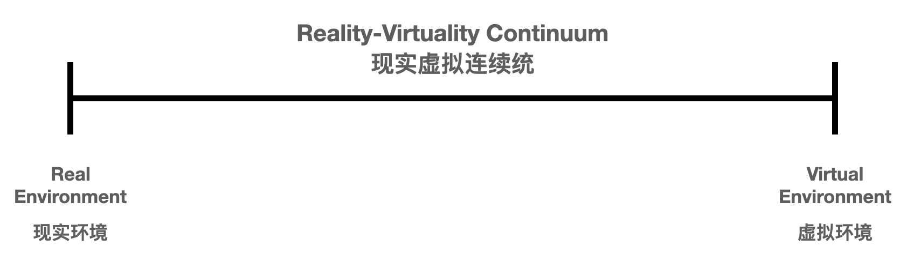

在这个坐标轴中，左侧是完全的现实环境，右侧是完全的虚拟环境。

有了这个坐标轴，我们就可以把很多和 VR / AR 相关的应用或者技术，在这个坐标轴中找到相应的位置。

对于大多数我们理解的 AR 应用，本质其实都是靠近现实环境一侧的。在现实的基础上，使用虚拟的东西进行“增强”。

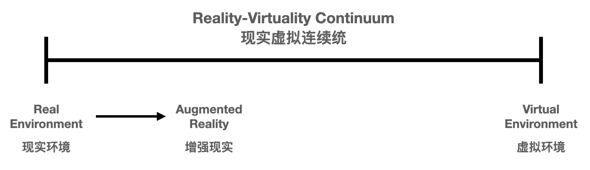

 

比如，现在比较火的很多直播滤镜，可以实时对主播做在线“磨皮”。在这里，现实是基础，虚拟的东西是在辅助现实。

 

从这个角度看，其实，我觉得拍一张照片，然后 PS，本质也是 AR。我们在使用 Photoshop 来增强现实。

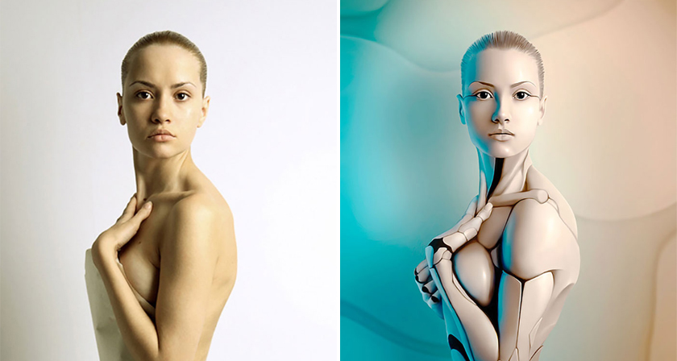

 

再比如，现在已经有了车载系统，可以将汽车相关的虚拟信息投射到挡风玻璃上，让司机不需要低头，就可以查看到相关参数，来提高驾驶安全性。

在这里，虚拟的信息虽然仅仅是一些读数，但也是增强现实。

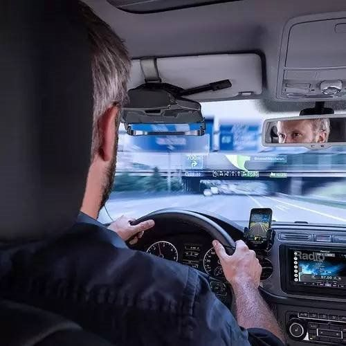

 

实际上，这样的应用已经很多了。比如，基于地理位置信息，显示出真实世界上各个建筑物的商家名称等信息。

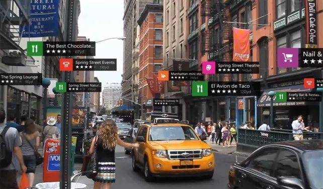

 

比如，大名鼎鼎的 pokemon Go，在现实世界，叠加一个虚拟的小精灵。

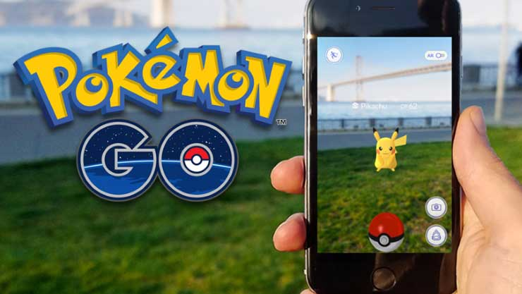

 

这些应用看起来娱乐性比较强，但其实，在很多专业领域，AR 也有着非常重要的应用。

比如，Google Glass（包括其他所有的智能眼镜）在探索，可不可能在医生做手术的时候，将关于病患和手术的基本信息，直接展示在医生眼前，而不需要医生回头去看显示器上的信息，从而增强手术的连续性：

 

再比如，在专业的生产车间，技术人员可不可以直接看到相关设备的参数或者说明，来进行设备的组装，维修，或者调试工作。

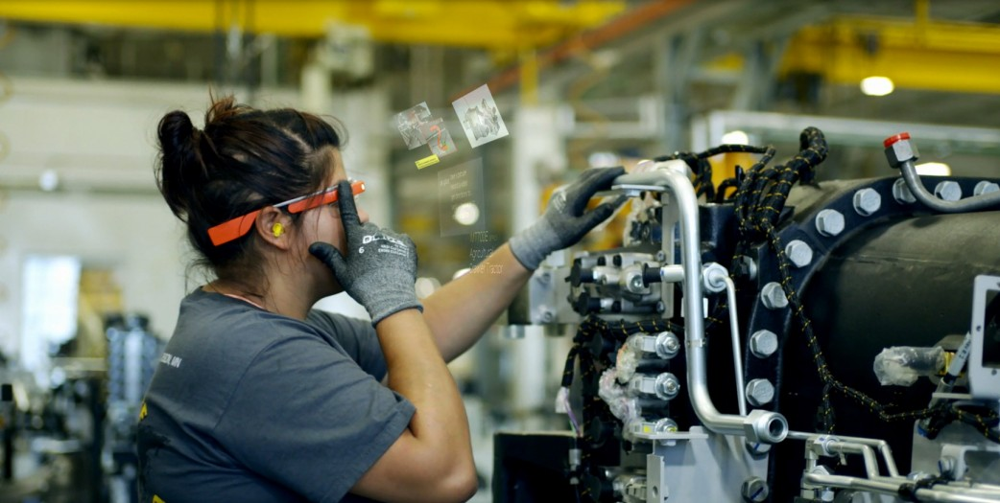

 

这些应用，很多如今已经成为了现实，但是仍然有巨大的发展空间。并且，我坚信不疑：**这样的技术可以极大地提高生产效率，是未来的趋势。**

 

在现实-虚拟连续统的坐标轴上，另一端会被大众所忽略，尤其是非专业人士。实际上，我们除了可以增强现实，也可以增强虚拟。

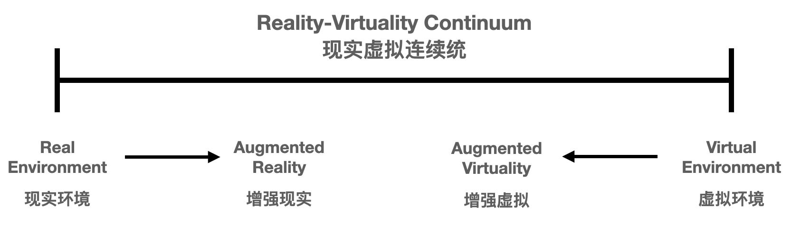

 

增强虚拟的英文是 AV，听起来似乎很龌龊的样子。这是因为很不幸，这个英文缩写和另外一个英文缩写撞车了。

但其实，这里，**AV 是 Augmented Virtuality** 的意思，即增强虚拟。

什么叫增强虚拟？就是原本是虚拟的东西，但是，我们靠技术手段，让它更真实一点。

最简单的例子，我们为了更好地玩儿虚拟的赛车游戏，制造出了专用的“游戏方向盘”，让玩家尽量真实地体会虚拟的飙车快感。这就是增强虚拟。

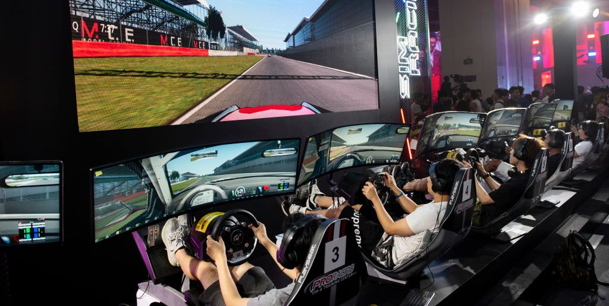

 

我们在游戏厅看到的大量游戏都在增强虚拟。比如拿着游戏枪在虚拟的世界里和僵尸们厮杀。

 

如果你理解了什么是 AR（增强现实）和 AV（成人...不是，是增强虚拟）以后，就可以理解另外一个概念了：MR。

MR 是混合现实（Mixed Reality）的意思。实际上，不同厂家对 MR 的定义都有所不同。他们会鼓吹各种奇怪的特性，把自己的产品的优点当做 MR 的定义来宣传。

可是，从学术界的角度：**AR 和 AV 都是 MR，都是在混合现实。**

在现实-虚拟连续统的坐标轴上，就是这样的：

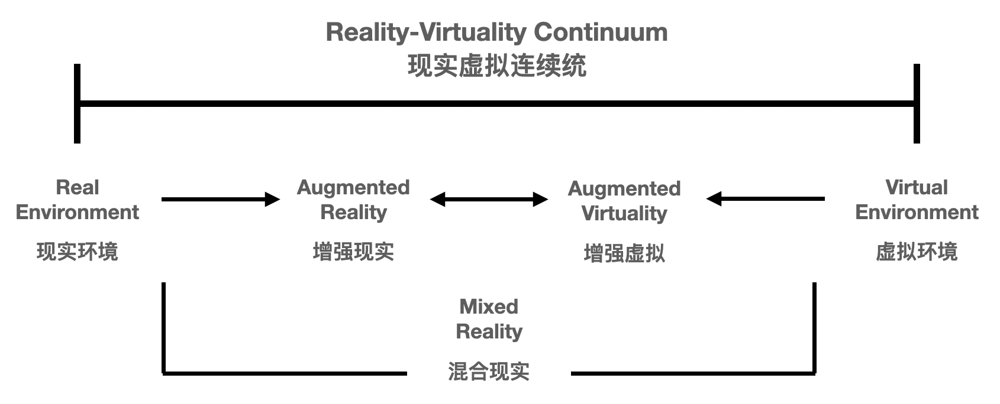

 

如果你去查 MR 在 维基百科上的定义，就会看到维基百科是这么说的：

> 混合现实（Mixed Reality，简称MR）指的是结合真实和虚拟世界创造了新的环境和可视化，物理实体和数字对象共存并能实时相互作用，以用来模拟真实物体。混合了现实、增强现实、增强虚拟和虚拟现实技术。Mixed Reality 是一种虚拟现实（VR）加增强现实（AR）的合成品混合现实（MR）。

这个定义在我看来很含糊。但实际上，把它放到现实-虚拟连续统上看，就很清晰。

说白了，增强现实是混合现实；增强虚拟也是混合现实。

现实和虚拟之间是一个连续的坐标轴，没有清晰的界限。除了两段，中间都可以叫混合现实。谁多一些，谁少一些而已。

混合现实在努力做好增强现实的同时，也在努力做好增强虚拟。

可能混合现实太努力了，以至于觉得应该为自己创造出一个全新的概念。于是，混合现实（MR）这个名词出现了。

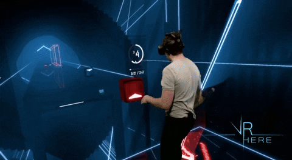

看了上面的介绍，相信大家可以理解：在现实和虚拟之间，有很多事情可以做，想象空间极大。这就是我看好 AR 的原因。

在这里，我说是看好 AR，更准确地说：是看好在现实-虚拟连续统**中间的区域**做事情。

 

相较而言，VR（虚拟现实）的目标是使用计算机创建出一个完全虚拟的世界，让用户沉浸在其中，就像和真实的世界一样。

如果大家看过黑客帝国，就很容易理解什么叫真正的虚拟现实。很可惜，那种程度的虚拟现实，我们现在人类根本做不到。

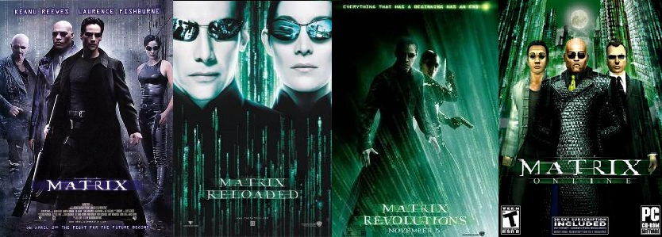

 

我个人认为，现如今，我们人类可以做到的真正的最逼真的虚拟现实，是靠人类的大脑这台“计算机”产生的，叫“梦”。

在《盗梦空间》的电影海报上，赫然写着：The Dream is Real。（我的翻译：梦境即现实）

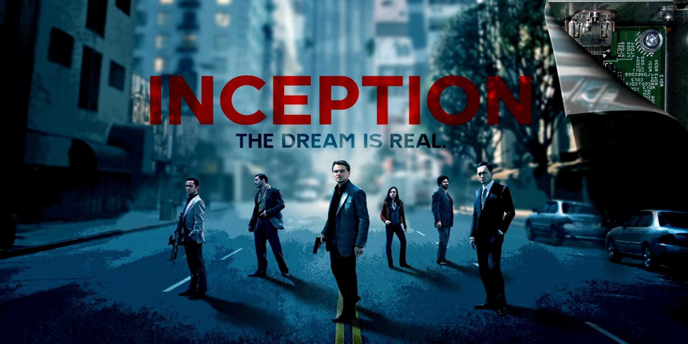

很可惜，无论是大脑的运行机制，还是梦的原理，我们人类自己也没有搞清楚。

 

在短期内（至少 10 年时间），我完全不看好 VR。因为到现在为止，VR 领域有一个很重要的问题没有解决，就是**现有的所有 VR 设备都会造成人类生理上的不适，使得大多数人无法长时间在 VR 中作业。**

为什么 VR 会让人类身体不适？其实很简单，因为我们人类现在做出来的“虚拟现实”，离“现实”的差距太远了，导致我们人类的身体本能地排斥它。

这个原理有点儿像 3D 眩晕。但是，即使没有 3D 眩晕症状的用户，在更大范围的 VR 设备中，都会开始“眩晕”起来。

这个问题是有非常翔实的生理学研究做基础的。有一篇很有名的论文在说这件事情，具体名字我忘记了。但如果大家以后做 VR/AR 方向的博士的话，我估计近乎一定会看到这篇文章，或者类似的描述这个问题的文章。

如果把这个问题放到现实-虚拟连续统中看，也很好理解。

现实-虚拟连续统中的一端：现实，已经被至今我们都还不能理解的一种力量（上帝的力量？宇宙的力量？）创造了出来。

而现实-虚拟连续统中的另一端，则是我们要挑战的，纯粹的 VR（虚拟现实）。**它的难度，是和上帝造物在一个级别的。**我甚至怀疑我在有生之年能不能看到真正的 VR。

因此，现在，很多所谓的 VR 方向，很大程度是对图形学（Graphics）研究的延展。如果你去看一些 VR 游戏的开发流程，也会发现，他们不过是近乎和普通游戏同样的开发流程和框架，去适配 VR 设备而已。

图形学领域相对是成熟的，我曾经在我的知识星球上，基于之前有一阵子很火的“清华姚班毕业生开发特效编程语言，99 行代码实现《冰雪奇缘》”，聊过这个问题。

在我看来，无论是业界，还是学界，AR 都比 VR 更火，也更容易出成绩。比如更容易发出好的论文；或者基于 AR 技术创业更容易成功。

当然，我其实也有很久不仔细观察这个领域的发展了，我的看法可能是错的。同时，未来怎么样也不好说，搞不好 VR 就大爆发了呢。

（虽然从现在人类的科技树的角度，我依然觉得可能性很小。）

 

最后，选方向这种事儿，自己的兴趣最重要。说实话，我个人就对 Graphics 更感兴趣，所以，也更喜欢看偏 VR 的东西。

我个人还是坚信，人在自己感兴趣的领域更容易做出成绩。

至于风口，随缘吧。

**大家加油！：）**