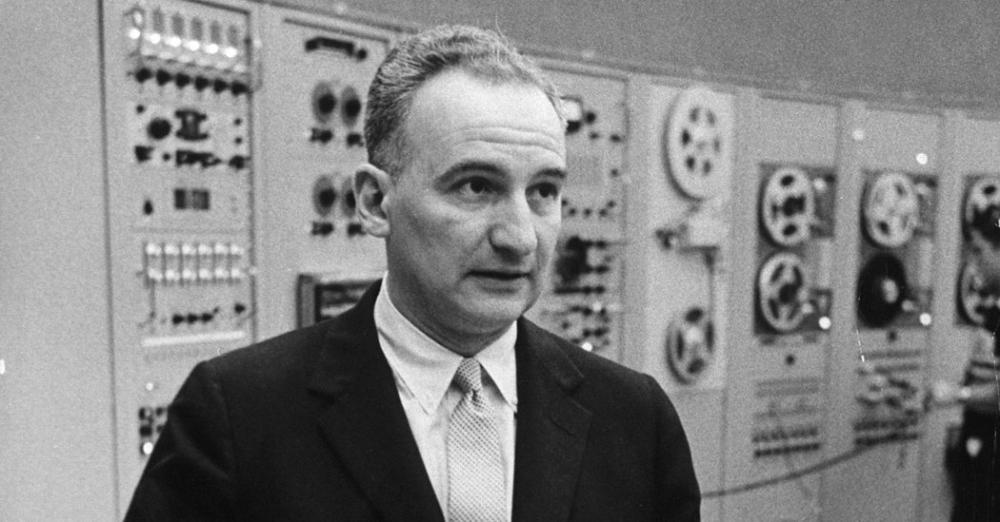
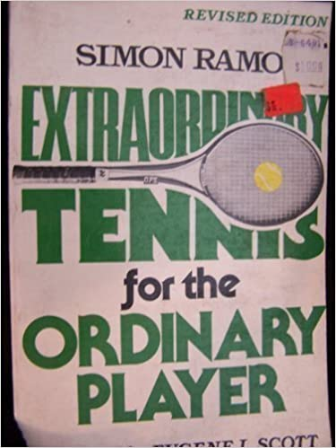
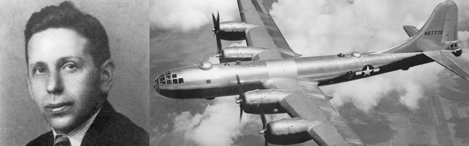

## 败者的游戏

Simon Ramo 是一名美国的工程师，商人，和作家。生于 1913 年，逝于 2016 年，享年 103 岁。

如果你去查看他的履历，会发现，从微波炉的发明，到电子显微镜的出现，乃至导弹技术，背后都有他的影子。

他早年在通用电气工作，之后有两次极其成功的创业，先后在 1958 年与 1964 年参与创立了 Ramo-Wooldridge 和 Bunker-Ramo 两家企业。这两家企业都曾经登上过全球 500 强企业的名单。

有意思的是，让我真正认识这个人的，并非是他的这些“丰功伟绩”，而是他写的一本名不见经传的小册子：Extraordinary Tennis Ordinary Players，我简单翻译成：杰出的网球比赛，普通的选手。

这本书出版于 1970 年，在 1999 年又重新修订。但是重新修订的年份也在上个世纪，距今已有 21 年了。

这本书实在太老，以至于在亚马逊上，都没有一个“体面”的封面照，只有这样一个看起来“脏兮兮”的，随手拍摄的二手书封面照片。

但是，这本出版距今已有 50 年之久的小册子中，却讨论了一个让今天的我也感触颇深的问题。

 

Ramo 是一名网球运动爱好者。他看了无数场网球比赛，有专业组的比赛，也有业余组的比赛。

不管是专业比赛，还是业余比赛，网球的规则都是一样的。但有一天，Ramo 意识到：专业的网球比赛，和业余的网球比赛，其实是两种截然不同的比赛。

Ramo 称专业组的比赛，是**“胜者的游戏”（Winner's Game）**。在专业比赛中，**得分大多数是胜球方赢来的**。胜球方使用高超的网球技巧，最终让对方无法接住自己的球，赢得了比分。

但是，业余的网球比赛完全不同。Ramo 称业余的比赛是**“败者的游戏”（Loser's Game）**。因为在业余比赛中，**得分大多数是对方输来的**。

在业余比赛中，选手犯错误的概率大大增高，把球打出界或者没有过网是家常便饭。

在业余比赛中，很多时候，赢球不是因为自己的技巧多高超，而是因为对手的失误，让自己赢得了比分。

根据 Ramo 的统计，在专业组比赛中，80% 的比分是赢来的；而在业余组比赛中，80% 的比分是对手输来的。

因此，在专业组比赛中，最终的比分取决于谁的技巧水平更高；而在业余组比赛中，最后的比分则取决于谁的失误更少。

如果理解了这一点，对于业余选手来说，最佳的比赛策略并不是用各种“酷炫”的扣杀赢得对手。虽然这会让比赛更加好看，但与此同时，也增加了自己失误的概率。

相对而言，业余选手反而应该选择稳扎稳打的策略。业余选手的第一要务是把球安全地击回给对方。只要做到了这一点，对手就有很高的概率因为失误，让你赢得比分。

 

---

**只要更少的失误，就能赢。**这就是 Ramo 对业余网球比赛选手的建议。虽然看似胜之不武，但它确实行之有效。

有些人认为，这样的方式会大大降低比赛的观赏性，甚至有违体育精神，不值得鼓励。但是，很快，人们就发现，这样的一个思考方式，却适用于更多领域，哪怕是对专业选手而言。

 

查理芒格是巴菲特的重要合伙人，巴菲特回顾自己投资成就时说：“我之所以能有现在的成就，是因为遇见了查理芒格。”

在投资领域，查理芒格最重要的一条忠告就是：如果要想保持长期的优势，**最重要的不是追求卓越，而是努力让自己不要犯错。**

> It is remarkable how much long-term advantage people like us have gotten by trying to be consistently not stupid, instead of trying to be very intelligent.

从芒格的角度看，对于投资来说，最重要的并非看准一次两次巨大的投资机会，而是想明白：在市场中，哪些资产有风险，有可能让你输钱。

只要小心地躲开这些可能让你输钱的陷阱，即使没有大赚，但是长期来看，你将赢得市场上的大多数人。

对于芒格来说，投资更像是一场**败者的游戏**。

芒格有一句半开玩笑的名言，广为流传：**我只想知道我将在哪里死去，那样的话，我就可以永远不去那里。**

> All I want to know is where I’m going to die, so I’ll never go there.

 

Abraham Wald 是一名匈牙利的统计学家，在二战时期为美军做统计研究工作。

他实际上是序贯分析（sequential analysis）的发明人。但是，大部分人不懂什么是序贯分析，却津津乐道于他在二战期间，巧妙地大幅提升了盟军的飞机防御能力。

Abraham Wald 当时所在的研究组接到的任务是：研究如何提升作战飞机的防御能力。

面对这样一个问题，Abraham 反其道而行之，着手研究：到底是什么，让作战飞机最终坠毁阵亡。

Abraham 把这个研究想成是一个**败者的游戏**，不去追求如何让作战飞机更强，而是去追求如何让作战飞机“不弱”。

值得一提的是，在探索“到底是什么让飞机最终坠毁阵亡”这一问题时，Abraham 证实了：返航飞机上，弹孔最多的位置，反而是飞机最坚固的部位；而见不到弹孔的地方，才是飞机最脆弱的地方。因为这些地方过于脆弱，使得一旦被击中，飞机就坠毁了。所以在安全返航的飞机中，永远看不到这些部位有弹孔。

Abraham 的这一洞察，已经成为了统计学与经济学中讲解**幸存者偏差（Survivorship Bias）**的经典案例。

 

在企业界，这样的思考也很为常见。

如果你曾经去过一个创业孵化器，大多数负责任的投资人都会告诉你：创业的第一要务，不是如何“火起来”，而是如何“不死”。

负债累累的“火”不是可持续的商业模式；能够让自己“不死”，才有机会。

我在 [从巴黎圣母院的大火，到消逝的IT巨头](../../2019/2019-04-18/) 一文中曾介绍过，BBC做过一个统计：现如今，美国标普 500 指数的公司，竟然平均年龄只有 15 岁。

标普 500 的公司尚且如此，更不用提创业公司了。99.99% 的创业公司还没有绽放，就已经凋谢。

创业是一场**败者的游戏**，创始人的第一要务，是保证自己的企业不死。因为不死，就已经赢过了 99.99% 的其他初创公司。

 

这样的思考，同样适用企业运营的方方面面。我在 [我不埋怨奋斗B](../2020-08-06/) 一文中，曾经举过一个我亲自采访的案例。

企业老板高喊创新，但是因为最终的绩效依然是销售额，导致保守的人拿到了大红包，真正尝试创新的人反而吃了苦头。

这不叫鼓励创新，这叫鼓励保守。

那到底应该怎么鼓励创新？实际上，这个案例已经给了我们答案。

我们可能很难找到具体的，能够真正激发员工创新的举措；但是，我们可以看到，**到底是什么在抑制创新？**

仅仅使用销售额作为绩效，就是在抑制创新。要想鼓励创新，就要从改变这些抑制创新的规定开始。

一家不抑制创新的企业，就已经是在鼓励创新了。

 

同理，运营人员一定要时时刻刻盯着新增用户的数字看吗？绝不是。很多时候，相比新增用户，如何留住老用户，防止已有用户的流逝，或许是运营人员更应该关注的问题。

产品设计人员一定要时时刻刻思考怎样的功能点，能带来更多的效益吗？也不是。很多时候，判断清楚什么样的功能，可能带来效益的降低，或许更重要。

 

我在 [万能学习法](../../2019/2019-08-20/) 一文中，曾经分享过：我曾经拜过一个师傅学习设计。那到底什么是好的设计？

我的师傅告诉我：好的设计千变万化，我们很难总结出“好的设计”的规律。实际上，没有规律，恰恰是艺术类学科的特点。

但是，我们能做到的是：识别出什么是差的设计，在设计的过程中避免它们。

一个“不犯错”的设计，可能不是一个好的艺术品，但是从商业设计的角度，已经成功了一半。

 

实际上，这样的思考模式，我们程序员应该并不陌生。

所有有过性能调优经历的人都明白：在一个真实的项目中，要想做好性能调优，第一件事不是去想：要用一个什么新的架构，新的模式，新的算法，来提升性能。

我们要做的第一件事，永远是仔细的检查：现在的系统，性能瓶颈在哪里？最耗时的逻辑是什么？

我们的首要目标，是想办法改善性能差的地方，这就将极大地提高整个系统的性能。

看，**败者的游戏是一种思考方式，它无处不在。**

 

---

之所以写这篇文章，是因为有人问我：bobo 老师，觉得自己的工作学习效率很低，每天不知不觉就过去了，如何能够提升自己的效率？

我想了很久，觉得，如果要想找到一个普世的提升效率的方法，太难了。毕竟，每个人的情况千差万别。

但或许，最简单的做法是：认真观察自己每天的工作学习过程，在其中，**鉴别出，到底哪些因素，在影响你的效率，在降低你的效率。**

与其去思考如何提升效率，不如想办法改进那些降低效率的行为。

你或许总被手机吸引；或许因为目标不明确，做着 A 却总是想着 B；或许因为学习工作的环境不够友好，总被打断；或者因为休息不好，导致效率低下。

找到那些真正影响你效率的原因，想办法改变它。

我们真正要做的，或许不是更高效，而是想办法不低效。

只要尽量少的低效，我坚信，在效率方面，你就已经超过绝大多数人了。

又是**败者的游戏。**

 

大家加油！：）