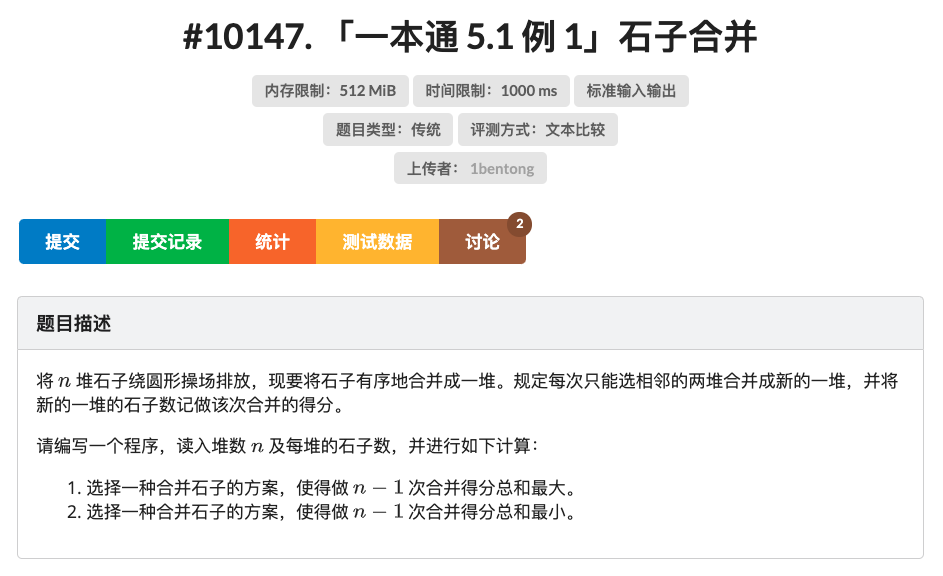
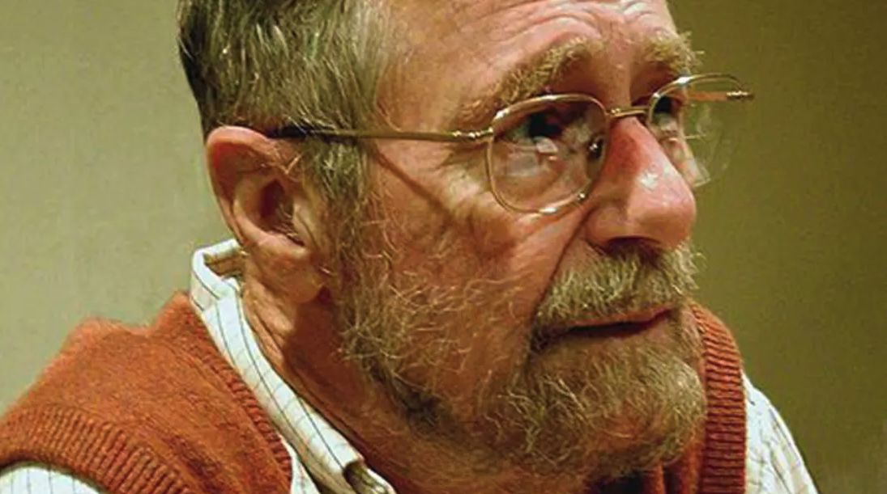
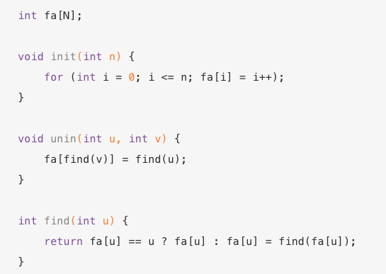

## 模板不重要

最近有同学问我打算法比赛是不是用模板？能不能分享一下？这个问题一下子勾起了我好多回忆。

晚上躺在床上睡不着，手机码字一个小时，随便聊聊我对算法比赛模板的看法。

都是碎碎念，感兴趣的同学凑合看。

 

---

我本科参加 ACM 比赛的时候，有没有准备算法模板？有。但那个模板我早已经找不到了。

一来，当年那个模板用现在的眼光看，简直是惨不忍睹。我个人也确实不是那种顶尖的选手，在 ACM 圈儿里看简直是平庸，我真的不认为我的模板有任何参考价值；

二来，在那个年代，别说 github 了，连百度云盘都没有。想在线上存储资料，主要靠邮箱。而实际上，每个人最重要的存储介质，是一块儿 128M 或者 256M 的闪盘，现在早就找不到了；

三来，最重要的，在我的记忆中，比赛模板基本就是一个心理安慰，实用性极低。稍微有点儿水平的比赛，瓶颈绝不是模板。反正我没遇到过在比较重要的比赛中，只因为没有准备好模板，而做不出来某个问题的情况。

也正因为如此，我在大四不打 ACM 比赛以后，曾经准备的比赛模板再也没有看过一眼，更别说更新了。

现在，那个存储着当年模板的闪盘，应该静静地躺在家里吃灰。闪盘里八成还有很多那个年代的电脑病毒，和那些曾经的奋斗一起长相厮守。

 

---

说实话，别看我本科做 ACM 比赛，但其实我是在研究生的时候，才开始踏踏实实系统学习算法的。

因为本科的时候只顾着比赛，别看训练时间挺多，刷题挺多，但其实都是在“应试”，对很多算法都不知其所以然。

在研究生的时候，完全没有比赛的压力了，才知道自己对算法有多感兴趣，于是捡起了很多经典的算法书细品。**不再追求刷题的数目，沉浸在算法的前因后果中，反而对算法有了更深层次的理解。**

所以我总建议大家不要一味刷题，扎扎实实打基础最重要。

 

---

在这里吹几个小牛。我本科升研究生的机试，是我们那届最快完成的。两个小时的机试，我大概 20 分钟就搞定了。

离场的时候看好多人在那里翻书，但我一本书都没带。其实那个时候我心情特别不好，遇到一些所谓的人生挫折。虽然现在回头看不是事儿，但那会儿情绪挺低落的，所以研究生复试我完全没准备，直接裸考，想的是大不了不读研究生了，直接工作。

结果没想到光脚的不怕穿鞋的，那场机试反而是第一名。当时带了一堆书当模板的同学，反而没看到成绩有多好。

 

研究生时闲得没事儿也会做点儿比赛玩儿。我印象最深的有两次。

一次是一个校内的 ACM 选拔赛。我是研究生，已经没有成为正式选手的资格了，只是参加着玩儿，结果竟然排名前五；

还有一次是一个企业的算法比赛。我拿了第一名。奖品除了奖状，还有个数码相机。那个年代数码相机挺贵的，基本就是现在的一个 iPhone 旗舰的赶脚了。我把那个相机送给我妈，我妈高兴了好久。

关键是，这两次比赛，我都完全没带模板。

 

实际上，在我印象里，算法模板最有用的一次，是本科一场预选赛。其中一个问题需要大数计算，我们没有模板。那会儿对 Java 完全不熟，不知道 Java 有大数类。我要没记错，那会儿还是 Java 4 的年代。

于是，我们比赛的时候现场用 C++ 手写了一个大数类，耽误了很多时间。后来我们总结说不行，要自己有一个大数类模板，于是我就做了一个。

可在那之后，在我的记忆中，那个大数类模板再也没有被用过了。我怀疑是那场比赛以后，有选手向组委会反应了。反正，我再也没在正式比赛中见过用 Java 因为有大数类就能轻易过；用 C++ 没有大数类一下子时间拉开差距的问题了。

其实，这样才是合理的。算法比赛比拼的是算法设计能力，而不应该因为语言标准库的差异而产生巨大的比赛结果差异。

 

---

当然，这里面还有一个问题，就是到底什么叫算法模板？我是在慕课网讲算法以后，才意识到大家对这个问题的理解是非常不同的。

我印象最深刻的是，有一次，一名同学问我，做二分查找的问题，哪个模板更好？我当时就懵了。

首先，写二分查找我确实不用模板，直接手写。但真正让我懵的是：二分查找就是那样一个算法思想，为什么还有“哪个”模版？难道还有很多二分查找的模板？

后来通过他的介绍，我才发现，确实网上有很多文章讨论，二分查找这个模板比那个模板更好一类的文章，我觉得还挺神奇的。

在我看来，二分查找是一个统一的逻辑思想。真要细究，我们用二分查找，可以解决如下问题：

1. 查找一个元素；
2. 求大于某个元素的最小值；
3. 求大于等于某个元素的最小值；
4. 求小于某个元素的最大值；
5. 求小于等于某个元素的最大值；

等等等等。

这些二分查找的不同应用，表现在代码上，只是一些边界发生微小的变化。难道对此，我们还要准备五个不同的模板？

如果需要五个模版，才有信心面对一个二分查找的问题写出正确的代码，那在我看来，大概率是因为根本没有理解二分查找。

需要五个模板，本质等于是在背代码。可又背不下来，于是写成了模版。

如果真的理解了二分查找，所有这些“变种”，背后是一套统一的逻辑。根据这套逻辑，求解的问题不同，相应的边界变化自然而然就写出来了。其中的代码，根本不需要背，也不需要模板。

插播一个广告，我在慕课网的体系课程，对二分查找的这些变种背后的这个统一逻辑，有详细的介绍。

 

再比如，我发现有同学写回溯算法，写滑动窗口，写 BFS，是需要模板的。这背后，大概率的，其实是根本没有理解回溯，没有理解 BFS，没有理解滑动窗口。或者是对循环不变量的理解不深刻，导致需要靠模板来“记忆”边界，而不是根据自己要组建的逻辑写出正确的边界。

如果对这些经典算法和数据结构的理解都还停留在记忆的阶段，基本上不太可能谈算法设计。就算有了所谓的算法设计的思路，具体实现起来，八成也会一团糟。

 

还有一些模版，在我看来完全没有用。比如我就见过有同学整理出“区间 DP”的模板。

说实话，“区间 DP”这个概念，我觉得在我本科的时候都没有。后来估计越来越多人发现一类求解区间上的问题，可以使用 DP，相应的状态定义方式就是区间的边界，于是造出了“区间 DP”这个词，方便交流。

可关键是，在我看来，了解区间 DP 就是把区间边界当做状态，就已经足够了。在具体的问题中，状态转移的方式千变万化。就算能识别出一个问题是区间 DP，其实意义不大的。

区间 DP 最经典的问题是这样一个石子合并的问题。我完全不相信准备这样一个问题的解，就能据此做出所有区间 DP 的问题。

 

甚至有的时候，**模板会起反作用，因为它会限制你的思路。**

举个例子，很多同学会准备 KMP 的模板。但这里有一个错误的假设：那就是 KMP 算法内部的所有细节一定会当做一个整体出现；见到字符串匹配问题，直接上 KMP 模板就好了。

但实际上，我从来没见过算法比赛直接考字符串匹配的。但就在今年，我见到一个有意思的比赛问题。

这个问题是一个数位 DP，但在状态转移中需要一步优化，这步优化要使用 LPS 的思想。

LPS 是什么意思？是 Longest proper Prefix which is also Suffix 的意思，即字符串中最长的是后缀的前缀。

这个概念是 KMP 算法中使用的一个重要思想。如果对 KMP 的理解只停留在它是一个更快的字符串匹配算法的程度，就很难提炼出 LPS 的思想，更不可能把它灵活应用在一个数位 DP 的问题上。

对于这个问题，懂的人都会说背后是 KMP。但有 KMP 模版和做出这道题之间，相差十万八千里。

 

再比如，Binary Lifting 也是一个很经典的思想。这个思想最典型应用是在 LCA 问题上。所以很多同学就准备了一个 LCA 模版。

还是今年，我见到了一个在网格上求解特殊路径的问题，需要使用 Binary Lifting 的思想。这个问题和 LCA 没半毛钱关系，如果手里只有 LCA 的模版，将很难做出这个问题。但如果你深入理解了到底什么是 Binary Lifting，理解它的本质其实就是 DP，了解它的状态定义和状态转移，完全不需要模板。

今年有一场 Leetcode 周赛的 Hard 问题，就是很标准的 Binary Lifting。我手里其实早就没有 Binary Lifting 的模版了，但是因为对这个问题的状态定义印象很深，十来分钟就搞定了。（又吹牛了🤥）

 

我的体会是，很多时候，**写一个算法，如果需要模板，基本就是对这个算法理解不深刻。**

再举个例子：我以前写 Dijkstra 是需要模板的。后来，我突然意识到，Dijkstra 的思想，本质就是 BFS！因为 BFS 处理的是无权图，所以用一个普通队列就够了；但 Dijkstra 处理带权图，就需要一个优先队列了。在此基础上，BFS 和 Dijkstra 近乎是同样的逻辑。

从此，我写 Dijkstra 再也不需要模板了。

我甚至坚信，Dijkstra 当年就是从 BFS 推导出 Dijkstra 算法的，而不是一般教材里讲的，先证明出切分定理，然后 Dijkstra 算法就冒出来了。

 

当然，对于一些更复杂的算法，我也要用模板，比如求解最大流的 ISAP 或者 HLPP。但我坚信这是因为我对这些算法理解的不透彻。

不过对于最大流的问题，我后来发现大多数情况 EK 算法就够用，顶死了用 Dinic。而手写 EK 算法其实很容易，建好残差网络以后做 BFS 就好。不排除是因为我水平还不够，见的变态问题太少。

这其实也是 ACM 和 NOI 或者 IOI 的一个重要区别。NOI 或者 IOI 很多问题卡优化卡得很厉害；但 ACM 更重视算法的思路设计，而不是特别变态刁钻的算法的使用。因此，很多人觉得其实 NOI，IOI 比 ACM 难。

 

---

我现在不时做做比赛，也会用模板。最常用的模板是并查集，线段树，BIT 等等这种数据结构的模板。因为这类数据结构封装得太完整了，拿来可以直接用，其实就是标准库的补充。

不过，对于大多数玩儿过算法竞赛的同学，手写一个并查集，BIT，也是小 case。因为代码量真的很小。大家可以在网上搜搜并查集或者 BIT 的模版，也就 10 行不到就够用了。真理解了，现场写很快的。

比如，我在网上随便搜一个并查集的模板，是这样的：

 

对了，因为有了互联网，所以很多时候，模板意义更小了。尤其是对于网络赛，真想要用一个模板，随便一搜，一堆大神用各种语言写的模板，任你挑。

难道有了这么多模板，大家算法比赛就都能 AAC？绝不是。

算法比赛比的，从来不是谁手里的模板更好。

**大家加油！：）**

 

**P.S.**

这篇文章没有想说模板没有用，而是如标题所说，想强调：模板没有那么重要。相较而言，深刻理解算法，能够灵活运用算法，比去寻求一个好的模板重要一万倍。

当然，其实每个人自己总结模板的过程，也是学习算法的过程。如我文中所说，我现在也用模板，我的 github 私仓有一个 repo，就是我的模板，但真的不常用，而且代码烂得很，没有好好整理。

以后我应该会认真整理一下，然后公布出来的：）