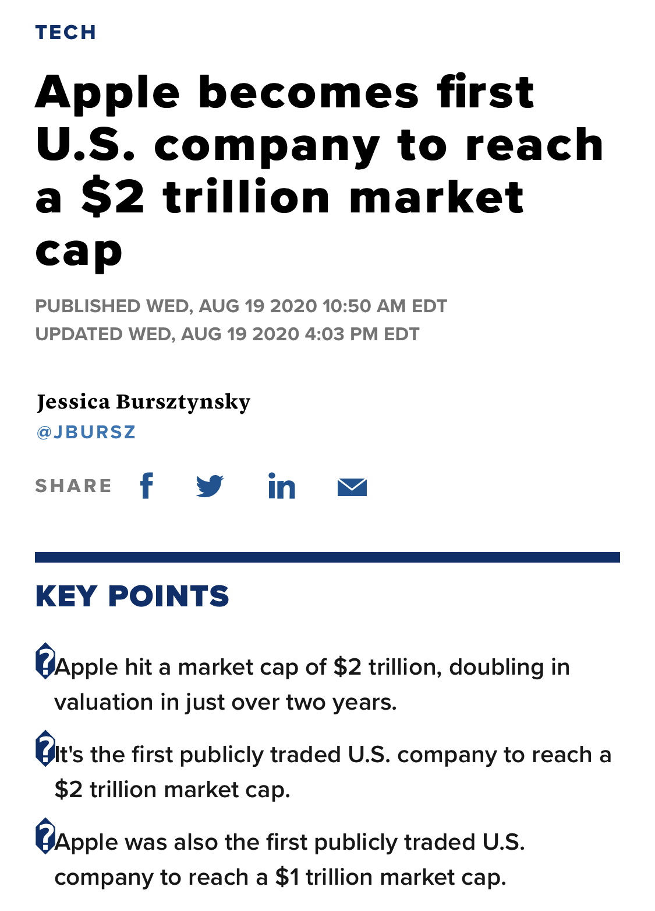
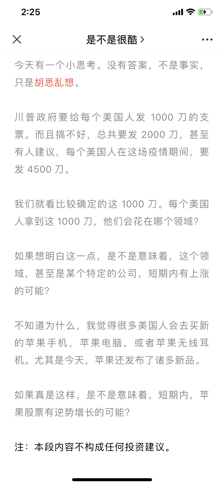

## 我曾预言苹果股票会大涨？

今天科技界的大新闻是：苹果市值超过 2 万亿美元，成为第一家市值突破 2 万亿美元的美国公司。

现在，紧随苹果之后的美国大企业，分别是亚马逊，微软，和谷歌的母公司 Alphabet。

这三家企业的市值现在分别是：1.63 万亿美元、1.59 万亿美元、1.05 万亿美元。

 

苹果市值为什么能达到 2 万亿？

我分析有这么几个原因：

1）因为疫情的原因，美联储货币政策上的“大放水”；

2）疫情期间，投资者更愿意把钱投向大企业来规避风险。更不用提巴菲特老爷子早早给苹果背书，领投苹果。巴菲特甚至在今年曾经说，苹果的股票已经成为了自己的“第三大业务”。（巴菲特心目中排名前二的业务是保险和铁路业务）。

3）因为疫情，大家在家里需要更多电子设备远程做各种事情。现在疫情下的美国，别说上课这种本来就很成熟的，能在线上完成的事情了。看病，看房，咨询，乃至很多聚会，演唱会，都远程了。疫情期间，无论是 macbook 还是 iPad，销量都大增；反而是 iPhone 的销量没什么变化。

 

另外，美国政府给每个家庭发了救济金。我很早就在公众号里说，以我对美国人的了解，我怀疑很多美国人会拿着这笔钱买苹果设备，而不是食物或者防疫物资。。。

 

据可靠消息，华尔街分析师曾认为，苹果要在 2021 年底，才能达到 2 万亿市值。

现在看来，因为疫情，加速了苹果的发展。

（仔细看我总结的三点，其实都和疫情有关！）

 

如今，**据不可靠消息**，华尔街分析师认为，到大概 2023 年底，苹果将达到 3 万亿市值。

如果这个预测是真的，那就意味着，苹果的股票能在三年时间里上涨 50%，简单计算下来平均年回报率 16% 多，还是相当可以的。

 

但是投资有风险，入市需谨慎。

比如，今年本来 Airbnb 能上市的。谁能想到结果出现了新冠病毒这样一种精准打击 Airbnb 的商业模式的东西。华尔街那帮分析师在一年前，恐怕就算被人用枪指着脑袋也想象不到。

这件事儿说起来就让我唏嘘。Airbnb 的估值几近腰斩。但就在两年前，很多挺靠谱的求职网站还都认为，Airbnb 是非常值得加入的企业，甚至是最值得加入的企业。

谁想今年竟会如此。

鬼知道在后面的 3 年，会出现什么新的奇怪的东西，可能精准打击苹果的商业模式？

不过，如果没有这种奇怪的意外的话，我还是相当看好苹果的。

坐等见证历史，或者被打脸。

**大家加油！：）**

 

---

**P.S. 1**

这篇文章我首先发布在了我的知识星球上。然后有同学告诉我，我去年 Adobe 发布会写过一篇文章，盛赞 Adobe，然后 Adobe 的股票之后也涨得很凶。

我算了一下，从 2019 年 11 月初 Adobe 开发布会到现在，Adobe 的股票上涨了 66%。

我觉得这是瞎猫碰上死耗子了。实际上，在过去的这一年，硅谷大企业的股票涨得都很凶。

我简单对比同一时期：亚马逊上涨 82%；微软上涨 45.9%；Google 的母公司 Alphabeta 上涨 21.4%；苹果上涨 80.9%。

哦，原来 Amazon 上涨幅度最大，怪不得最近 Amazon 扩张的很厉害。同时，疫情对 Amazon 也是大机会 🤔

 

**P.S. 2**

本文不构成任何投资建议。
