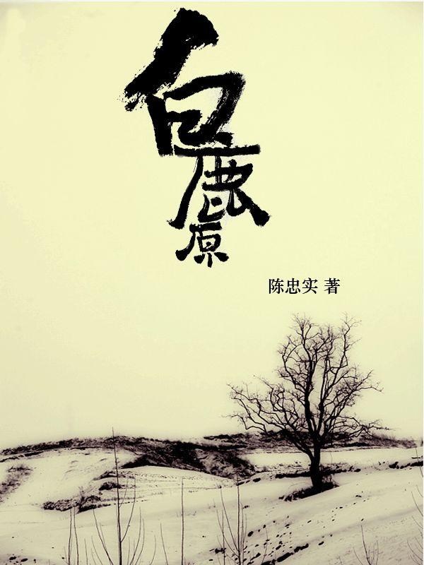
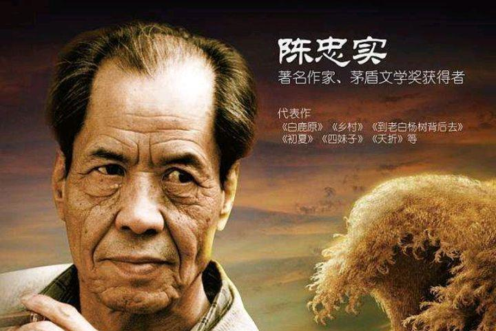

## 不是天才，不是星

这是在我的知识星球上，一个同学问我的问题。

> 波波老师经历过那种长期努力过后仍然比别人差一大截的情况吗？
>
> 人们常常说，你现在的努力程度远远还轮不到拼天赋。但是实际上，在很多时候，面临的竞争并不是完全公平的，因为存在很多前置知识的铺垫，有些人完成学习的速度就是快得多。
>
> 陈忠实曾经说“我爱上文学的同时，就知道了人类存在着天才的极大差别。这个天才搅和得我十分矛盾而又痛苦，每一次接到退稿信的第一反应，就是越来越清楚地确信自己属于非天才的类型。尤其想到刘绍棠带着红领巾就蜚声文坛的难以理解的事实，我甚至悲哀起来了。”
>
> 比较会带来很多痛苦，但是又不得不硬着头皮去做。高校对 GPA 或者说加权均分的向往，仍旧出于功利，评价手段仍然未变，而短时间出成绩，这仍然是重要的。应该不择手段地刷分？还是像郭宇一样只追求自己的热爱？哪一种选择更好呢？
>
> 面对这种情况，是否只能用鲁迅先生"天才即勤奋"的哲理与之抗争呢？

 

---

**bobo 老师的回答：**

 

我经历过那种长期努力过后，仍然比别人差一大截的情况吗？

当然经历过。甚至在我尝试过的每一个领域，都是如此。永远有人在各个领域做得比我出色，这近乎是一种**必然**。

如你所说，你已经意识到了，很多时候是因为：别人有“前置知识的铺垫，所以那些人完成学习的速度就是快得多。”

正是因为如此，恰恰说明了，问题的关键并非天赋，而是时间。很多时候，所谓的天赋，就是时间积累的结果而已。

人家高中就玩儿信息学竞赛了，凭什么我大一开始玩儿，就能一下子超过人家；

人家小学就抱着原版读物看了，凭什么我研究生才意识到英语的重要性，然后一下子英语就比人家还牛？

人家起步比自己早，甚至有些事情早十几年，如果这样，自己轻松就能追上，那这个世界才叫真的不公平。

 

每个领域总有追不上的人，怎么办？

恰恰因为如此，面对选择的时候，我永远会说，不要忘了问问自己的内心，到底对什么感兴趣。

如果你不知道自己对什么感兴趣，那么就要努力地去找自己感兴趣的方向。不要害怕尝试，不要害怕开始。

寻找自己感兴趣的事情，是我们每一个人一生都必须面临的问题。

这和你考试多少分，家庭如何，是不是有钱，没什么关系。年少时可能会做一些更功利的选择，但越长大，越明白，找到自己最重要。

为什么？就是因为，我们每个人都必须面对一个残酷的现实：在每一个领域，永远有人比我们做得好，永远有人比我们更有“天赋”，永远有人比我们更成功。

**从某个角度讲，我们每个人注定是“失败”的。**

那我们如何和自己自处？

于我来说，这个问题的答案，就是**热爱**。

 

我们一旦选择的是自己喜欢的事情，得失心就会小很多；在很多事情上，也就不会那么在意和别人的比较。

至少对我来说是这样的。

如果不喜欢编程，那么编程就只是一份“生产金钱”的工作而已。我们的眼睛就更容易盯着：自己在什么厂子？自己的级别是多少？自己的薪水是多少？别人又在什么厂子？别人的薪水是多少？别人的年终奖是多少？

但如果真的喜欢编程，我们就更会自然而然地关注：自己又学会了新东西；自己又解决了新问题；自己的代码更优美了；设计更合理了；扩展性更强了；甚至有一天，突然发现：咦？原来我的代码也在帮助别人。

这个感觉棒极了。

因为喜欢一个事情，我们就会更关注于这个事情本身。不敢说其他的事情不会干扰我们，但对我们的干扰将大大变小。

甚至，当真正喜欢一个东西时，别人眼里的“奋斗”，对我们来说，都不是“奋斗”了。我们只是在做自己喜欢的事情而已。

 

你在问题中举了陈忠实的例子，我觉得陈忠实老先生很能说明问题。

如你所说，陈忠实不是一个天才的作家。那他在那里吭哧吭哧，写什么呢？

他老人家的原话，因为他“爱上了文学”。

因为“爱上了文学”，所以即使自己不是天才，即使会因此“矛盾而又痛苦”，他也无所谓，继续坚持写。

因为他“爱上了文学”，所以要写出自己心目中的作品，只此而已。

最后，他完成了《白鹿原》。

 

这名不是天才的作家，在去世后，世人为他写的悼词，有一部分是这样的：

> 陈忠实以文学为神圣，几十年如一日，坚韧不拔、精益求精，毕生献身文学，勇攀艺术高峰......
> 
> 他把当代我国长篇小说的创作推向了一个新的高度，构成了当代中国文学的艺术标杆和精神标识...
>
> 世间已无陈忠实，天地白鹿魂永存。

 

在路遥的追悼会上，人们都说：一颗璀璨的星，从中国文学的天宇陨落了。

但在陈忠实的追悼会上，并没有人这么说。

或许是陈忠实对自己的认识太深刻。他知道自己不是天才，不是一颗璀璨的星。他不是坠落，只是黯然离开。

世人也不夸他是天才，不说他是一颗璀璨的星。

世人只是说，**天地白鹿魂永存。**

陈忠实老先生，留下了“白鹿魂”。

如果你要问我，“白鹿魂”是什么？

我想，这里面很大一部分，就是“**因为热爱，所以坚持**”吧。

**与你共勉，大家加油！：）**

