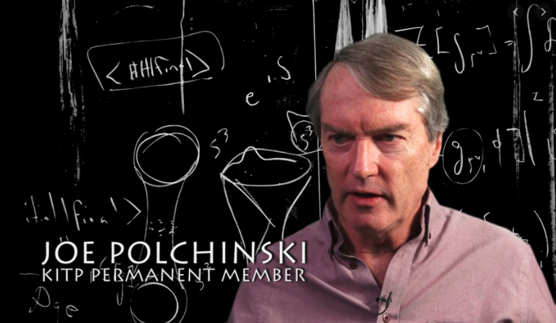

## 如何创作一个时空穿越的故事

我和老婆都是科幻迷，喜欢看科幻小说，喜欢看科幻电影。

在所有科幻类型中，我们最喜欢的，是时空穿越的故事。

时空穿越的故事有一种魔力，那就是即使这个故事本身不是那么“硬科幻”，我们依然可以沉浸在故事所设计的因果循环中，进行一场“思维实验”，一起来设想：如果我们可以穿越时间，会怎样？

时空穿越的故事，关键不是其理论的完备性，而是对因果关系进行自洽的阐述。

比如去年大火的台湾连续剧《想见你》，就是一个很好的例子。一个老式卡带录音机，播放着伍佰的《Last Dance》，主人公就穿越了，这完全没有科学道理。

但整个故事的因果关系充分自洽，就能让我们享受其中的逻辑美。这个逻辑美，和数学公式推导的逻辑美异曲同工：环环相扣，错落有致。

 

你看，我说了好多次“因果关系”，因为在我看来，大多数时空穿越的故事，创作的关键，就是讲明白“因果”关系。

比如，一类非常典型的时空穿越的套路，被称为是 **Predestination Paradox**。这个词在维基百科中，被翻译成是**命定悖论**。

命定悖论这个词最初来自于美国科幻影视剧的“老前辈”，1966 年的《星际迷航（Star Trek）》；而这一系列影视作品，又起源于 1955 年美国科幻小说家 Robert Heinlein 的作品：《星际迷航（Tunnel in the Sky）》。

 

命定悖论的故事套路是：一个灾难发生了。主人公千辛万苦，回到过去，想要阻止这个灾难的发生。但是，主人公最终发现：自己恰恰是这场灾难发生的原因。

比如，你回到过去试图阻止一场历史著名的火灾事故。本来火灾不会发生，但恰恰因为你回到了这段时间，在未发生火灾的现场碰倒了一盏煤油灯，于是火灾发生了。

你回到过去试图阻止火灾，却发现自己“试图阻止火灾”的行为本身，恰恰是火灾的起因。一场因果无穷的轮回诞生了。我们永远逃不出这个因果循环，一切命中注定。这就是命定悖论名称的由来。

很多时空穿越的故事背后都有命定悖论的影子，比如大名鼎鼎的《十二猴子》(Twelve Monkeys)。

 

同样描述无法分清因果关系的另一个穿越时空故事的套路，被称为是 **Bootstrap Paradox**。我没有找到这个表述的正统中文翻译，但因为 Bootstrap Paradox 又被称为是 **Information Paradox**，所以我们可以简单称其为**信息悖论**。

信息悖论是指：时空穿越导致一个信息没有“源头”。

比如说，我是一个音乐家。我因为一段音乐作品闻名于世。为了保证我自己能闻名于世，我穿越回了过去，将自己的这段音乐交给了过去的我自己。于是，我因为这段音乐闻名于世。

在这个时空穿越的故事中，这段音乐作为一段信息，没有起源。没有任何人创造它。我从未来的我手中拿到这段音乐，又在未来送给了过去的我。

信息悖论更高阶的展现形式，不是某段信息没有起源，而是“我”没有起源。

比如主人公穿越时空，回到过去，和一名女子恋爱。而事后发现，这名女子就是主人公的母亲！她生下的小孩，就是过去的主人公。这名主人公，将在未来的某一天，穿越时空，回到过去，找到自己的母亲，生下自己。

所以，主人公自己，就是自己的父亲。

著名电影《终结者(The Terminator)》中，未来的人类联盟反抗军约翰·康纳，其父亲恰恰是自己派到过去的凯尔·里斯。如果约翰·康纳没有在未来派出凯尔·里斯，也就没有了自己。这里颇有信息悖论的意味。

 

上面介绍的“套路”，不管是命定悖论，还是信息悖论，实质其实是一样的——因果形成了一个环。因即是果；果即是因。

但如果因果不是环会怎样？

**祖父悖论**就是在时空穿越的故事中喜欢探讨的另一个主题了。

祖父悖论说的是：如果你穿越时空，回到过去，杀死了自己在过去还没有结婚生子的祖父，那么你会怎样？

如果你成功地杀死了自己的祖父，那也就不会有你的父母，也就不会有你，那么你就不能穿越时空杀死自己的祖父。于是悖论产生了。

值得一提的是，祖父悖论不完全科幻小说家们的幻想。其实，理论物理学家们在非常严肃地对待这个问题。只不过，理论物理学家们探讨的版本，被称为是 **Polchinski 悖论**。

Polchinski 是美国著名的理论物理学家和弦论学家。他曾形式化地讨论这个问题：如果一个小球，经过虫洞，穿越时间，来到了过去，恰好撞击了自己，使得自己偏离了运行轨道，无法进入这个虫洞，怎么办？

这个小球因为进入了虫洞，才能撞击过去的自己；但这次撞击让自己无法进入虫洞，也就无法去撞击过去的自己。这个小球到底有没有进入虫洞，有没有撞击自己？

我第一次看到这个表达，感觉太有意思了。原来世界级的理论物理学家探讨的问题和我们在高中探讨的问题差不多：都是这个小球到底会怎样。🤔

 

上面介绍的，无论是命定悖论，还是信息悖论，虽然名字叫悖论，但其实逻辑是自洽的，没有矛盾，只不过因果形成了一个环，而不是我们一般理解的线性因果关系。

但是，祖父悖论是一个真正的，可以导出矛盾的悖论。

如果可以导出矛盾，我们就需要解决矛盾。怎么解决这个矛盾？

 

解决这个矛盾的理论之一是：因为存在这样的矛盾，所以时空穿越是不可能的。

由于这个理论过于无聊，虽然它有可能是真的，但我们在这篇文章中不讨论它。因为，实在没什么可讨论的。

 

解决这个矛盾的另一个理论是：事实上，你永远不可能杀死自己的祖父。

这个说法放到 Polchinski 悖论中，就是：经过计算，进入虫洞的小球，即使可以碰到自己，但是碰撞的力量，永远不足以让自己偏离原有的轨道，所以这个小球最终还是会进入虫洞。

这个理论被称为是**时间保护假设（Timeline Protection Hypothesis）**。即：时间会保护已经发生的事情，确保他的发生，哪怕有可以回到过去的力量。

可以想象这个场景：你回到了过去，想杀死自己的祖父。你用枪指着他，扣动扳机。但是，子弹卡壳了。你连续扣动三次扳机，子弹就是卡在里面，无法发射。

你把枪口对准旁边的空地，扣动扳机。砰！子弹发射出来了。

看起来枪好了？于是你又把枪口对准自己的祖父，扣动扳机，子弹再次神奇地卡壳了。

一种未知的力量在保护你的祖父，让你无法杀死他。因为，这将导致时间产生矛盾。这就是时间保护假设。

 

还有一个解决祖父悖论的假设是：**平行宇宙假设（Multiple Universes Hypothesis）**。

你回到过去，杀死自己的祖父。结果，你成功了！

但这并不影响现在的你的存在。因为，你杀死自己的祖父，将会导致另一个时空出现。在这个新的时空中，你的祖父被杀死了，于是你不存在了；但是，你所在的时空里，你依然存在。

两个时空平行进行，演绎着各自的故事。

其实，从“感性”的角度，平行宇宙也是我不喜欢的理论，因为用这个理论来解决祖父悖论，给人的感觉过于“简单粗暴”，而缺少了逻辑性和故事性。

所谓解释不通，平行宇宙。虽然，很多理论物理学家认为，平行宇宙很有可能是真实的。

美国的超级英雄故事系列经常使用这样的方式处理问题。在这个系列中，X 教授死掉了；在下一个系列中，X 教授又活了。如果问为什么？答案是：他们在不同的漫威宇宙中。

 

当然，以平行宇宙做为基础的科幻故事也能讲得很好。在我看来，关键就不是时空穿越了，而是如果两个或者多个平行宇宙出现了“交点”，会发生什么？

比如《彗星来的那一夜》（Coherence）。

 

再比如《相对宇宙》（Counterpart）。

 

使用祖父悖论讲故事，不仅仅可以讲“我杀死我的的祖父”这种只关乎个人命运的故事，更可以讲关乎全人类命运的故事。其中一个故事模式，被称为是**杀死希特勒**。

如果二战时，纳粹胜利，纳粹就将带领人类进入一个“万劫不复”的纪元。随着科技发展，一小撮革命军终于发明出了时光机，决定回到过去，刺杀希特勒。

结果，刺杀希特勒成功，历史被扭转，纳粹没有获得二战的胜利，这样一来，人类将进入一个新的，光明的纪元。（我们的现在？）

可问题在于，如果刺杀希特勒成功，我们可能就不会去发明时光机；或者即使发明了时光机，也不会回到过去去执行刺杀希特勒的任务。可如果我们不去刺杀希特勒，那么纳粹德国又会在历史上取得最终的胜利。

悖论产生了。

Doctor Who 有一集，就叫 Let's Kill Hitler。

 

穿越时空的故事，还有一个套路，叫**蝴蝶效应**。

一只南美洲的蝴蝶扇动翅膀，可能引发美国德克萨斯州的一场龙卷风。

把蝴蝶效应放进穿越时空的故事中，就是如果你回到过去，改变过去，哪怕是微小的改变，都将导致未来巨大的变化。

对此，最著名的电影，应该就是《蝴蝶效应（The Butterfly Effect）》了。

 

不过在我看来，蝴蝶效应不仅仅是穿越时空的故事套路，更是近乎所有故事都可以使用的套路。起初一个小小的动作，导致了后续一系列巨大的变化。这是很多剧本创作的源泉。

英格兰曾有一首民谣，是这样说的：

> 丢了一颗钉子，
> 坏了一块蹄铁；
>
> 坏的一块蹄铁，
> 折了一匹好马；
>
> 折的一匹好马，
> 摔伤一位骑士；
>
> 摔伤一位骑士，
> 输了一场战斗；
>
> 输的一场战斗，
> 亡了一个国家。

 

---

相信大家都猜到了，我写这篇文章，是因为电影《信条》（TENET）。

可惜，美国疫情这个德行，我是不敢去电影院看《信条》的。只能看着国内铺天盖地的宣传，留着口水，在家里写这篇文章。

恰巧这篇文章最后的落点，是蝴蝶效应。

谁能想到这样一个小小的病毒...

哎，不说了。

**大家加油！：）**