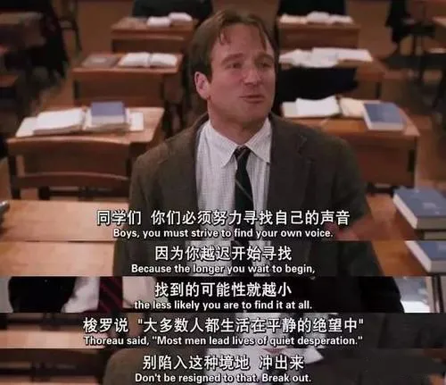
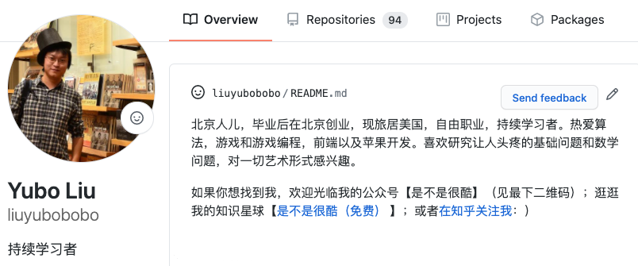
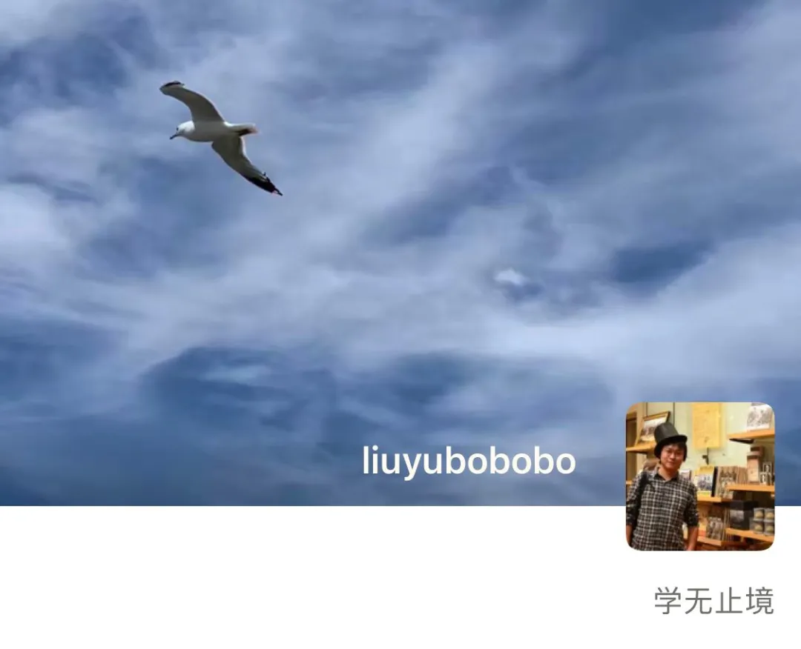
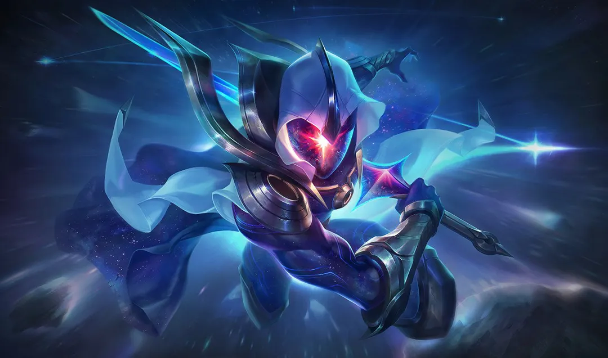

## 大师和学徒

今天，好多同学祝我教师节快乐。谢谢大家 

也不知道从什么时候开始，教师节这个节日竟然和我有了关联，这是我以前万万想象不到的。

 

说实话，我一直不觉得自己是“老师”。

一方面，我从来不觉得自己“燃烧了自己，照亮了别人”。我没有那么高尚，也似乎没有想着要成为这么高尚的人。可能我要检讨一下自己 

另一方面，我总觉得“老师”是一个有距离感的称谓。这或许是我的“偏见”。

老师给我的感觉是那种高高在上的，全知全能的。

可惜，我并不全知全能。很多同学花样问我各种问题，我的回答都是：嗯... interesting... 这个问题，我也不知道耶 🤔

我也不希望自己“高高在上”。除非是很认真地探讨问题，我会一本正经；但除此之外，很多和我熟悉的同学都知道，我经常和大家一起互黑，开着没边儿的玩笑。

 

我最喜欢的老师形象，是《死亡诗社》中的老师基廷（Keating）。可惜，我没有那么厉害，也没有那么自由。

我顶多学学他，假装告诉别人，要“寻找自己”。但其实，我也没有找到自己，我和所有人一样，一直在寻找自己。

所以，相较而言，我更喜欢做学生。

 

我的 github 首页，bio 一栏，填的是**持续学习者**。

 

在微信上，我的 What's Up，是**学无止境**。

 

实际上，学习我课程的同学，很多都是大佬。在和他们的交流中，我学到了太多东西。我认为，我从大家身上汲取的，远比我分享的那点儿玩意儿要多得多。

很多时候，对我而言，我是学生，你们是老师。

 

我不玩儿英雄联盟，但前不久，我听说了英雄联盟中的一个人物台词，我很喜欢。

这句台词来自无极剑圣易大师：

> 真正的大师，永远怀着一颗学徒的心。

我还特意找到了这句台词的英文版：

> A true master, is an eternal student.

很多学习我的课程的同学，都是真正的大师，而他们一直怀着一颗学徒的心。

很多时候，这让我汗颜。

所以，在这个日子，我也要祝所有那些曾经给予我启迪的，假装是我的“学生”的老师们，教师节快乐！：）

 

不过，可能还是会有同学说：哎呀！我没那么厉害呀！我就是个学生呀。

对此，我的回答是：每一名学生，也终将成为一位大师。

所以，我觉得无极剑圣的这句话，还应该有后半句：

**真正的大师，永远怀着一颗学徒的心；**

**每一名学徒，也应该怀有一颗大师的心。**

祝所有人，教师节快乐！

**大家加油！：）**