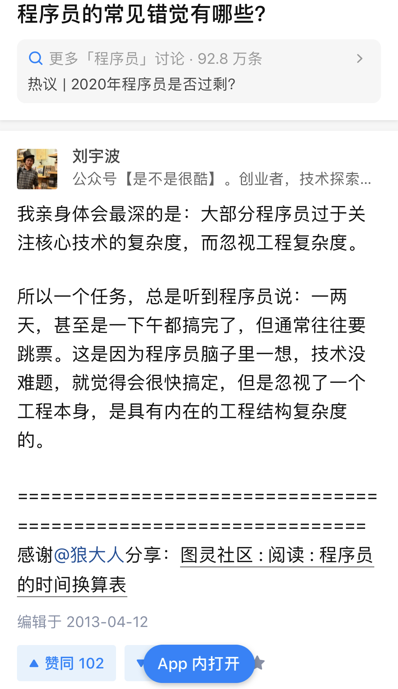
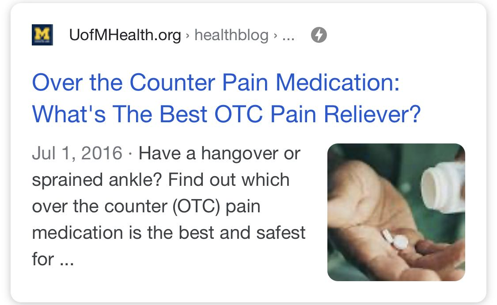
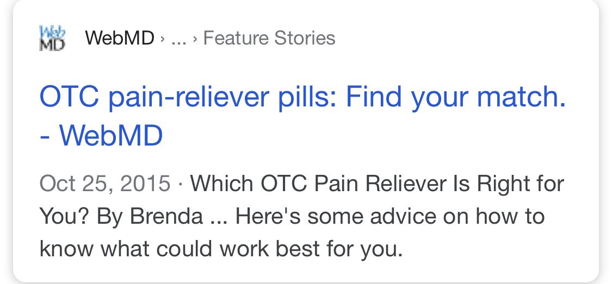
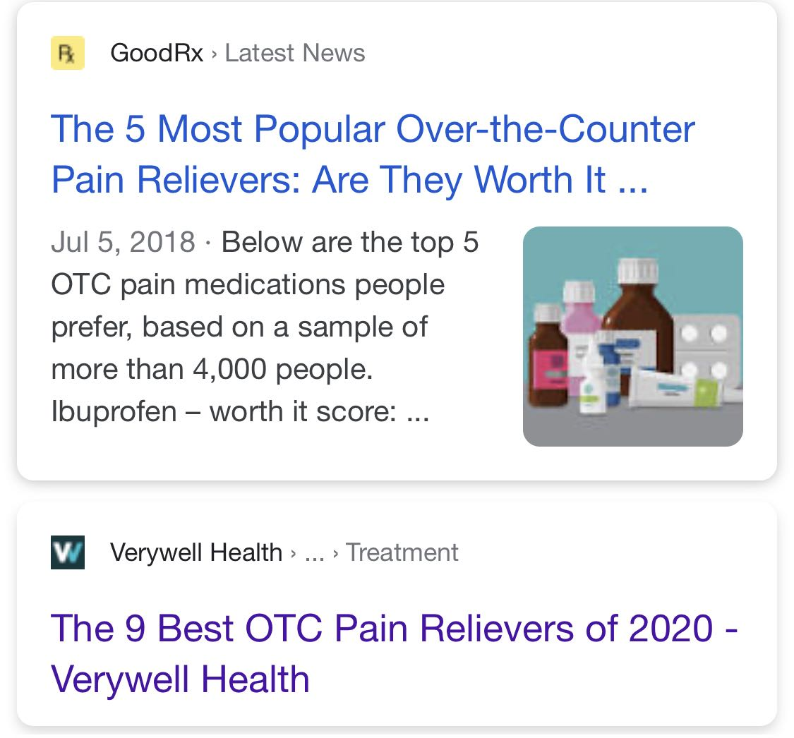
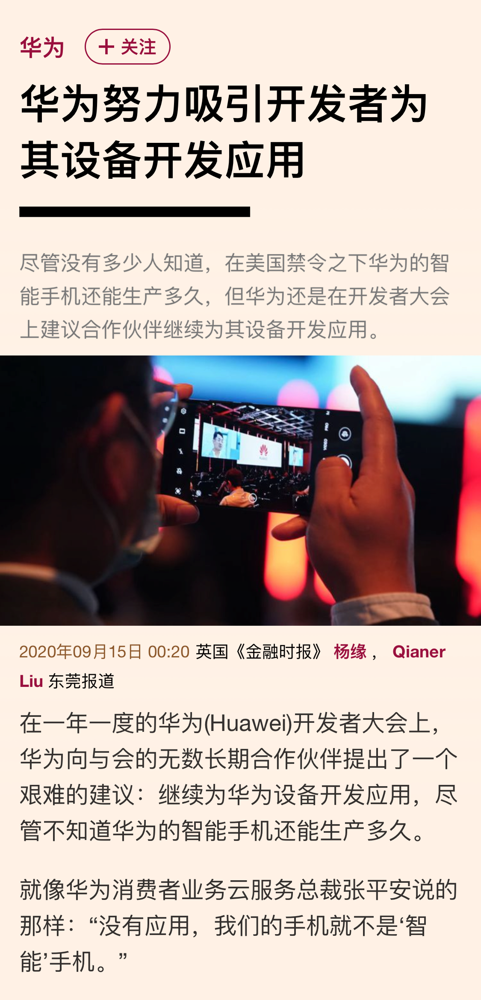

## 软件行业还大有作为

随便聊两个最近接触的事儿。

 

我有个朋友，我们叫他 W 吧。

W 最近联系我。问我认不认识靠谱的外包团队。

W 在国内创业，做医疗生物相关的行业。几年下来，已经相当有规模了，团队近百人。

我参观过他们公司，在一个二线城市的“工业园区”，一整层都是他的地盘儿。

和互联网创业不同，生物医疗行业需要大量的仪器设备，需要专门的实验室。我去参观他的企业，就像刘姥姥进了大观园，看啥都新鲜。

W 的项目发展得极好，不仅和国内很多大型综合医院有直接合作，在一些领域还是国家认证的数一数二的企业。我上次和他面对面交流，还是两年前。那时，他甚至想在美国建立一个专门的研究中心做研发。

W 本身是海归，了解美国文化。他认为中国研究人员的水平和美国研究人员的水平还是有差距的。但从去年开始，中美关系极度恶化，加上现在的疫情，这个想法恐怕是要破产了。

我和他聊天，其中一个挺重要的话题就是，计算机技术和生物医疗行业的融合。从机器学习到人工智能，从大数据分析到物联网，我们探讨了很多这些当下最“热”的技术有可能在生物医疗领域的应用。

但是，W 最近联系我，和这些高大上的技术一点儿关系都没有。他的诉求是想做一个软件开发的外包，来追踪记录他们的产品从生产，到运输，到流入各个医院以后的使用，等等各个环节的信息。

听上去很像一个快递的货单跟踪系统，但因为行业的特殊性，需要很多定制化的需求。

我甚至没有完整听完他的需求，就很遗憾地告诉他：我这里已经不认识做外包的朋友了。

 

十年前，我认识的朋友们，还有不少做外包的。有的是拉私活儿，用业余时间做，赚点儿外块；还有一个朋友，外包做得挺成规模，十多个人的团队全职做，能接到相当不错的单子。一年接一个单子就能养活整个团队了，接到两个单子，那就赚大了。

但是慢慢地，大家都成长了，渐渐不愿意做外包这种“体力活”了。我说的这个专注于外包的团队，也早就转而去开发自己的产品和服务了。

 

说回 W。W 问我，那这个需求难不难？

我说，技术上，不难。

当我说出“不难”的瞬间，仿佛时间突然倒退了十年。是的，我也曾经做过不少外包，本科还曾在一个师兄的外包公司做实习。我也曾经和无数不懂计算机的“老板们”说，这个东西不难。

但是实际情况是，要想达到客户的预期，真正的项目执行过程，是比每个人的评估，包括软件工程师自己的评估，要困难得多的。

这里的“困难”，不是某个技术无法实现，而是一个成规模的软件工程，自身就带有“**系统复杂度**”。

从需求分析，到系统设计；从模块测试，到上线部署，**每一个环节都是极其成熟的，但是每一个环节都会出问题，都将比所有人想象得更困难**。

我在 2013 年，就在知乎上回答过这样一个问题。

一转眼，现在已经是 2020 年了。虽然更多的工具被创造了出来，虽然程序员开发的门槛大大降低了。但是，当面对一个稍有规模的定制化软件产品需求时，我并不觉得事情比起七年前有多大的改变。

这样一个软件工程，依然是“**技术不难，但实际执行起来，困难重重**”。

在我看来，这本身就说明了：**软件行业本身，依然是不够成熟的。**

软件虽然已经无处不在，但是，当一个非计算机行业的企业老板想要使用计算机的力量来优化自己做的事情的时候，却发现无从下手。

我不知道这个问题怎么解决。但我知道：有问题存在，就会带来解决问题的思考和行动，就有产生突破的空间。

 

---

说第二个事儿。

 

我在国外的一个朋友，有一天和我聊起，他认为美国非处方药的信息，太混乱了。

注意，是非处方药，不是处方药。处方药无所谓，因为吃什么处方药，医生说了算，患者不管。

但有的时候，如果我们自己有点儿小病，想找点儿非处方药减缓自己的病症的时候，却发现无从下手。

我怀疑国内也是如此，不过，我以前确实没有太关注过药品信息。

 

以最常见的止疼药为例。如果在 Google 搜索“best OTC pain reliever”（最好的非处方止疼药），你会得到一群类似这样的文章推荐：

什么是最好的非处方止疼药？

 

寻找最适合你的非处方止疼药。

 

5 个最受欢迎的非处方止疼药；

最搞笑的是，紧接其后的就是：2020 年 9 个最好的非处方止疼药。

 

不知道大家有没有 get 到问题：我们获取这些非处方药的信息，只能通过这些博客文章来做出自己的判断。**没有一个专业的平台，汇总这些信息。**

但事实是，每年，美国的药品实验规模是以万为单位计算的，这些实验也包括最为普通的非处方止痛药；同时，每一个诊所每天也会接收到大量的患者数据。

无论是这些实验结果，还是这些患者的用药数据，都可以通过汇总分析的方式，帮助大众更好地理解：自己到底在何种情况下，使用何种非处方药，是最好的选择。

但是，这些信息是 Google 不到的。能 Google 到的，只有那些博客文章。我们甚至无法鉴别，这些博客文章的作者，到底是否有专业的医学基础。

这就涉及到当下互联网行业的另一个问题：专业的信息，很难被获取。

 

如今，通过互联网，我们可以轻易找到某个电影的评分；某本书的整体概要；某个餐厅大家是否喜欢，都有哪些拿手菜。互联网让信息更容易获取。

但并不是所有信息都产生了这样的“颠覆”。直到今天，依然有大量信息，是很难获取的。

非处方药只是一个例子，这个例子介乎于“大众”和“专业”之间。但如果放到更专业的领域去看，今天获取某些信息的难度，甚至可能和没有互联网的时代，并没有太大的区别。

 

我在国内创业期间，认识了两个老板。一个是做化学分析仪器行业，粗分类就是化工行业；另一个是做环境行业。

这两个行业的特点，都是需要购买大量的专业设备。所谓的专业设备，是一个很大的范围，从价格上千万的高端仪器设备，到仅仅几毛钱的耗材，都在这个范畴里。其中的品类，相当复杂。

和他们聊天，这两个行业的老板不约而同地向我反映了同样的行业现状：**采购这些设备是个大难题。**

导致这个难题的原因有很多。比如渠道问题；不同供货商之间产品质量的认定问题；价格问题；供货商的诚信问题；采购员吃回扣的问题；等等等等。

但所有这一系列问题，都指向同一个方向：这些相对专业的行业信息，并不透明。即使是行内人，也很难获取。

 

实际上，很多行业内部，已经有了各种各样的信息交流平台。有很多极其简陋，就是一个 90 年代的论坛的样子。但即便如此，也已经足以让这些平台的拥有者赚到相当可观的利润了。

因为，这本质就是信息流通的价值。

但很显然，这样的行业信息平台可以更好，使用者也有更大的需求；更何况，还有太多的行业，根本没有这种平台。

诚然，建立这样一个平台，也会困难重重。这些困难是怎样的，不是我想说的重点。

我想说的是：因为还有这样的问题存在，并且我坚信，在各个专业领域，这个问题一定会慢慢被解决。那么解决这个问题的过程，就会产生巨大的发展空间。

 

---

其实关于这个话题，我还想写很多，但又怕太长大家不爱看，先举这些例子。

随手扯出这篇文章，是因为最近听到很多人讨论：软件行业是不是快到头了。

说实话，**我的看法是远远还没有。**

如果说这个行业竞争越来越激烈，那可能是真的。别说几万倍这样的增长奇迹了，就算是几百倍几十倍的增长，未来可能也会越来越少见（虽然我怀疑还会有很多或大或小的企业脱颖而出）。

但这不代表到头了。

**有大量的问题，现在的技术还不能解决；同时有太多的行业，软件的渗透率还相当低。**

这还没有提到那些“高大上”的技术，诸如 5G，人工智能，物联网，量子计算，等等等等，可能带来的增长与变革。

 

无独有偶，就在几天前，我看到了这样一则新闻：

华为和 Tik Tok 的事儿我都不太懂，所以我也没有太聊过。这背后所涉及的政治，法律，历史，等等问题，太复杂了，是我的水平聊不清楚的。

但是，这个新闻，我能看懂最后一句话：

**没有应用，我们的手机就不是‘智能’手机。**

**软件行业还大有作为。**

**大家加油！：）**