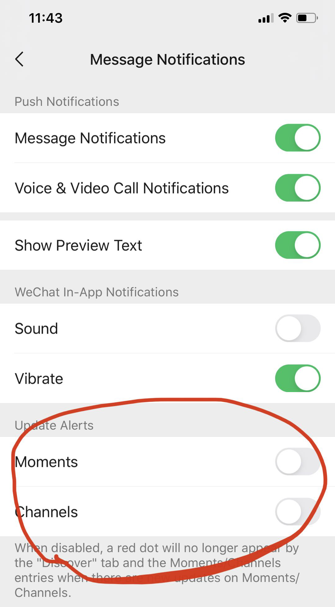
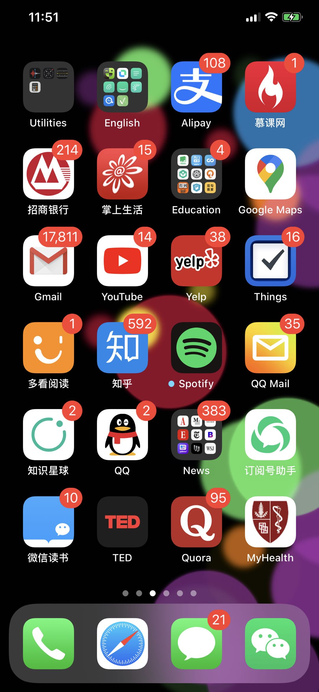
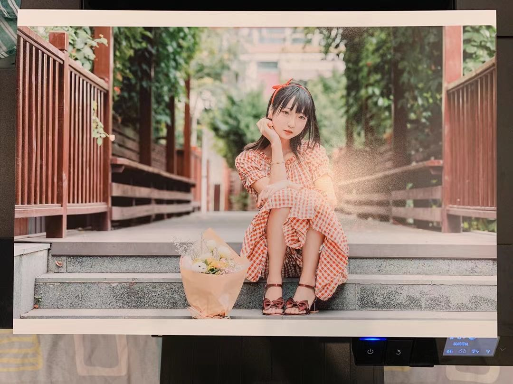

## 水晶宫里，一声吹断横笛

这两周没有更新公众号，主要原因是家里有一些事情要处理。在这里向大家道歉。

因为今天是个节日，按照惯例，出来冒个泡，顺便给大家发个红包，喜庆一下。

既然冒泡了，就随便聊一聊，没有主题，就当朋友聊天儿。想到哪里，说到哪里。

 

​---

这两周没有更新公众号，除了有家里的事情要忙，还有一个原因是，没有特别关注世界发生了什么，所以也就没有特别想写东西的冲动。

为什么没有特别关注世界发生了什么？其中一个原因是，我这两周没太刷朋友圈。

两周前，无意间看到微信有一个设置，可以把朋友圈的那个小红点给去掉，如下图所示：

我本来认为这个设置并不会对我产生什么影响。因为我觉得自己对这种红点挺免疫的。毕竟，我的手机屏幕是这样一个风格：

但是，当我在微信中，把小红点设置成不显示以后，神奇的事情发生了。我真的不太去看朋友圈了！

用微信聊完该聊的事情，打开探索页以后，很多次，看到朋友圈没有小红点，竟然完全没有打开的欲望。

于是，我一不做二不休，直接把我的探索页设置成这样了：

什么短视频，朋友在看，小程序，游戏，周围的人，统统隐藏掉了。效果棒棒的，被微信分散注意力的时间大大减少。

至于我为什么留着朋友圈？毕竟，朋友圈还是维系朋友关系（了解朋友八卦）的一个重要工具嘛  

所以，如果有同学希望自己能够减少刷朋友圈的时间，可以试试这么设置一下。

---

 

最近 Netflex 有一个自制的纪录片很火，叫 The Social Dilemma，中文翻译成《监视资本主义：智能陷阱》。

这个纪录片描述的就是社交网络对我们的生活，乃至整个人类社会带来的巨大问题。

在双节期间，闲得没事儿，大家可以找来看看。对于身处互联网行业的同学，应该会有一些启发。

我计划找时间专门写一篇公众号文章，聊一聊这个纪录片。

---

 

通过微信设置这个事情，我理解了产品心理学的强大。

因为我老婆本来就是搞心理学的，我自认为读了不少心理学的书。在国内创业的时候，蹭了五年北大 MBA 的课程，其中很多内容也涉及到心理学，诸如行为心理学，经济心理学，等等。

我一直以为这种产品设计上的“小心思”，不会对我有什么影响。但是我发现，自己还是会掉入陷阱。

更可怕的是，我明明掉入了陷阱，还不自知，还自我感觉良好。甚至有的时候，心理小阴暗，还会暗暗鄙视一下别人。

直到有了对比，才意识到自己简直是个笑话。

人果然容易高估自己。

我还计划找时间专门写一篇公众号文章，聊一聊产品设计中的心理学。

---

 

你看，我这么一会儿时间，就列出来了两个公众号文章的选题了。

实际上，我在我的手机笔记簿上，专门有一个公众号文章的选题列表。毫不夸张，这个列表里，现在已经有 100 多个选题了。

在这个选题列表中，大多数内容我已经有了框架性的思考，稍微花些时间把具体内容写出来，就能当一篇原创的公众号文章发出来了。但即使这样，在过去的两周，我还是没有抽出时间写一篇文章。

所以，有再详尽的计划，再完整的框架，在伟大的战略，也没有用。**所有的事情都是一点一点做出来的。**

生活不断地在告诉我这个道理，可我还是会经常忘记它。

---

 

我认识一个专门搞摄影的小朋友。说是小朋友，是因为比我小一轮多。

他两年前考取了在英国排名第二的艺术学院，专门学习摄影。但是根据他的说法，学院派的学习太枯燥了，都是理论，没有实践，于是他选择了退学，回国创建工作室。现在已经小有规模了。

最近，他发朋友圈说，2020 年，截至现在，也就是整整 9 个月的时间里，他已经拍了 15 万张相片了。

这意味着 2020 年，他至少按了 15 万次快门。这还是有疫情的情况。

我计算了一下，粗略算这 9 个月有 9 * 30 = 270 天，那也意味着他平均每天都要按快门 150000 / 270 = 555 次。这还不算挑选照片，修整照片，在工作室和客户、员工沟通，等等的工作。

哪行都不容易。

我当然明白，按照按快门的次数来评判一个摄影师的工作，是不公允的。这就好比按照代码行数来评判程序员的工作一样不合理。

但我坚信，谈论质的前提，是量。只有量变，才能引发质变。

我很看好他。

转发一张他的人像作品，据说是打印出来准备参展的。

 

---

前几天，想在网上找一个群论的定理，然后无意中翻到了一个有意思的评论。

这名网友说，自己学群论的时候，发现这是一门需要平静的心态才能学好的科目。你需要弄明白每一个定理表达的意思和相应的证明。事实上，证明过程是很有趣的。

而且，群论并没有那么难。本科生就可以学会。

最后，他说，**如果想检验自己的心态是否平和，可以试试读群论。**

 

说实话，在我看来，大多数离散数学的分支，都非常有趣，并且静下心来去看，去思考，都不难。至少我认为比连续数学要简单很多。

但是，一环扣一环，每一环都不能丢。一想赶时间，跳过去几条定理，或者没把某条定理吃透就往后翻，很快就什么都看不懂了。

所以，数学不适合赶时间看，甚至我认为不适合带有功利目的去看（反正数学也没有什么直接的作用）。

如果没有数学的学习任务，我认为数学特别适合睡前看。

我以前晚上睡不着觉，就躺在床上看英语，读不懂很快就睡着了。后来英语水平提高了以后，看英语并不能治疗失眠，甚至看英文小说会越看越精神，于是我开始选择躺在床上看数学。

深入一个定理的证明过程，一会儿就把自己绕晕了，然后就能睡着了 

 

---

现在。美国西部夜已深，我又没睡着。

到阳台看了一眼月亮，又圆又亮。

尝试了一下用手机拍照，发现拍不好。索性不拍了，多看两眼月亮。

真美。

以前，我喜欢月有阴晴圆缺，人有悲欢离合的伤感，或许只是为赋新词强说愁。

如今，天凉好个秋到了嘴边，却发现自己更喜欢水晶宫里，一声吹断横笛的豪迈。

来自苏轼，《念奴娇·中秋》

 

凭高眺远，见长空万里，云无留迹。桂魄飞来光射处，冷浸一天秋碧。玉宇琼楼，乘鸾来去，人在清凉国。江山如画，望中烟树历历。

我醉拍手狂歌，举怀邀月，对影成三客。起舞徘徊风露下，今夕不知何夕。便欲乘风，翻然归去，何用骑鹏翼。水晶宫里，一声吹断横笛。

 

好了。我要躺到床上去看数学催眠了。

祝大家双节快乐。

**大家加油！：）**

