## 如果川普确诊新冠，之后会发生什么？

川普确诊新冠，相信大家已经知道了。实际上，是川普自己发推向全世界公布的这一消息：

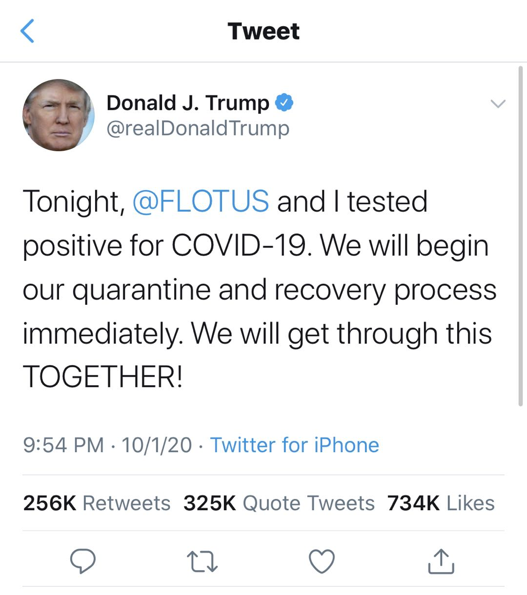

有人说这可能是川普的一个竞选策略，假装感染，然后表演如下的戏码：

> 假装感染→可以治愈→新冠不足为惧→大流感而已→经济可以重启→支持率爆涨→连任成功

 

说实话，这个链条里的一切都有可能发生，唯独源头：川普成心“假装感染新冠”，概率非常非常低。

媒体早先已经报道了，川普的身边最核心的女助理：Hope Hicks，已经确诊了感染。正是因为她的确诊，川普和她的夫人才接受了检测，并且第一时间进行隔离；然后，确诊了新冠。

而川普和这名女助理，在这周二，刚刚共同乘坐空军一号，往返于总统辩论；之后，还一起奔赴了明尼苏达州的集会。川普真的感染了，是大概率事件。

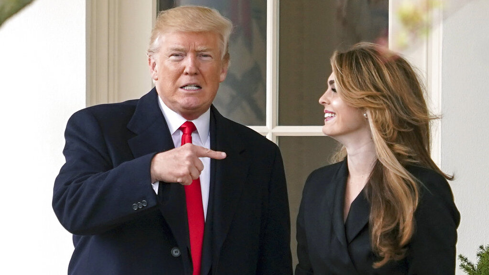

 

刚进入十月的第一天，就发生了这样的事情，不得不让人想到**十月惊奇**这个词。

十月惊奇本意是指：因为美国大选的日期是 11 月 3 日，所以两党及其候选人，有可能在 10 月份故意制造重量级的新闻事件，以影响选举的结果。

但历史表明：即使不是刻意为之，很多时候，也会在十月份发生重量级的新闻。

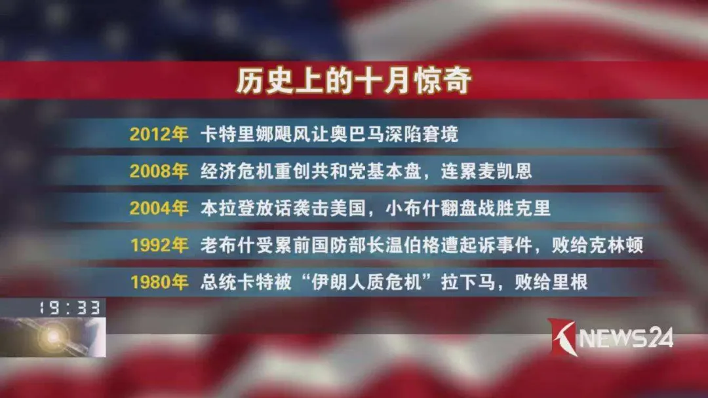

今年 9 月 18 日，大法官金斯伯格突然病逝，就让很多人高呼，十月惊奇提前到来了。但是，大家还是没有预料到，十月份会发生更劲爆的新闻，比如这个星球上最懂新冠病毒的男人，会感染新冠病毒。而这个人，恰恰是美国总统。

2020 年实在太魔幻了。

那么川普确诊新冠以后，会发生什么？

---

 

首先，从现在美国的数据来看，新冠的致死率大概是 3%，而普通流感的致死率只有 0.1%。

虽然很多人（比如川普总统自己）对这个 3% 持争议态度，认为被高估了，但是，CDC 官网上明确表示：对于新冠病毒的真实致死率，我们并不清楚，不过有一点可以肯定：一个人能获得的医疗质量，将极大地改变新冠病毒对他自身的致死率。

川普作为著名富二代（其实是富三代），同时也是美国总统，能够享受的医疗条件肯定没得说。从这个角度看，我个人认为他因此病亡的概率还挺低的。

虽然他已经 74 岁高龄了，属于妥妥地新冠高危人群。

所以，川普应该会首先继续在隔离的条件下履行美国总统的职责。尤其是现代通讯技术很发达，这应该不成什么问题。英国首相约翰逊，已经为川普做出表率了。

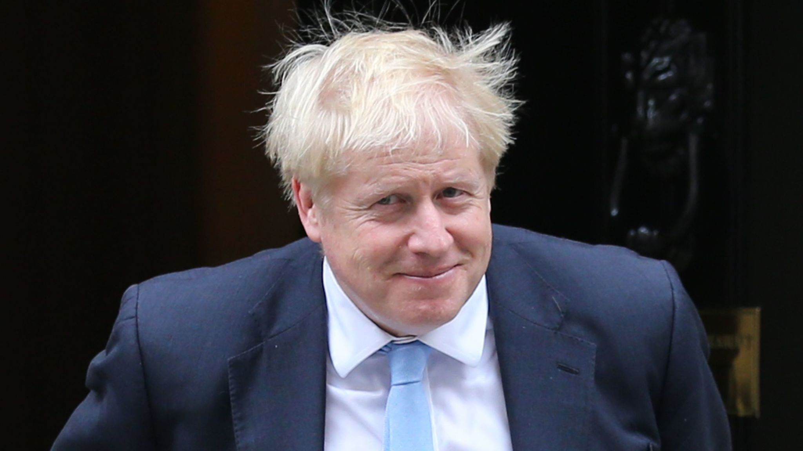

但是，一些其他的额外预防措施也会执行。最重要的，应该就是保护当前的副总统彭斯了。因为，如果川普真的在任期发生意外，彭斯将会暂时接手美国总统一职。

 

另一方面，一定会发生的就：金融市场因此受影响。

由于川普确诊的时间是在美国的周四晚上（东西部都是），所以还不确定第二天的股市会怎样。但是，由于是在亚洲的白天，因此，相应的影响，在亚洲金融市场上已经表现出来了，产生了剧烈的下滑。

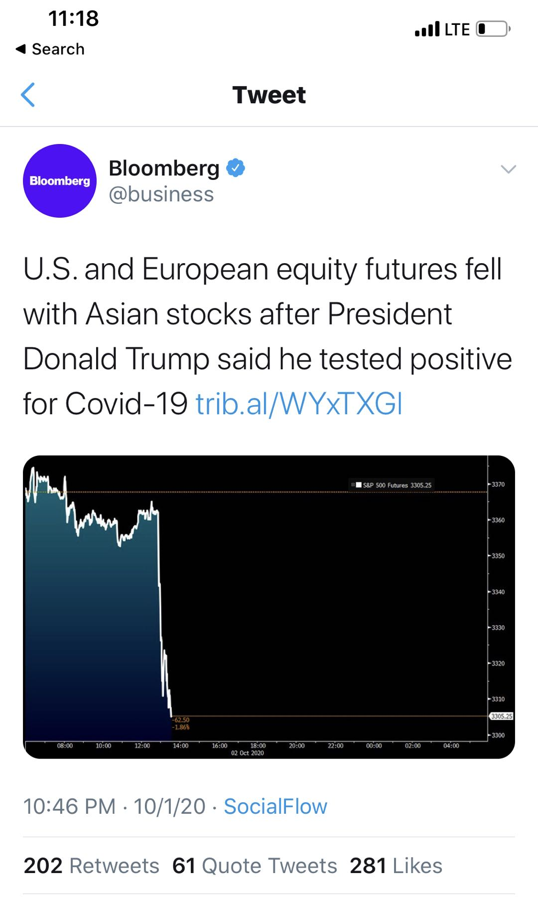

不过，如果川普的症状没有那么严重的话，川普应该会出来说话，来稳定民心，更重要的原因实际上是稳定市场。

川普本来就喜欢发推特，这段时间，他的推特应该会是大家关注的重点（其实一直是大家关注的重点）。甚至，川普可能会做一场电视演讲，直播一把，表示自己挺好，大家放心。

 

但是，万一，川普的病情严重了的话，比如上了呼吸机，这就会使得川普无法继续履行总统的职责了。那么此时，就会触发**美国宪法的第 25 条修正案**。

这个修正案的作用，就是规定美国总统的职位由于各种原因出现空缺的话，应该怎么办。

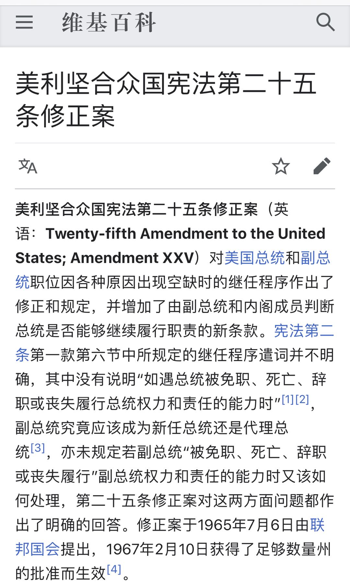

首先，如果川普的病症严重，但是意识还清醒的话，他可以引用第 25 修正案的第 3 款，向议院提交一份声明，说明自己无法履行总统的职责，并且将这个职责暂时移交给副总统，也就是彭斯。

当川普的病情缓解或者痊愈了的时候，他可以再向议院提交一份声明，说明自己已经可以继续履行总统职责了，要回总统的权力。

 

这个情况在美国历史上其实发生过很多次。

比如在 1985 年，当时的美国总统是里根。医生在对里根总统的一次体检中，发现了一个肿瘤。里根总统决定立即动手术移除肿瘤。手术期间，里根总统引用这一法案，暂时将总统权力移交给了当时的副总统：乔治.布什，也就是后来的第 41 届美国总统——老布什。

 

更有意思的是，在 2007 年，小布什执政期间，由于他要接受一次结肠镜检查，而这次检查需要全身麻醉，期间会失去意识。

所以，这个结肠镜检查期间，小布什无法胜任总统一职。于是小布什援引这条法案，暂时将美国总统的权利移交给了当时的副总统迪克·切尼。

迪克·切尼当了多长时间美国总统呢？答案是两个小时零五分钟。这次总统权力移交发生在美国东部时间 2007 年 7 月 21 日早上 7:16，在 9:21 的时候结束。

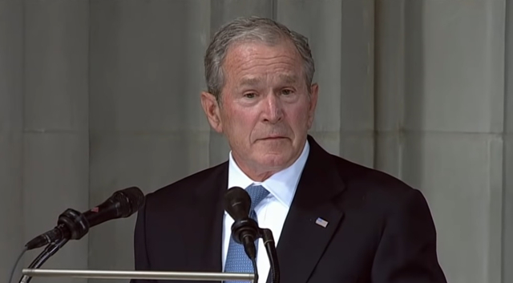

 

但是，如果川普总统的病情极其严重，使得他已经没有能力自主发起一个声明，来移交总统权力的话，第 25 修正案的第 4 款将发生作用。

此时，作为副总统的彭斯，可以主动向议会说明：当前的美国总统已经没有能力继续履行总统职责了，需要由自己担任代理总统。

 

我查到的美国历史上，这一项法案还没有被真正地使用过的记录。最接近的一次，是 1981 年 3 月 30 日，当时的里根总统，在哥伦比亚特区的希尔顿酒店门口被刺杀，紧急送入乔治·华盛顿大学医院进行治疗。

也就是著名的里根遇刺事件。

不过，当时的副总统老布什，正在乘坐空军二号，处于得克萨斯州的上空，无法引用这一法案。等到老布什飞回哥伦比亚特区时，里根的手术已经结束了，并且情况良好，所以也就没有必要再使用这一法案了。

值得一提的是，里根遇刺案的刺客：约翰·欣克利，后被法院裁定为精神失常，因此罪名不成立，被遣送精神病医院进行治疗。

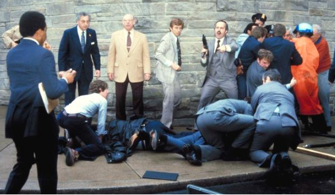

 

所以，不管怎样，如果川普真的这次情况危急，那么现在的副总统彭斯将会接手总统职责。

如果彭斯引用了第 25 修正案的第 4 款，那么就又在 2020 年创下了一项美国历史的记录。

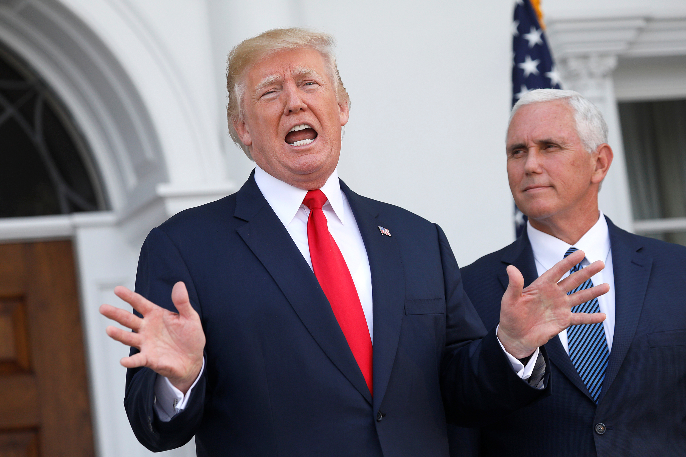

 

另外一点受关注的是：现在美国大选正在进行中，并且已经到了关键时刻，就剩下一个月的时间了。

如果川普真的无法继续参选了，那么现在共和党还有时间，提名一位新的美国总统候选人。

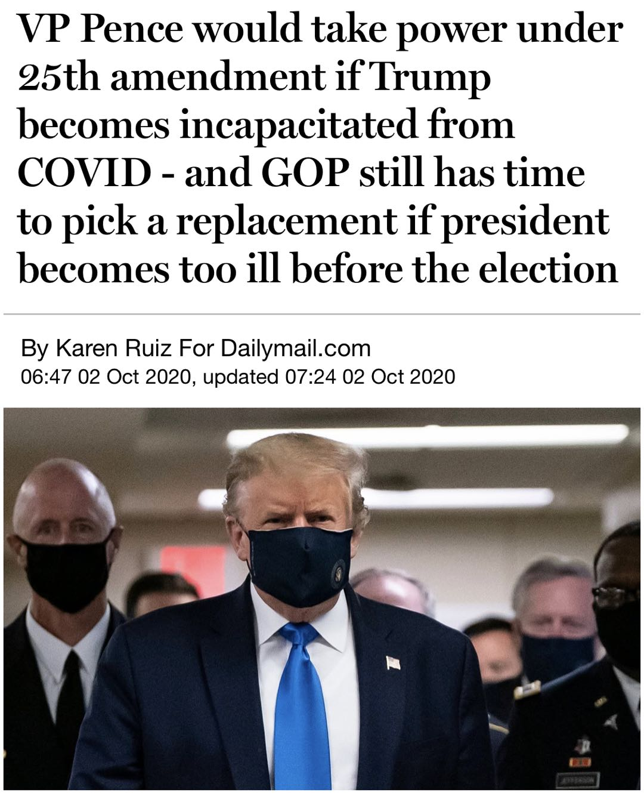

 

其实，除了川普总统，大家对这次总统大选的民主党候选人拜登，也是非常担心的。毕竟，拜登比川普年岁要大，今年已经 77 岁了，对新冠病毒来说，更易感。

而就在几天前，这两个人还在同一屋檐下唇枪舌战，进行总统辩论。这个过程，肯定不会戴口罩了。

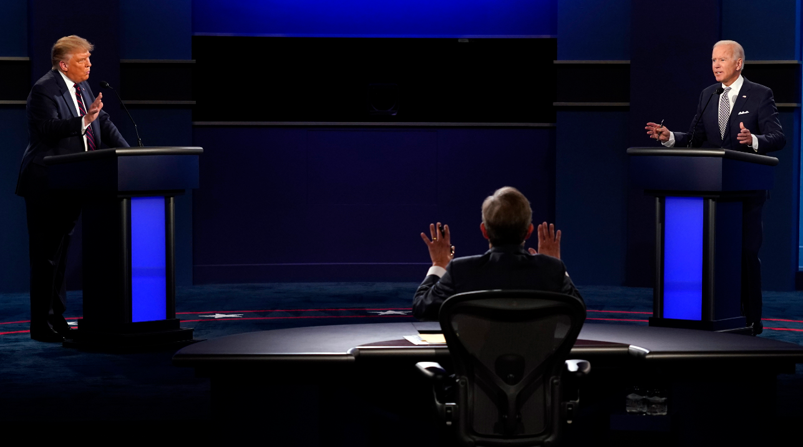

 

现在，川普总统已经证实感染了新冠，鬼知道在辩论的过程中，大家吐沫星子横飞，会不会致使拜登也感染？

反正漫画家们已经画出漫画了。

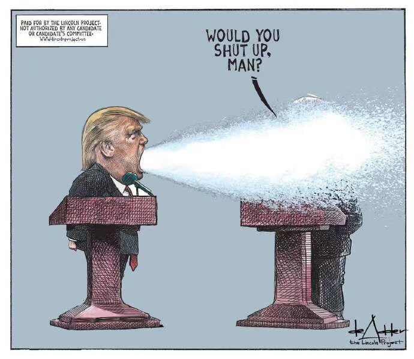

 

虽然道理上，如果两党的候选人无法继续竞选，两党可以提名新的候选人。但是，这种情况在美国历史上从来没有出现过，所以还是有可能会出现非常大的争议和问题。

尤其是在美国极度割裂的当下。

比如，今年的一个最大可能的争议就是：由于疫情的原因，很多民众会对前往投票站投票的安全表示担心，因此，会使用一种叫做“**缺席投票**”的方式，进行美国大选投票。

所谓的“缺席投票”，就是声明，在大选当天，选民因为各种原因，会不在现场投票（即缺席），因此，提前使用邮寄的方式进行投票。

在今年 9 月 4 日，北卡罗来纳州已经正式开始向申请“缺席投票”的选民寄送选票。据统计，今年北卡州有 75.8 万选民申请了缺席投票，是 2016 年的 20 倍之多！

那么，这么多选票已经投出去了，问题来了：如果川普不能继续参加总统选举，那些投给川普的选票怎么算？

是自动算给共和党提名的下一名候选人吗？如果这样，似乎不够合理，因为会有选民认为是投给川普这个人的，而并非共和党这个党派的；但如果废弃不作数，对共和党又不公平。

如果投票推倒重来，劳民伤财不说，对于选举的公平性，还是会产生很大的争议。因为毕竟只剩下一个月的时间了，选民对新的候选人，可能完全不了解。

这种情况在历史上从没有发生过。

 

不管怎样，比起什么微信或者 Tik Tok，这才是一次真真正正地影响美国国家安全的危机。

我只能说，2020 年实在太魔幻了。

好在，2020 年快过去了（还有三个月呢），大家一定要保护好自己呀！

**大家加油！：）**

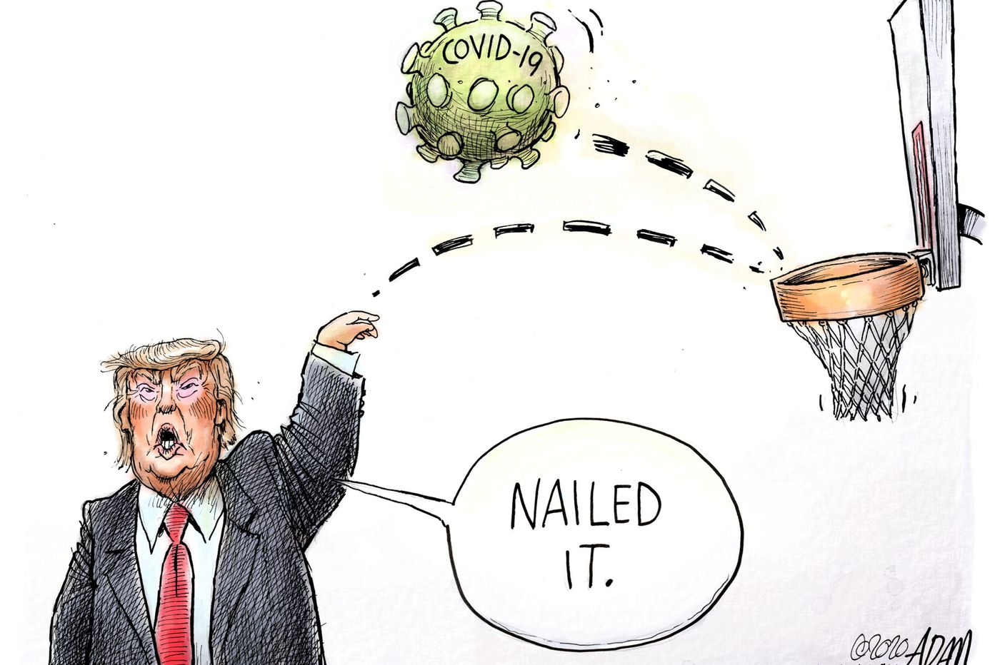

