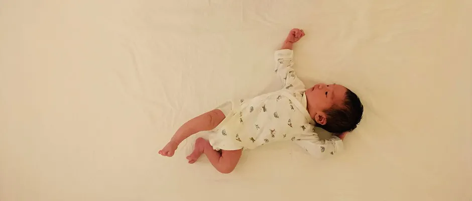
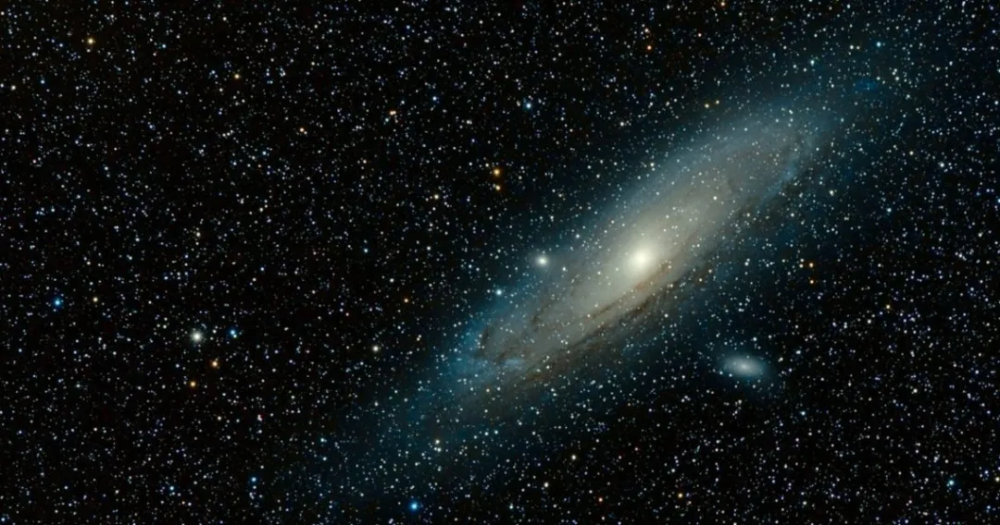
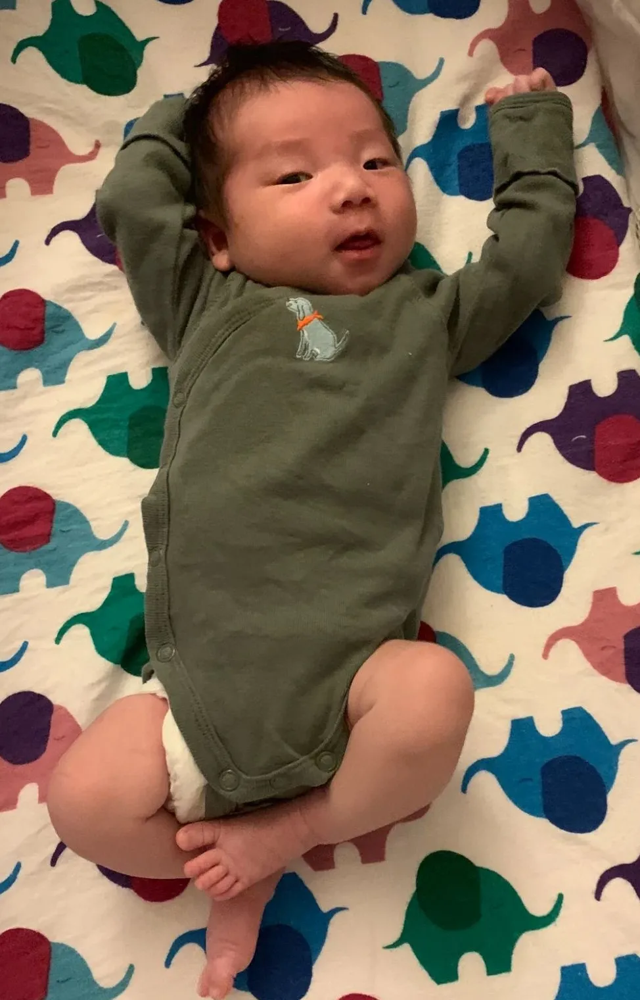

## 欢迎来到这个世界呀，小宇宙

你好呀，小宇宙。

写下这段文字的时候，你已经来到这个世界两周多了。在这两周多的时间里，我一直在仔细地观察你。但是我知道，你并没有在仔细地观察我。

你一直在观察这个世界，感受这个世界，还暂时顾不上我。毕竟，这个世界，和妈妈的肚子里区别太大了。

我想，是时候和你介绍一下这个世界了。

 

我是你的爸爸，我叫刘宇波。根据这个世界的风俗，你也姓“刘”。

但在这个世界里，一个人除了有姓，还要有名。姓代表着一个人的家族；名才真正代表这个人自己。

然而，你的中文名，爸爸妈妈还没有决定下来。实际上，对于你的名字，爸爸有很多自认为很不错的提议，但都暂时没有被妈妈完全接受。好在这件事儿并不着急，爸爸妈妈还有很长的时间可以帮你起一个中文名字。

但是，你的小名儿，爸爸妈妈早就帮你决定了，叫“小宇宙”。爸爸的名字中有一个“宇”字，本身就是“宇宙”的意思，所以顺理成章的，你就叫“小宇宙”了。

虽然很多时候，爸爸也被别人叫做是“波波”，所以，叫你“小波波”似乎更顺嘴一些。但爸爸还是决定叫你“小宇宙”，因为“小宇宙”还有另外一层意思。

在爸爸小时候，有一部很火爆的动画片，叫《圣斗士星矢》。在这个动画片中，有一个很重要的概念，就是小宇宙。

每个人的灵魂深处，其实都拥有着整个宇宙的能量；每个人的心中，都有一片属于自己的宇宙。这，就是小宇宙。如果你能够激发出自己体内的小宇宙，你将变得无坚不摧。

爸爸希望你将来，能够激发出属于自己的小宇宙。

 

你可能会问，那样，我就能无坚不摧了吗？

不不不，我的小宇宙。无坚不摧是一个充满童话色彩的词汇。我们谁都做不到无坚不摧。

我们都是凡夫俗子，血肉之躯，脆弱得很。这个世界充满了危险，能够摧毁我们的事物有太多太多。我们必须小心地保护自己，才能在这个世界生存。

你在长大的过程中，一定会看很多动画片，听很多故事，里面满是无坚不摧的超级英雄。他们拥有着各种超级能力，战无不胜。但是，那些都是骗人的。我们谁也不是超级英雄。

你以后可能还会喜欢扮演几个超级英雄，甚至发明出只有你自己才知道的，独一无二的超级英雄。你可能会穿上一件小斗篷，并坚信穿上这件斗篷的自己法力无边；你也可能会挥舞不知道从哪里捡来的树枝，并坚信自己御剑天下。

爸爸怎么知道的？因为爸爸小时候就是这样的呀。你的小脑瓜里，一定会在很多瞬间，认为自己无坚不摧。但终有一天，你将明白，那只是你的幻想。

你只是一个普通人，和你的爸爸妈妈一样。

 

我不知道你什么时候才能意识到这一点。但是，当你意识到这一点的时候，一定会非常的伤心难过。

那可能是你喜欢的小动物离开这个世界，你发现自己无论如何也无法把它唤醒的时候；

那可能是你发现自己无论如何都考不了满分的时候；

那可能是你追不到自己心爱的姑娘的时候；

你可能会大哭一场，但还是想不明白，这个世界为何是这个样子。

到那时，爸爸可能也会很难过吧。

但与此同时，爸爸可能也会很欣喜。

 

你可能会很奇怪，这有什么可欣喜的吗？

这当然值得欣喜啦！我的小宇宙。因为只有在那个瞬间，才是你真正开始认识这个世界的时候呀。

只有当你明白自己的普通的时候，你才会把你的大眼睛，从那些你迷恋的卡通片里的超级英雄中转移开来，认真地去看你身边的每一个普通人呀。

可能只有到那个时候，你才会仔细地观察爸爸和妈妈；仔细地观察你的同学和老师。

只有到那个时候，你才会开始明白，医院里的医生和护士；超市里的收银员；商店里的小姐姐；开火车飞机的叔叔；游乐场里那些可爱的卡通人物背后；以及电视里无论是主角还是反派，哪怕是一个名不见经传的小角色的扮演者，都是一个个像你一样的普通人呀。

但是，就是这些和你一样的普通人，构建了我们这个精彩的世界啊！而你，也属于这个精彩的世界呀。

只有到那个时候，你才会开始思索：自己到底是谁？自己到底要做什么？

只有到那个时候，你才会开始认真地寻找自己呀。

 

**寻找自己，这是爸爸对你唯一的期望呀。**

爸爸不指望你能赚多少钱，也不指望你能成为怎样的名人大家。爸爸只希望你能找到自己真正的热爱，并且有这份热爱一直陪伴。

即使你找不到自己的热爱，也没有关系呀。只要一直去寻找，就好了呀。

**谁说所有的寻找都要有结果？**去尝试，去挑战，去拓宽自己，去勇敢地面对自己。**寻找本身，就是一个人来到这个世界的乐趣所在呀。**

还记得你的小名儿吗？你是小宇宙呀。不断地寻找自己，就是在自己的小宇宙里遨游呀。

千万不要小瞧自己的小宇宙哦。还记得爸爸说的吗？我们每个人，都拥有着属于整个宇宙的能量；你的小宇宙里，蕴含着无限的可能呀。

更关键的是，只有不断寻找自己，你才能收获真正的平静，真正的自由呀；

只有不断寻找自己，你才能坚定地前行，无惧他人的目光，你才能在这个世界上无坚不摧呀。

 

你可能会问：爸爸，你不是说，我们谁都不能无坚不摧吗？

是的呀，我的小宇宙。但是这个无坚不摧，和那个无坚不摧，是两个意思呀。

你的小脑瓜一定糊涂了，明明是一样的字儿，怎么会是两个意思呢？

我的小宇宙呀，等你长大了，看到这篇文字的时候，或许你就明白了。

在此之前，爸爸妈妈会一直帮助你的。帮助你，在这个世界，寻找自己。

 

哈。爸爸看到，你已经被爸爸说困了。

此时的你，只要乖乖睡觉，就好啦。

希望你在睡梦中，已经开始在自己的小宇宙中，遨游啦。

我们一起加油呀，我的小宇宙：）

 

2020.10.23 凌晨，于 Santa Clara

liuyubobobo

