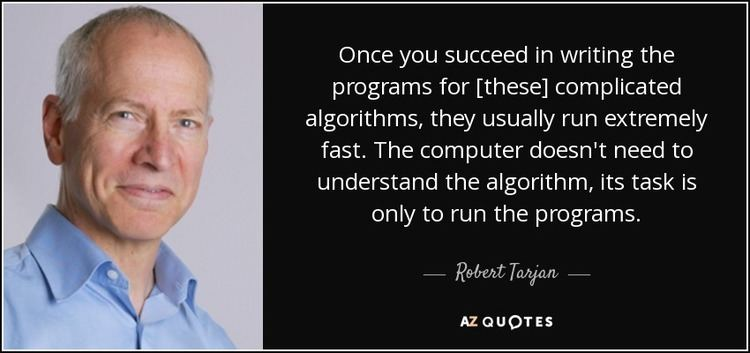
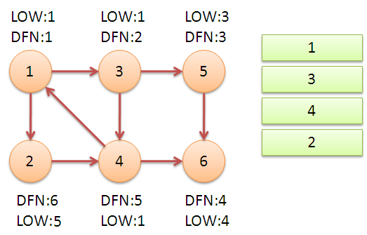
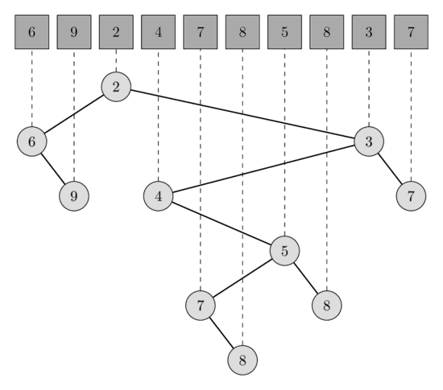
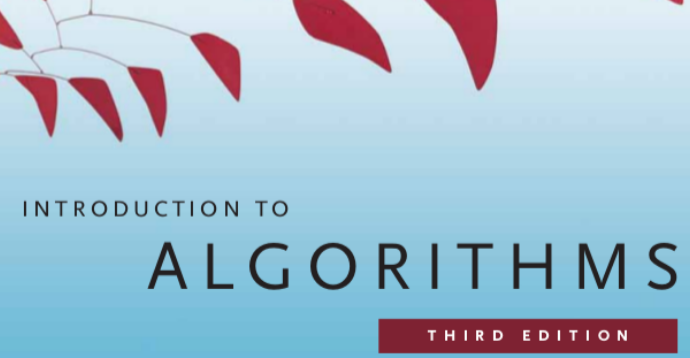
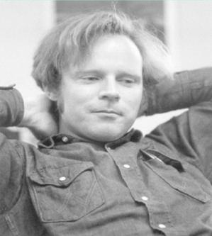
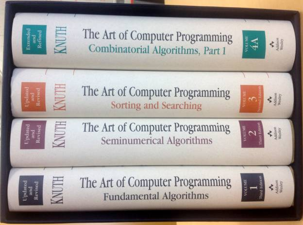

## Tarjan 这个大神

有同学在学习图论算法的时候，发现这里有个 Tarjan 算法，那里有个 Tarjan 算法，而似乎 Tarjan 算法解决的问题并不一样，于是非常迷惑：Tarjan 算法到底是指什么？

这是一个很好的问题。Tarjan 是计算机领域的大牛，发明了很多现在大家耳熟能详的算法或者数据结构，所以有同学会觉得冠他名字的算法有些多。

但如果我们仔细梳理一下，其实并不复杂。

在这篇文章中，我会带领大家梳理一下 Tarjan 发明的算法都有哪些，整体脉络是怎样的。

注意：在这篇文章中，我不会具体讲解某个算法的原理。但是，我会给出很多具体的关键字，并且标红。如果大家对某个算法想深入了解，可以以此为引，在互联网上搜索学习。

我相信，互联网上关于某个具体算法的资料是非常多的，反而是这样按照某个脉络做总结的文章很少。

---

 

首先，Tarjan 是一名美国的计算机科学家和数学家，全名 Robert Endre Tarjan。

先来一个 Tarjan 大神的名言镇楼：

 

一般提起 Tarjan 算法，通常是指 Tarjan 发明的求解有向图的强联通分量算法，全称是 **Tarjan’s Strongly Connected Components Algorithm.**

为什么这么叫？因为求解有向图的强联通分量还有一个著名算法：**Kosaraju 算法**。Kosaraju 算法也是以他的发明者的名字命名的。

我在算法比赛中，或者需要求解 SCC（强连通分量的缩写：Strongly Connected Components） 问题的时候，喜欢写 Kosaraju 算法。因为 Kosaraju 算法的实现非常简单，复杂度和 Tarjan 算法是一样的，都是 O(V + E) 的。

但实际上，Kosaraju 算法需要遍历两次图，而 Tarjan 算法只需要遍历一次图。所以，Tarjan 算法的性能更高，一般可以高 30% - 40% 左右。

而 Tarjan 算法之所以有名，关键在于使用 Tarjan 算法的思想，不仅仅可以求解 SCC 问题，还可以求无向图中的桥或者割点。

这就是为什么，很多同学看到 Tarjan 算法，做的事情不一样，但都叫 Tarjan 算法的原因。**我们可以把 Tarjan 算法理解成是一种思想**，基于这种思想，可以求解桥，割点，和 SCC 问题。

所谓的 Tarjan 算法思想，就是在遍历整个图的过程中，对每一个遍历的节点记录一个时间戳，通常被称为是 DFN；同时，记录通过这个节点，不经过父亲节点，最早能回到的时间戳，通常被称为是 LOW。通过这些信息，就能判断一个图的桥，割点，和强连通分量。

 

---

然而，Tarjan 的贡献远不止于此。以Tarjan命名的另外一个非常著名的算法，叫 **Tarjan‘s Off-line Least Common Ancestors Algorithm。**

这个算法本质是借助并查集，求解 LCA（最近公共祖先的缩写：Least Common Ancestors）问题。

实际上，**离线的 LCA 问题**，是计算机科学领域非常著名的问题，深究下去，和 **Binary Lifting，RMQ** 等非常著名的算法思想都有联系。

 

说到**并查集**，Tarjan 也和这种数据结构有不解之缘。并查集虽然不是 Tarjan 发明的，但是并查集的复杂度是 Tarjan 首先分析清楚的：也就是 **Ackerman 函数**的反函数。

如果对此感兴趣的同学，可以翻看《算法导论》，《算法导论》对这部分内容介绍得很清楚。

实际上，这也是《算法导论》这本教材的意义：稍微深入一些的算法分析问题，一般的算法教材都不会涉及。而《算法导论》所覆盖的深度和广度，比大多数教材都高太多。

当然，这也是《算法导论》不适合入门的原因。

 

说到数据结构，Tarjan 确实发明过数据结构。最有名的两个，一个是**斐波那契堆**，一个是 **Splay 树**。

Splay 树虽然不保证一定平衡，但各个操作的均摊复杂度是 O(logn) 级别的。

Splay 树最大的优势是实现简单，比红黑树简单不知道多少倍。所以，如果我们需要调用更加底层的树操作，需要自己实现一个自平衡的二分搜索树时，通常 Splay 树是首选。

也正因为如此，很多搞竞赛的同学，都是能手写 Splay 树的。

 

Tarjan 还是非常著名的算法：**BFPRT** 的作者之一。其实 BFPRT 这个算法的名字，是其五个作者首字母的缩写。其中的 T，就是 Tarjan。

BFPRT 这个名字听起来非常拗口，同时也难记，但是它的另一个名字就很简单直接了，就是 **Median of Medians**。

这个算法整体并不难理解，是快排思想的一种更稳定的优化，每次近乎可以保证选取所处理的数组的中位数作为标定点（pivot），使得快速排序的最差时间复杂度真真正正达到了 O(nlogn)。

 

值得一提的是，BFPRT 算法的这五位作者，都是计算机科学领域的大牛。他们分别是：

**B** 是 Blum，全名 Manuel Blum，他因为复杂度理论方面的贡献，以及密码学的应用，获得了 1995 年的图灵奖；

**F** 是 Floyd，全名 Robert W. Floyd，相信大家都很熟悉。大家在算法课本上一定会学到的**所有点对的最短路径算法**，就是他和 Warshall 一起提出的，即 **Floyd–Warshall 算法**。同时，Floyd 还提出了非常著名的 **Floyd 环检测算法**。他获得了 1978 年的图灵奖；

**P** 是 Pratt，全名 Vaughan Pratt，是斯坦福的教授；

**R** 是 Rivest，全名 Ron Rivest。他是 MIT 的教授，专攻密码学。我们现在所经常使用的 **MD5 算法**，他就是作者之一；

最后的 **T**，就是这篇文章的主角：Tarjan，全名 Robert Endre Tarjan。

 

在图论领域，Tarjan 还改进了一个非常著名的算法：**最小树形图**。最小树形图这个名字听起来很复杂，但其实这个概念很简单：就是**有向图的最小生成树**。

解决最小树形图问题，有一个非常朴素的算法，叫**朱刘算法**。听这个名字大家也知道，这是两位华人科学家首先提出来的算法，在论文记载中，分别是  Y.J. Chu 和 T.H. Liu 在 1965 年提出来的。朱刘算法的时间复杂度是 O(VE) 的。

后来，Tarjan 改进了这个算法，可以使用 O(ElogV) 的时间做预处理，之后使用 O(V) 的时间，求解图中以任意顶点为根的最小树形图。

 

Tarjan 还发明了一种平面图的检测算法，首次在线性时间解决了**平面图检测问题（Planarity-Testing）**。因为平面图检测离大多数同学的工作比较远，所以可能很少有同学了解这个算法。

Tarjan 的平面图检测算法还有一个合作者：John Hopcroft。他们二人因为这个算法，以及在算法和数据结构等基础领域对计算机科学的贡献，获得了 1986 年的图灵奖。

 

Tarjan 的硕士和博士是在斯坦福大学读的。他的导师有两个。一个就是大名鼎鼎的 Floyd，上文介绍 BFPRT 算法的时候介绍了。在这里给一个年轻的时候，Floyd 风流倜傥的帅照：

 

Tarjan 的另一名导师，则是计算机科学领域的神级人物：Donald Knuth。他可以说是计算复杂领域的创始人。

Donald Knuth 的经历和贡献，可以写一本书了。有时间，我会再写一篇文章介绍他。现在，很多人了解他，都是因为他的神作：TAOCP，即 **The Art of Computer Programming，被中文翻译成《计算机程序设计艺术》**。这套书被评为至今计算机科学史上最重要的神作，但其实还没有写完。

不过 Donald Knuth 对计算机科学领域的贡献，远不止一套书这么简单。要聊 Donald Knuth 的话，能聊的就太多。这篇文章我们收一收，说回 Tarjan。

 

Tarjan 现在还在世，今年已经 72 岁了。根据维基百科，现在 Tarjan 在普林斯顿任教。

实际上，在计算机科学领域，很多在教科书中出现的人物，都还在世；很多教科书级别的算法，概念，理论，其实距离提出，也不过是几十年的时间。

这足以可见：**计算机是多么年轻的一个学科。**

也正是因为这个原因，在计算机科学领域中，还有大量的没有被完全解决的问题。

**计算机科学领域其实还大有可为。**

最后贴一下 Tarjan 老爷子的帅照。

**大家加油！：）**

