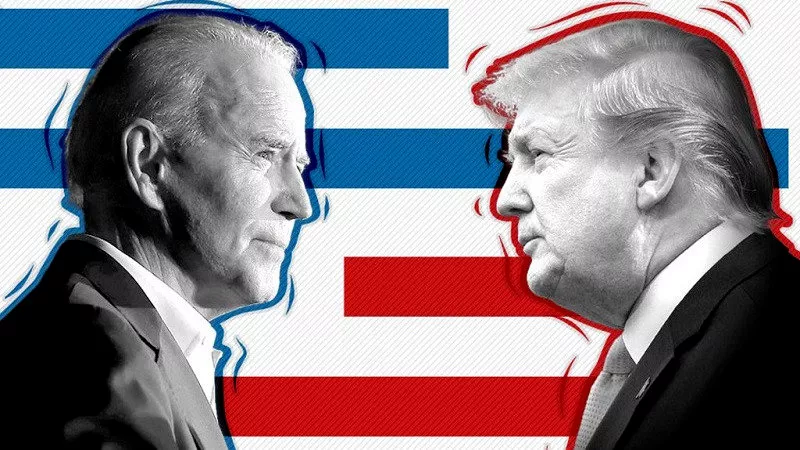
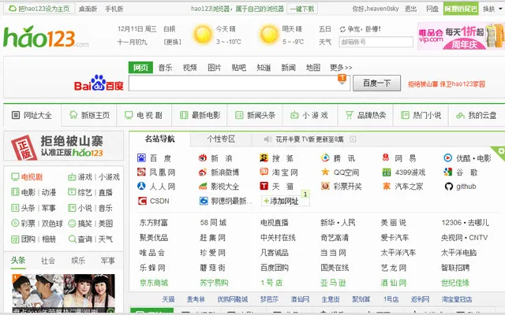

## 换个角度思考问题

我的前投资老板有一个电报群，这个群里的人大多是他的朋友，以海外华人为主。

这个群在过去的一个星期，不出所料地打了起来。原因自然是美国大选。

实际上，因为我的前投资老板人在澳洲，所以这个群里的大多数人都在澳洲。他们再怎么打，也对美国大选没有半点影响。

群里只有少数人在美国，但我估计，还有很多人并没有投票权，比如我。

所以，这么一群人因为美国大选吵得面红耳赤，我觉得挺好笑。

我的前投资老板认识的朋友，社会阶层普遍不低。受教育程度即使因为时代原因偏低一些，但也绝对是同龄人中的榜样。无论是积累的财富，还是眼界，都是中等偏上。

这么一群人，面对美国大选产生的意见分歧，吵出来的内容，竟然和我在网上绝大多数地方见到嘴炮儿没什么区别。这让我觉得好笑，同时也有失望。这也让我再次深刻意识到，遇到一个和我的前投资老板一样的人有多么地难。

为什么这么说？我最佩服我的前投资老板的，是他看待问题的“理性”。

 

什么叫理性？我不知道这个世界上有没有关于这个词的严谨定义。但如果让我给理性下定义，就是**能够从不同的角度看待同样的问题。**

如果你去仔细观察那些“煽动人心”的“非理性”的言论，就会发现他们有着出奇一致的共同点：**他们只是站在自己的立场拼命呼喊，却看不见对方的观点。**

比如有人说，美国大选中，民主党肯定作弊了！从川普选前集会的阵势就能看出来！

川普的集会人山人海；而拜登选前的集会，参与的人少得可怜！这么直接的证据，还不能说明问题吗？

但是他们却忽视了，拜登的支持者，大多对待疫情的态度是严格保持社交距离，尽量避免集会。所以拜登选前的集会看起来没那么热闹。

而拜登支持者的这一风格，甚至延续到了大选投票上。川普的支持者都积极地前往投票站亲自投票，而拜登的很多支持者由于顾及疫情，选择了邮寄投票。这也就是为什么在统计邮寄选票之前，川普遥遥领先，但是当开始统计邮寄选票的时候，拜登反超了回来。

我并不是说这场大选绝对没有问题。我只是说，现在发生的一切，并没有那么奇怪，合理的解释就在眼前，一点儿都不难理解。

仅仅通过选前集会的阵势来佐证大选舞弊，是不理性的。

当然，川普的支持者有权利怀疑民主党舞弊。大选舞弊是一个很严肃的指控，**我坚信川普的团队比任何人都更有动力，也更有资源，通过正当的法律途径，来揭示出大选中可能存在的问题。**

而通过法律途径解决问题，是最有效的。

注意，我并没有说通过法律途径，一定可以解决问题。但以我对美国的理解，如果这件事情无法通过法律解决的话，通过其他途径更难解决。

至少两边在社交媒体上疯狂对骂是肯定没有帮助的，除了加深美国的割裂。

 

在我看来，现在很多人都在讨论的，所谓的美国的割裂，一个重要的原因就是，能够站在对方的角度思考问题的人太少了。

两边的人都深陷在自己的立场中无法自拔。铁锈一带的低收入劳动者无法想象如果自己是出生在大城市的精英家庭，观点是否会发生改变；大城市的精英也无法想象如果自己出生在破败的铁锈一带，是否观点会发生改变。

从这个角度，我非常喜欢看一些有责任感的社会学家，抛开主观的政治偏好，认真地去分析当下割裂的美国，各个族群，各个阶层，各个行业的人们，他们的所思所想，以及为什么会逐渐产生这样的变化。

当我们抛开自己的立场，站在自己的对立面去认真思考的时候，理性的光辉就出现了。

只可惜，这样的人太少了。

 

**如果我的出身是这样的，或者如果我的境遇是那样的，我的观点是否会产生改变？**这是我的前投资老板经常引导我思考的问题。

因为我们当时的创业项目需要采访很多传统行业的企业，比如农业从业者；比如三四线城市的食品厂，服装厂；比如那些营业额可能还不如大城市里打工族一年工资高的小微企业；等等等等。

初次面对这些行业的人时，我对他们的很多想法，做法，都充满不解。但是，一旦我深入了解他们的生活，开始思考，如果我是他们，我会怎样的时候，大多数不理解都会变为理解。

在当下，很多所谓的精英人士崇尚“功利主义”，不认为这种理解对自己有任何帮助。我的前投资老板告诉我，**即使你的目的不是追求更平和的内心，这种“理解”背后也蕴含着巨大的机遇。**

 

我不知道现在是不是还有同学了解 hao123。这在当年是一个简单的不能再简单的导航网站，2006 年，百度却花了 5000 万收购了这个网站。

14 年前的 5000 万，放到现在也是几个亿了。

当时，很多互联网人不理解，这么一个“破”网站，一个“农民”就能做出来，凭什么值那么多钱？而事实是，正因为那些“精英互联网人”不是“农民”，不理解“农民”的需求，所以他们永远也做不出 hao123 这么“简单”的网站。

这个解释，放到后来出现的种种互联网“怪象”上，同样成立。比如拼多多；比如快手；比如土豪在“破游戏”上动辄几万元的消费；比如多到令人咋舌的直播打赏。

 

在我看来，换个角度去思考问题，不仅仅可以用来理解不同人群之间的观念和生活状态，作为技术人，也可以用来观察技术的世界。

比如，前一阵子有个新闻挺火。在一场苏格兰的足球比赛中，转播比赛的摄像头使用 AI 技术自动跟踪足球。结果，在比赛过程中，AI 一度错误地把边裁的光头辨识成了足球进行跟踪。

电视机前的观众因此看了半天光头裁判跑来跑去。

很多人因此高呼，AI 一点儿都不靠谱，AI 被人们高估了。

但是，大家有没有想过，因为这次事故，电视台或者足球俱乐部，是更大概率的从此不再使用这个 AI？还是吸取这次事故的经验教训，更多地测试，实验，以方便未来更多地使用这种 AI？

这次事故到底是 AI 的终结者？还是仅仅是 AI 发展道路上的一个小插曲？

 

再比如，更早之前，美国有个新闻很火，大意是，美国某警局全面改用特斯拉作为警车。结果在一次高速公路的追捕过程中，执行追捕任务的特斯拉警车由于没有事先充满电，追捕到一半没电了，只能目送肇事车辆逃之夭夭。

面对这个事故，很多人抑制不住地嘲讽特斯拉。但是，大家有没有想过，难道汽车就不会因为没有加满油，而追捕到一半没有油了吗？当年汽车刚刚出现的时候，是不是马车车夫们也会这样嘲笑汽车？

 

对于这些问题，我并没有说哪个答案一定是正确的。我只是想说，**当我们换一个角度去思考问题的时候，往往能看见事情的另一面。**

 

类似这样的问题非常非常多。

比如，一个你认为很简单的问题，会不会实际上很难？不然，为什么有那么多老板能说出“给你 2000，做个淘宝”这样的话？

比如，一个你不看好的技术，真的那么不堪吗？区块链只能用来产生加密币“骗钱”吗？如果是这样的话，为什么 Amazon 上有那么多专门介绍区块链技术的书籍？我国为什么要测试数字人民币？

PHP 真的死了吗？而那些所谓的高大上的语言，比如 LISP，被称为是“上帝的编程语言”，为什么实际应用却那么少？似乎还不如一直被程序员们嘲笑的 PHP？

有些所谓的成熟的技术，真的成熟了吗？

那为什么到现在，新的语言依然层出不穷？比如 go，比如 rust，比如 Kotlin，Swift，比如 TypeScript；为什么新的数据库技术层出不穷？比如 MongoDB，比如 Redis，比如 PostgreSQL，比如 HBase 或者 Splunk？

而那些所谓的前沿技术，真的那么前沿吗？

比如 AI。深度学习的流行已经有小十年时间了，在这段时间里，AI 技术的发展有质的变化吗？AI 技术的应用领域有数量级的扩展吗？为什么马斯克不停地说 L5 无人驾驶很快就会出现，却一直没有出现？

再比如，一个已经存在已久的产品需求，真的没有市场了吗？那为什么笔记这么简单而又朴素的需求，近乎所有的手机系统都内置笔记软件，印象笔记曾经占据了笔记市场大半江山。在 2016 年，一款叫做 Notion 的笔记软件，再次流行起来，甚至席卷全球？

对于这些问题，我都没有答案。我也不站在某一方。

我只是想说，很多时候，看起来很显然的问题，或许没有那么显然。

换一个角度思考问题，或许会看到事情的另一面。那比不断站在自己的立场和别人吵架，有意义得多。

**大家加油！：）**

