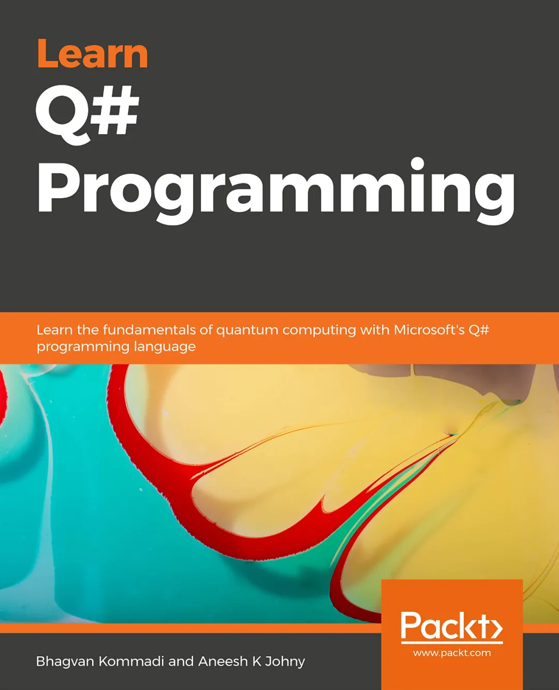
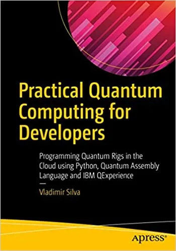
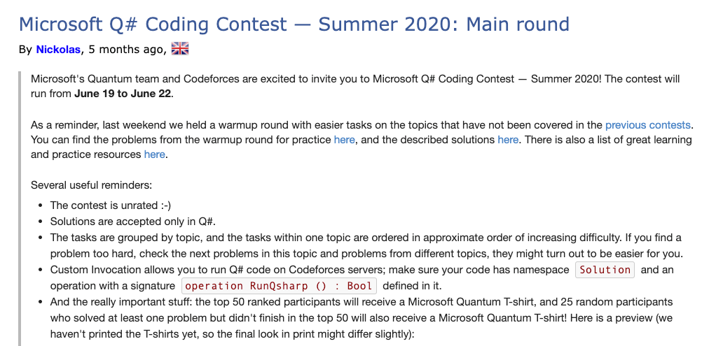
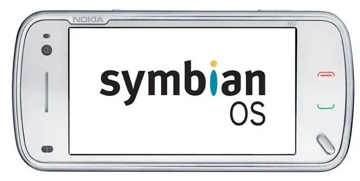

## 如果明天量子计算机量产

这是在我的知识星球上，一个同学问我的问题。

请问波波老师，如果明天量子计算机量产，那么我们现在学习的数据结构、算法，还有用吗？编程语言会怎么样？

 

---

**bobo 老师的回答：**

如果明天量子计算机量产，现在学的数据结构，算法，还有用吗？

我敢非常肯定地告诉你：还有用。但于此同时，也会有更多新的算法出现，或者旧的算法思路，根据量子计算机的特性被重新实现。

你知道《算法导论第三版》和《算法导论第二版》最大的区别是什么吗？

最大的区别，就是《算法导论第三版》增加了全新的一章，介绍并行算法。

但全书 95% 的其他主题，是没有变化的。**深入理解并行算法的基础，是把串行算法的概念学好。**

 

至于编程语言，近乎一定会有新的基于量子计算机体系结构的语言出现。实际上，现在已经有量子编程语言 Q# 了。

虽然量子计算机还一点儿都不普及，但我们完全可以使用软件模拟量子计算机的工作原理，来开始设计，学习量子编程语言。

甚至，教材都有了。还不少。随便来两个封面。

 

在 Codeforces 上，微软也已经赞助了好几场基于 Q# 的编程竞赛了。要是有兴趣，可以找来看一看。

 

但实际上，这个问题**假设性太强**。因为量子计算机不可能明天量产。

**所有的新技术，从出现，到最终成熟、规模化，都是需要时间的。**

在这段时间中，慢慢的，和这个新技术相关的配套设施，从软件，到硬件，到教育环境，社会环境，大众的接受度，都是逐渐成熟的，而不会产生突然性的变革。

在这段时间里，所有相关从业人员可以慢慢适应，但不会大家突然都失业。当然，如果几年过去还不能适应的人，就会被时代淘汰。

所有的“突然性的变革”，都只是出现在历史评论中的。站在回看历史的角度，好像一下子人类就进入了新时代。但置身其中，永远是一个渐变的过程。

毕竟回望历史，别说几年十几年，100 年都弹指一挥间。

我在我的公众号文章[《如果真的学习人工智能》](https://github.com/liuyubobobo/ai-learning-roadmap)中，列举的很多科目，在十年前根本不是计算机科班必修，比如并行计算基础，比如机器学习基础。但随着并行计算，机器学习越来越发展，已经慢慢成为了计算机专业的必修课程。

同时，一些比较老的课程，也会随着行业成熟，慢慢不再需要所有人学习。比如数值分析，比如模拟电路，甚至可能以后汇编都不是科班必学，但某个量子计算的语言却是必学的。这就是时代在发展，社会环境在跟着演进。

 

至于现在学习的知识，完全没必要害怕它没用了，**越内功的知识越不怕。**当然，我们也不能指望着靠现在的知识吃一辈子。

放心，当量子计算机真的普及，量子计算真的有巨大的市场红利的时候，**最先吃到这波红利的，绝对是当下计算机行业，或者互联网行业的老鸟。**

我认识几个以前搞塞班开发的开发者。为了防止有的同学不知道什么是塞班，多说一句：塞班是之前诺基亚手机的操作系统。后来，随着诺基亚的没落，塞班开发也越来越“没用”。2013 年，塞班正式停止发展。

那这些塞班开发者，就失业了吗？被时代淘汰了？从此人生一蹶不振了吗？

才不是呢。

实际上，正因为有着“超前”的移动开发经验，这些人恰恰是最早拥抱 iOS 开发，享受 iOS 开发市场红利的人。后来，因为移动端发展的迅速，他们才是时代的幸运儿。

**大家加油！：）**