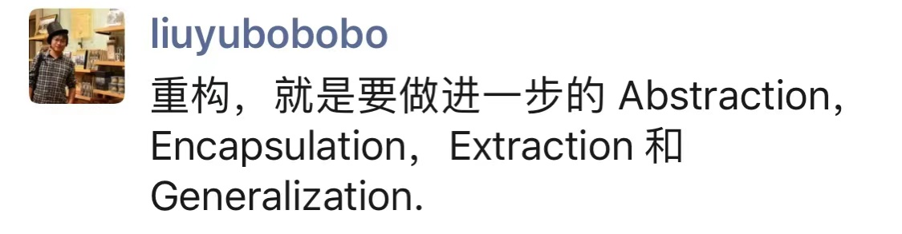

## 程序员凡学指南

周末了，来篇轻松的。

最近“凡尔赛文学”非常火。我一看，就是不经意地炫富呗。

炫富咱不会，毕竟咱不富。但是作为一名技术人，低调地炫耀自己的技术水平，咱懂。

不要问我为什么懂这个技能。每个创过业，拉过投资，需要在外行人面前侃侃而谈，假装自己技术很牛逼的人，都懂。[手动狗头]

在这篇文章里，我给大家分享一下我的独家秘诀。拿走不谢 [手动狗头]

免责声明：以下秘诀请根据自己的情况酌情谨慎使用。他们对不同的人群效果是不同的，甚至有的时候会起到反效果。[手动狗头]

另外，本文将大量使用狗头保命。[手动狗头]

 

---

**1，用英文。**

比如这样：

如果说成是：重构，就是要做进一步的抽象，封装，提取和一般化。效果大打折扣 。

另外，选择什么词用英文表述很重要。

太朴素的词语，比如非要把人工智能说成是 Artificial Intelligence；非要把算法说成是 Algorithm；非要把数据结构说成是 Data Structure，会让人觉得太装。

这些相对具体的名词，直接使用中文，效果更好。**请选择把比较抽象的词换成英文** [手动狗头]

 

**2，来不来就直指某个技术的“本质”**

比如这样：

对了，忘了说了，这四个词是我在维基百科上查“重构”这个词条以后，随便选的四个词，所以，和重构的本质没啥关系 [手动狗头]

在大多数情况下，不会有人质疑。毕竟，“本质”其实是很主观的概念。

甚至，你说：X 的本质是 Y。X 和 Y 之间的关系甚微，也没有关系。只要足够高大上。比如：

前面的两个词和后面的四个词，有关系吗？Who cares。看起来好像有点儿道理就行了 [手动狗头]

这里对第一条补充一点，能用英文缩写的地方，请使用英文缩写。[手动狗头]

 

**3，在指出“本质”前，进行一定的批判**

即使你的批判毫无道理，也没有关系。比如这样：

这个批判就毫无道理。我从来没有见过任何人认为“重构”就是“重写” [手动狗头]

但这句话一旦有了批判性，似乎就显得思考的很深刻。

 

再比如：

顺便悄悄说一句：**批判一个新东西并不是什么新东西，是一种常见的批判手法。**

毕竟所有的新东西都肯定有旧东西的影子，所以这个批判方式永远不会错 [手动狗头]

 

**4，随手配张图**

图多简单都没有关系，比如这样：

相信很多同学都看出来了，这个图毫无道理。

懂这些概念的同学就知道，IaaS 和 FaaS 画一个交集根本没有逻辑。但这不重要，画上去，就好像很厉害的亚子。[手动狗头]

 

**5，引用一篇论文**

即使引用这篇论文并不是必须。比如：：

请注意，这段话完全是胡扯。人工智能和计算复杂理论没啥直接关系；NPC 问题和 NP-Hard 问题的边界这样的说法也是鬼扯。

但这不重要，糊弄外行人足够了 [手动狗头]

敲黑板敲黑板 👨‍🏫请体会我在这段话中使用的各种综合技巧。包括：

引用论文；特殊的名词用英文；高大上的缩写；带有一定的批判性；还装模作样配了一幅图 [手动狗头]

 

**6，最后，基础我的大杀器！**

那就是，对于所有的技术，问一句：**能不能 scale？**

比如：

不要问我什么是一个语言的 Scalability！我也不知道！

但是这个问题在技术的世界里，只要问出来，听起来似乎就有点儿道理。[手动狗头]

 

再比如：

不要问我什么叫一个芯片能不能 scale！我也不知道！但是这么问就行了 [手动狗头]

 

最后，听说经常这么反思的，别管真的假的，都升职加薪了。

下次你可以试试看？这么写，看看老板会不会点赞？[手动狗头]

 

你学会了吗？

**大家加油！：）**

 

**免责声明**：使用本文的秘诀编写自己的朋友圈，产生任何负面效果，后果自负。

