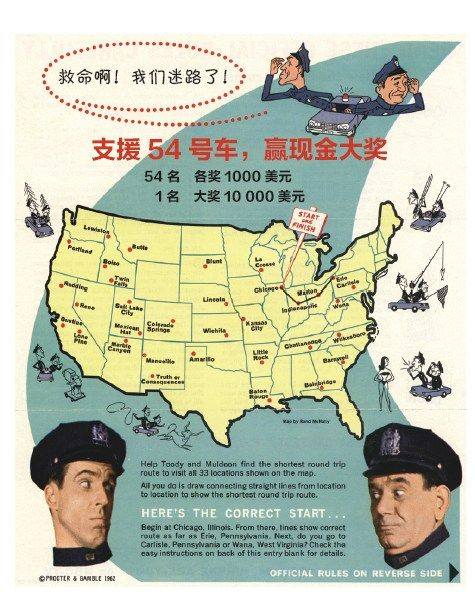
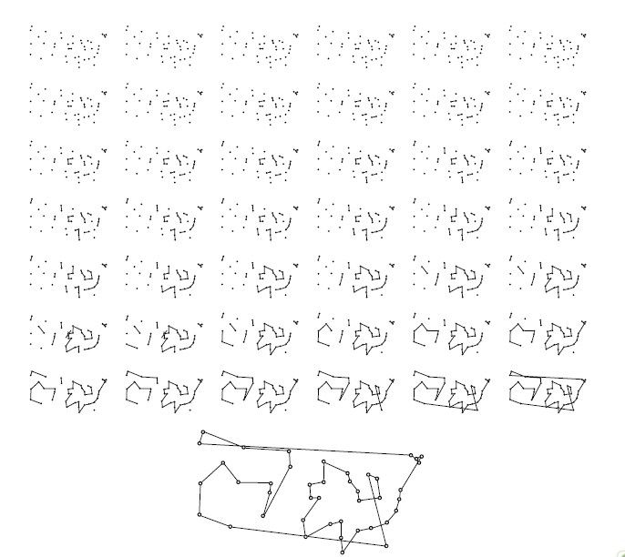
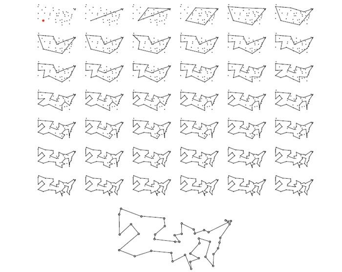
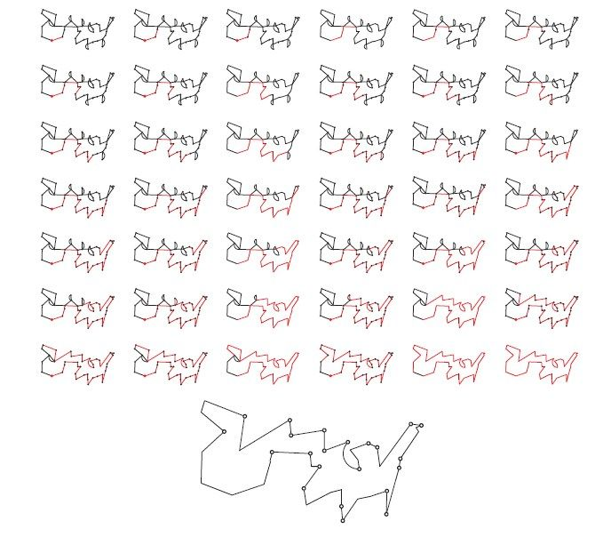

## 旅行售货员问题背后

有同学问我，bobo 老师，TSP 问题怎么解决呀？

我说，哇！这个问题好高级！

 

TSP 问题全称是 **Travelling Salesman Problem**，中文翻译成是**旅行销售员问题**。

这个问题的描述非常的简单：地图上有 n 个城市。每两个城市之间的距离是已知的。让你求出经过所有城市，并且回到出发点的最短路线。

别看这个问题描述起来非常简单，但是实际解决起来却非常难。

最直观的想法就是：枚举所有的旅行路线，找到其中的最短路线。可惜，这样做，时间复杂度是指数级的。

如果你的地图中包含有 33 个地点，则总共的旅行路线有 263130836933693530167218012160000000 这么多。

这个数字是什么概念？就算现代计算机可以在 1 秒钟内，计算出 100 亿条路线的长度，那么要枚举这么多可能性，也需要 830000000000000000 年，即 83 亿亿年。注意，有两个亿，是 8.3 * 10^17 年。

天文学家估算：整个宇宙从诞生至今不过 138 亿年，而整个宇宙可能会在 1400 亿年后毁灭；其中太阳的年龄大概 50 亿年，而太阳可能还有 50 亿年就会毁灭；至于地球，可能只有 10 亿年的时间了。

可是，和 83 亿亿年这个数字相比，这些天文数字都显得不值得一提了。假设宇宙的总寿命是 2000 亿年，那么用枚举法计算包含有 33 个城市的旅行售货员问题，大概需要有 400 万个宇宙诞生又毁灭的时间。

 

为什么我举例说 33 个城市？

因为，1962 年，保洁公司发起了一个活动，叫“支援 54 号车，赢现金大奖”。这个活动就是希望参与者可以解决一个包含有 33 个城市的旅行售货员问题。活动的奖金高达 1 万美元。

1 万美元在那个年代，足以买下一个房子。

我们甚至可以找来当年这个活动的海报。

 

如果你认为 TSP 问题只是数学家们的游戏，那就大错特错了。实际上，旅行销售员问题有巨大的用武之地。

最直观的，解决这个问题，可以用来做路线规划。小到餐厅送餐，邮递员送货；大到工业运输辗转在几个城市之间的路线规划，背后都是旅行售货员问题。如果我们能高效求解这个问题，整个社会的运转效率都会大幅度提升。

马里兰大学的研究小组曾经因为一个海洋项目深入的研究这个问题。因为他们在美国的切萨皮克湾，有大约 200 个监测站，用来监测海洋生物的活动。每次收集这些监测站的数据，就是一个 TSP 问题。他们起初因为每次出海时间太长，无法在特定时间内完成对所有检测站的监测，转而去求解 TSP 问题。

美国老牌石油巨头美孚石油，在更早的时候，也曾遇到类似的问题。大概在 20 世纪 30 年代，美孚石油在一片海域有 47 个采油平台。如何规划路线，使用更少的成本遍历这些石油平台，进行相应的检测和维护，就成为了一个重要的问题。

 

TSP 问题不仅仅出现在路线规划上，更在一些高科技领域，有着出人意料的应用。

比如在生物学领域，我们有若干的基因片段。我们可以计算出这些基因片段之间的相似程度。此时，如果我们把每个基因片段看做是一个城市，把基因片段之间的相似度看做是距离，那么，求解出从一个基因片段出发，经历所有基因，达到另一个基因的最短路径，就可以帮助我们找到这些基因片段在变异过程中的时间顺序。

这其实是一个典型的把问题抽象成图论问题的过程，而 TSP 问题恰恰是图论领域最重要的问题之一。

再比如，美国宇航局也需要求解 TSP 问题。因为空间站上的空间望远镜，需要观测不同的行星。而空间望远镜调整一次角度和方位，都会消耗巨大的能量。那么如何选择观测顺序，把所有的目标行星都观测到，同时损耗的能量最小，就是一个 TSP 问题。

类似的问题也出现在工业制造领域。比如工业制造中，我们需要在一块电路板中钻孔。如何依次打出这些小孔，使得钻头的总移动时间最短，就是 TSP 问题在现代社会的一大经典应用。

类似的问题不仅仅出现在电路板制造上，在芯片制造，工艺品制造，玻璃切割，等等诸多工业领域，都有着类似的问题。

 

说了 TSP 问题的这么多应用，可是我之前又说，解决一个 TSP 问题，需要的时间过长。那怎么办呢？

欢迎来到真实的算法世界。

在大多数时候，我们在书本上学习的经典算法，都能完美解决“最优问题”。比如“最短路径”，“最小生成树”，“取得整个数据的最大值，最小值”，等等等等。

但是，在实际生活中，很多问题，我们无法在有限资源下找到最优解。TSP 问题就是最好的例子。

怎么办？

答案是：退而求其次，去**寻找次优解**。

以 TSP 问题为例，我们无法找到最优路线，那我们就尝试去寻找一条相对比较短的路线。总长度越小越好。如果我们可以在有限的时间里，找一条尽量短的路线，也足够我们实际应用了。

顺着这个思路，大家将来到一片全新的算法领域。在大多数时候，这些算法是被人工智能这个学科所涵盖的。注意，是人工智能，不是机器学习。机器学习只是人工智能的方法之一。

完整阐述这算法的原理，已经可以写厚厚的一本书了。在这里，我只是随便说一些关键字。

 

求解近似解，最普遍的方法，就是使用贪心算法。

学习计算机专业的同学应该都了解，大多数问题由于不具备贪心性质，所以使用贪心算法不能得到最优解。但是，贪心算法确实可以帮助我们得到一个解。在很多时候，这个解还不赖。

对于 TSP 问题，我们可以像 Kruskal 最小生成树算法一样，每次只取最短的边，中间遇到不能形成解的边，就扔掉。

下图展示了对于一个规模为 42 的图，使用贪心算法可以得到的解。

 

另一类通用算法，就是**启发式搜索**。

所谓的启发式搜索，就是在搜索过程中，先搜索更有可能得到最优解的方式。这将更大概率地尽量早地找到一组更优的解，从而使得在后续搜索中，可以直接把另外一些搜索的选择扔掉。这叫剪枝。

启发式搜索是一大类算法的总称。这类算法的代表，就是大名鼎鼎的 **A* 算法**。

通过启发式搜索这个描述，大家也能看到，解决问题的关键是：如何定义“更有可能得到最优解的搜索路径”？这个定义没有一般性的方法，要具体问题具体分析的。通常，这被称为是**启发函数**。

实际上，A* 算法不是唯一的启发式搜索算法。**爬山法，模拟退火法**，其实都是启发式搜索。有些同学可能在机器学习中接触过这些算法，用来最小化损失函数。而这些算法，也能被应用在更一般的最优化问题求解中。

 

说到人工智能，另外两类算法不容忽视。他们都曾经在人工智能领域无比辉煌过，和现在的**神经网络**一样。

第一类算法是**遗传算法**。

所谓的遗传算法，就是模拟自然界进化的过程，让“解”和“解”进行“交配”，形成更优秀的“后代”。我们可以初始生成诸多随机的解，然后让这些解“繁殖交配”。在若干次这样的过程之后，就能得到一个相对更优的解。

遗传算法中所谓的“交配”，就是结合两个解的优点，形成另一个更优解的过程。具体“交配”的过程如何定义，也是因问题而定义的。

对于 TSP 问题，最经典的“交配”方案，是**边交叉法（edge-assembly crossove，简称 EAX）**。

 

另一类算法，则是**蚁群优化算法（Ant-Colony Optimization，简称 ACO）。**

蚁群算法是比利时人 Marco Dorigo 在 1992 年，在他的博士毕业论文中提出的。这个算法的原理，是模拟蚂蚁工作的方式。

一个蚂蚁的运动可能是毫无章法的，但是整个蚁群的运动模式，却能够协同一致，相对较快的完成任务。因为整个蚁群可以通过“信息素”进行交流，随时调整每一只蚂蚁的运动方式，进而调整整个蚁群的运动模式。

蚁群算法则模拟了这个过程。在具体求解 TSP 问题的过程中，我们可以模拟让一群蚂蚁在图中的各个点进行移动，之后通过“信息素”，来调整每只蚂蚁的移动方式，最终获得一组解。

在这里，“**信息素**”也是一个函数，用来计算出一个值，从而决定调整方式。具体信息素是如何定义的，也是需要具体问题具体分析的，和 A* 算法中的启发函数一样。

 

之前，在我的公众号里，我曾经给大家推荐过这本《人工智能，一种现代化的方法》。这应该是人工智能领域的经典了。如果大家对这些算法感兴趣，在这本书中，都有详细的讲解。

 

当然，经典的书相对难啃，大家也可以以这本书的目录为纲，去寻找更适合自己的书籍或者资料。

 

上面介绍的算法，都是相对比较通用的算法。实际上，专门针对 TSP 问题，人们还发明了很多独特的，寻找近似最优解的算法。

比如**最远插入法**：

 

比如 **Christofides 算法**：

 

比如 **Lin-Kernighan 算法**，以及之后的改进算法：**Lin-Kernighan-Helsgaun 算法**：

 

我个人非常喜欢 Helsgaun 改进 Lin-Kernighan 算法，形成 Lin-Kernighan-Helsgaun 算法（简称 **LKH 算法**）的故事。

这个改进思路其实并不复杂，简单来讲，就是每次针对某一个解，同时考虑变换 10 条边，生成一个更优解。

关键是，10 条边太多了，所以变换 10 条边的方式非常复杂，大概有 148 种可能之多。这些变换方式之间没有明显的规律，至少数学家们没有找到这个规律。也因为如此，没有人知道要如何实现出这个优化。

但是，1998 年，计算机科学家 Keld Helsgaun 给数学界带来了一枚重磅炸弹。他实现了这个改进，完成了 LKH 算法！

LKH 算法的实际性能飞跃，比大多数人预计得都要好得多。但最吸引人好奇心的是，Helsgaun 到底是如何实现的这个优化？

Helsgaun 向研究界公开了他的完整代码，以此揭示他成功的秘诀。答案是：**没有秘诀。**

他在代码里，完整列出了所有 148 种情形，分别讨论了这些可能性。他为了写出正确的代码，付出了堪比愚公移山的努力。

回顾历史，看那些伟大的计算机学家，...

 

同学：“老师，等等，等等。你说的我已经越来越听不懂了。怎么愚公移山都出来了？🤔”

我：“额？”

同学：“老师，其实，我要解决的 TSP 问题，**只有 8 个城市**，要怎么做啊？”

我：“... ”

我：“**穷举**所有的可能即可。8 的阶乘不过是 40320 种可能。对于每一个可能，计算其距离，再遍历 8 个城市，整体计算量不过 30 万这个量级。对于现代计算机来说，轻而易举......”

同学：“老师，我懂了。谢谢老师！”

我：“...”

**大家加油！**

---

P.S. 本文内容根据真实问答经历改编。

