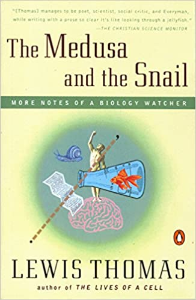
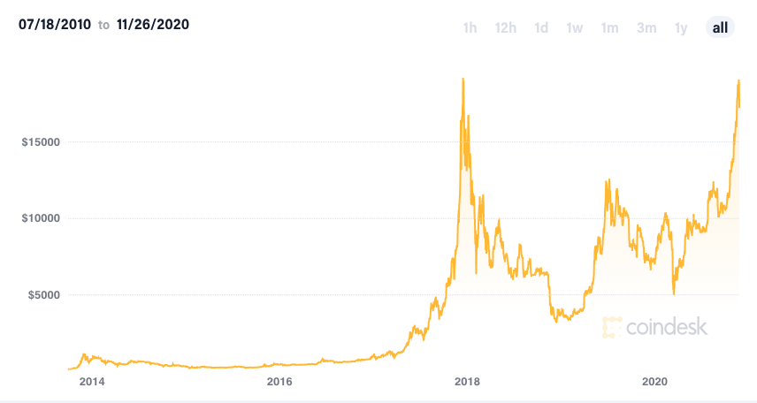

## 在惊讶中学习

美国大选的局势已经相对明朗了，虽然川普表示还会继续为挑战选举结果而努力，但与此同时，川普政府也已经正式通知拜登团队，准备好了政权过渡的过程。

如果没有意外，明年一月，川普就下台了。当然，如果 2021 年更魔幻的话，意外还会发生。

这是一个不缺黑天鹅事件的时代。

 

在大选前，我曾看过一篇文章，用非常翔实的数据，做了一个数学模型，最终预测川普获胜。当时我觉得整体分析过程挺不错，收藏了那篇文章。

如今，我想回头去看看那篇文章中的模型，哪些分析结果与实际不符，竟然发现作者把自己的文章给删除了 

太可惜了。算法预测失败是很正常的呀！关键是复盘，总结，让大家看到问题出在哪里，这也是学习，甚至是更重要的学习呀。

这届数据分析师和机器学习工程师，真不讲武德 🤷‍♂️

---

 

从失败中学习，是一个老生常谈的话题，我这么酷，就不聊这个了。

但最近看到一句话，我觉得挺有意思，仔细想想，也挺有道理。

> People learn when they’re surprised.

我的翻译：人们在惊讶中学习。

 

回想我学习编程的过程，经常是在惊讶中学习的。

我自认为自己理科不错，逻辑缜密。但是在学习计算机的过程中，却经常惊讶地发现：用我“缜密”的逻辑，编写出的“完美”的代码，竟！然！是！错！的！

这怎么可能？！

我无法置信。一定是计算机有问题！

于是，我开始调试，开始跟踪，开始认真看我“完美”的程序在计算机中的每步执行，看每一个变量在如何变化。我小心地去寻找，一定要找到，计算机究竟哪里出了问题。

**直到我找到了自己的问题，我又学到了新东西。**

 

说出来可能很多人不相信，我是非常喜欢 debug 的。

不要误会。我不喜欢 debug 别人的代码，所以不要把你的代码发给我让我 debug。我只喜欢 debug 自己的代码。

这其中的原因就在于：但凡是我写出的代码，我坚信已经思考得很清晰了。但为什么会出错？这太不可思议了！我一定要把这个错误找出来！

这种惊讶，让我保持着学习的动力。

---

 

前一阵子，看了一篇文章，觉得挺有意思。

文章提出了一个观点：现在的教科书中，一大弊病就是：

> astonishing facts were presented without astonishment.>

我的翻译：让人惊讶的事实，被表述得毫不让人惊讶。

 

文章的作者聊的是生物学。他引述了 Lewis Thomas 在 <The Medusa and the Snail>  一书中的一段话（不用看英文，下面有翻译）。

> For the real amazement, if you wish to be amazed, is this process. You start out as a single cell derived from the coupling of a sperm and an egg; this divides in two, then four, then eight, and so on, and at a certain stage there emerges a single cell which has as all its progeny the human brain. The mere existence of such a cell should be one of the great astonishments of the earth. People ought to be walking around all day, all through their waking hours calling to each other in endless wonderment, talking of nothing except that cell.

我的简单翻译：

真正让人惊奇的是——如果你想要看一些惊奇的事儿的话——就是这个过程。一开始，你只不过是一个精子和卵子结合产生的单细胞；这个单细胞一分为二，然后是四个，然后是八个，以此类推。

到了一定阶段，突然又出现了一种细胞，这种细胞的后代，就是你的大脑！

仅仅有这样一种细胞的存在，就应该算得上地球上的一大奇迹！

人们应该整天在他们清醒的时间里，彼此之间都在无尽的惊奇中呼唤，这太神奇了！我们应该除了那个细胞，什么也不谈！

 

我看到这段描写，忍不住笑出了声。

但是，他说得多么有道理呀！这难道不让人惊奇吗？

文章的作者说，他看完这段话，瞬间对生物学产生了浓厚的兴趣。

是啊！这一切都太让人惊讶了！

他希望他的高中老师，可以这样教他们生物，而不是平铺直叙，告诉大家，这是 DNA，那是 RNA，还有 mRNA 和 tRNA，大家注意他们的区别。

---

 

实际上，哪个学科不是如此呢？

以计算机为例，如果只是讲选择排序算法和归并排序算法，这只是两种不同的排序算法而已，甚至有些枯燥。毕竟，排序有什么意思？

但是，你敢相信吗？当我们要排序的元素规模达到一定程度的时候，归并排序算法在一个小时的时间里能做的事情，选择排序算法可能耗尽你这辈子都做不完！

这难道不让人惊讶吗？你难道不想搞明白这些算法吗？

 

如果只是讲计算机的组成原理，这里是存储器，那里是寄存器；这里是加法器，那里是乘法器；计算机内部这样表示负数，那样表示浮点数，听起来让人昏昏欲睡。

但是，你敢相信吗？计算机仅仅处理 0 和 1 组成的信息，就能完成我们现在所看到的一切！酷炫的 3A 游戏大作；神奇的互联网；复杂的图像编辑或者程序的运行。是的，这一切，只需要 0 和 1！

在我看来，计算机只靠 0 和 1，能够显示出一张普普通通的照片，都足够让我惊讶！你难道不想搞明白计算机的底层原理吗？

 

如果只是讲各种不同的自动机模型，什么有穷自动机，非确定自动机，下推自动机，图灵机，摆在你的面前，那一定让人头昏脑涨。

但是，你敢相信吗？我们在计算机中编写程序，只不过写出了一个个字符串。然而，就是这些字符串，最终就会转化成可以执行的程序，实际地运行起来！

各种网站，各种 App，甚至是各种操作系统，不过是程序员们“堆砌”的字符串，经过计算机“翻译”后得到的结果而已。计算机到底是怎么翻译的？这也太神奇了吧！

而这些奇迹背后的模型，就是那些自动机。你难道不想搞明白他们吗？

 

这样的例子太多太多。

我学习计算机的过程，就是一个不断被惊讶的过程。

代码还可以这样写？编程语言还能有这种特性？这样的问题竟然可以被计算机求解？竟然还可以这样解决？

计算机还能这样？程序还能那样？

太神奇了，太不可思议了！

我要学习！我要学习！

---

 

更远一点看，不仅仅是具体学科的学习。我们看待这个世界，都能从惊讶中学习。

如果你坚持比特币一文不值，那么如今，比特币的价值再次逼近历史最高点，这应该会让你惊讶。或许，这背后真的有些什么东西，是值得学习的。

 

如果你看不起同班的那个考试成绩总是中不溜的同学，却发现几年后的他颇有成就，或许你会觉得惊讶。但这或许意味着，这位同学身上，真的有值得你学习的素质和能力。

甚至站在一个更加宏观的视角，我们整个世界，都是被令人惊讶的事情所推动的。

偷袭珍珠港令人惊讶；911 令人惊讶；这场疫情，也令人惊讶。

这些惊讶的事情，组成了人类历史的重要节点，改变了整个人类社会。

> History is driven by surprising events, not by predictable ones.

或许，这就是因为，所有人，都是在惊讶中学习，在惊讶中创造吧。

从这个角度看，这场疫情，对于整个人类文明，或许并不是一件那么糟糕的事儿。

 

今天是美国的感恩节，感谢大家一直的支持。

**大家加油！**

