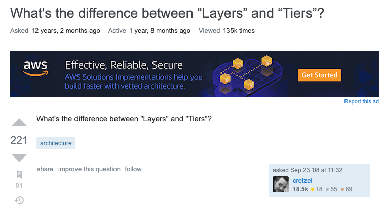
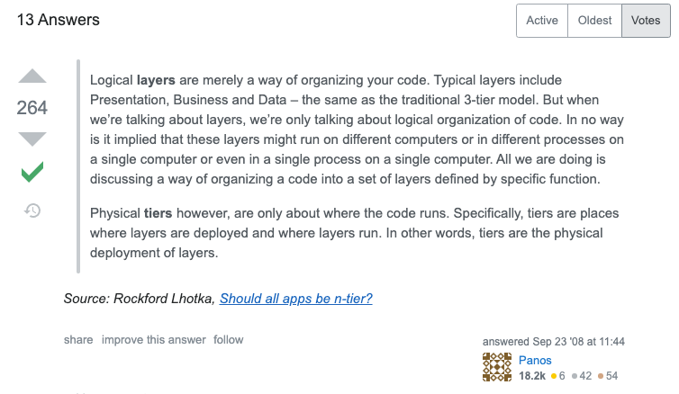
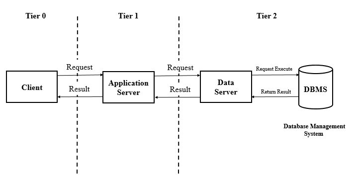
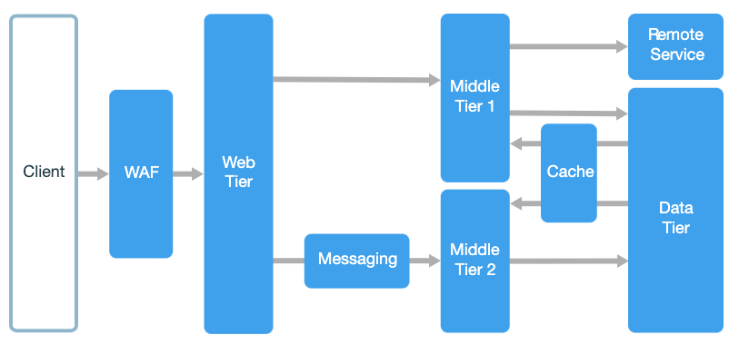
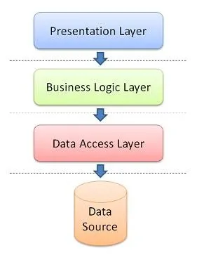
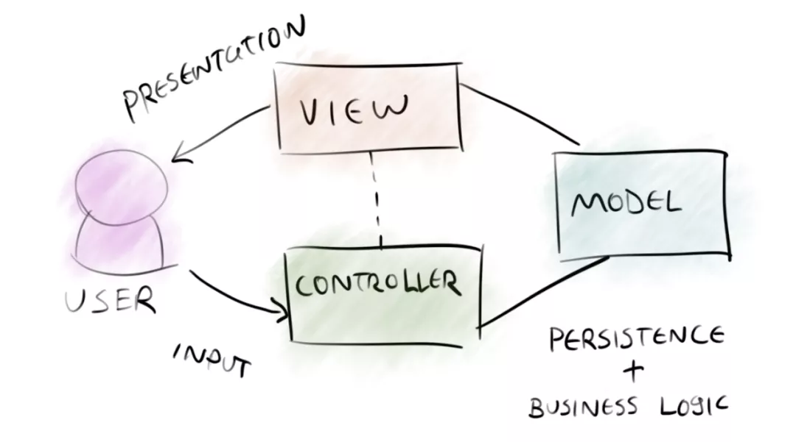
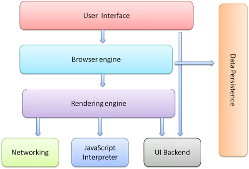

## 一些术语的区分，没必要

自己一时的一个思考，记录下来。不一定对，也不一定适合所有人。

---

 

脱离了学校环境以后，很多时候，我都不喜欢区分一些极其相像的术语或者名词之间的细微差别。

不要误会，我并不是说所有的术语或者名词都没有意义，但确实存在一些情况，我觉得意义不大。

举个例子，很多和架构设计相关的资料，会强调 layer 这个词和 tier 这个词在使用上的区别。

在英文中，这两个词本来就是同义词。在 vocabulary.com 上，对 tier 的解释就是：

> A tier is a level or a layer.

但是，在软件架构上，这二者的使用是有区别的。

 

我本以为这种咬文嚼字的区别不是主流。但是我发现在 stackoverflow 上，就有这样一个问题。单单这个问题本身就有 221 个赞和 91 个收藏。

翻译：Layers 和 Tiers 的区别是什么？

 

而这个问题的最高赞答案，也有 264 个赞之多。

---

 

layers 和 tiers 的区别是什么呢？答案是：**tiers 表示物理上的分层，而 layers 表示逻辑上的分层。**

所以，一个 3-tier 的架构，至少要部署在三台服务器上。当然，也可能在三台以上的服务器上，因为一个 tier 可以是一个集群，使用多个服务器。

但不管怎么样，**每一个 tier 在物理上是和其他 tier 隔绝的。**

值得一提的是，3-tier 的架构是最经典的架构，即所谓的**表现层，业务逻辑层，和数据访问层。**

当然，随着现在互联网服务越来越复杂，大多数互联网大厂的服务早已不是 3-tier 架构了，而是 n-tier 架构。

更多的专有的 tier 被发明出来，并被使用着。比如 **Caching Tier（缓存层）**；比如 **Messaging Tier（消息传输层）**。

 

而 layers 表示逻辑上的分层。所以，**在一个 tier 上，可以有多个 layer。**

比如下图的架构中，3-tier 架构的中间层（tier），又被分成了两层（layers）：业务逻辑层和数据获取层。

很多时候，layer 更多是指代码的功能组织。比如，一个软件如果使用 MVC 的架构，虽然部署在一台计算机上，我们也可以说它是一个 3-layer 的软件架构。但是说 3-tier 就不合适。

（现在 MVC 已经被越来越多地被当做是一种设模式，而非架构了。但如果你仔细思考，会发现“设计模式”这个词，和“架构”这个词，挺相近的。）

再比如，我之前在这个公众号分享了一本开源电子书：How browsers work（浏览器是如何工作的），其中包含一个浏览器的结构图。

所有的这些“组件”（Components），都包含在同一个浏览器软件中。他们是一个一个的 layers.

总之，一个 3-tier 的架构，可以被解释成一个 3-layer 的架构，也可能被解释成一个 4-layer 的架构；一个 2-tier 的架构，可以是 3-layer 的；一个 8-tier 的架构，也可能是 5-layer 的。

反正，有多少个 layer，和你的系统部署在几台服务器上，没关系。因为 **layer 描述的是逻辑，不关心物理。**

---

 

如果是上学的时候，我肯定觉得，哇，原来还有这样的区别。好好好，妙妙妙，划重点，记下来。

我甚至可以想象，在别人说：这是一个 3-layer 架构的时候，我得意洋洋地反问：你的意思是不是 3-tier？

一脸得意，看起来像个 sb。 🤷‍♂️

 

而现在的我，觉得这样的定义完全没必要。

因为它将两个很相似的词：tier 和 layer，生硬地赋上了两个差别挺大的含义：物理分层和逻辑分层。**这为术语的使用者增加了额外的思维负担。**

对于叙述者来说，在表述的时候，需要先想清楚自己要强调的是物理分层还是逻辑分层，然后再将其转化为 tier 或者 layer。

而对于听者来说，则需要在接受到 tier 或者 layer 这两个词以后，把他们翻译成物理分层或者逻辑分层，在进一步去理解这个架构。

如果听者没有接受过专门的“术语训练”，他很有可能没有体会到表述者使用这两个术语背后的区别，于是，**信息丢失**出现了；

如果表述者没有意识到这两个术语的区别的话，在使用上相对随意，但听者却对这类术语很敏感，就会导致沟通上的**信息错位**。

 

那我觉得怎样好呢？

很简单，**tier 和 layer 就是两个同义词，没必要做区分。**

我们不过是想把“物理分层”或者“逻辑分层”这样的区别表达出来，**直接把“物理”或者“逻辑”这个词说出来就好了。**

physical layer 或者 physical tier，他们都表示物理上的分层；

logical layer 或者 logical tier，他们都表示逻辑上的分层；

**3-physical-tier architecture** 或者 **3-physical-layer architecture**。

对于这个表述，我同意，它比说 3-tier architecture，多用了几个字。

但是，没有多那么多，完全在承受范围里。

关键是，它的表意极其清晰。无论是叙述者，还是听者，都不需要有过多的“领域术语知识”，就能达到沟通的目的。

而**我们发明术语，发明新名词，本意是让沟通更顺畅的。**

如果在一些场合，他们阻碍了沟通，或许，我们就应该反思了。

**大家加油！**

 

**P.S.**

说到表意清晰，多聊两句。

听过我的课程的同学都知道，我的代码风格，倾向于“表意清晰”，而非“代码简洁”。所以，我在我的课程中，不会推崇一些“炫技”的写法，虽然他们看起来很酷。

“表意清晰”的代码，可能会对性能有一些影响，但在现代计算机上，影响并不大。**与其纠结这点儿性能开销，不如去追求复杂度更优的算法。**

更关键的是，在我看来，表意清晰是组建正确逻辑的关键。你能极其清晰地了解自己写的每一个函数，每一个变量，意义是什么，就不会逻辑混乱，把自己“绕进去”；同时，代码的阅读者，也很容易理解。

这一点不但在协同工作中意义重大，更重要的是，它能帮助你减少书写 bug。

在我看来，很多同学代码的 bug，都可以在“表意”上找到根源。

不清楚自己设立的变量或者函数的语义是什么，这种就不多说了。很多同学或是偷懒，或是炫技，让一个变量多表示一层意义；或者让一个函数完成一个功能的同时，顺便完成另一个功能。**bug 就在这个过程中产生了。**

**软件开发，首先要组建正确的逻辑，让软件可以被使用。**之后，再谈优化。

尤其是这种实现层面的优化，而非算法层面的优化。

大神 Donald Knuth，称其为 small efficiencies。

他的名言：

> Premature optimizatioon is the root of all evil.

**过早的优化，是万恶之源。**

