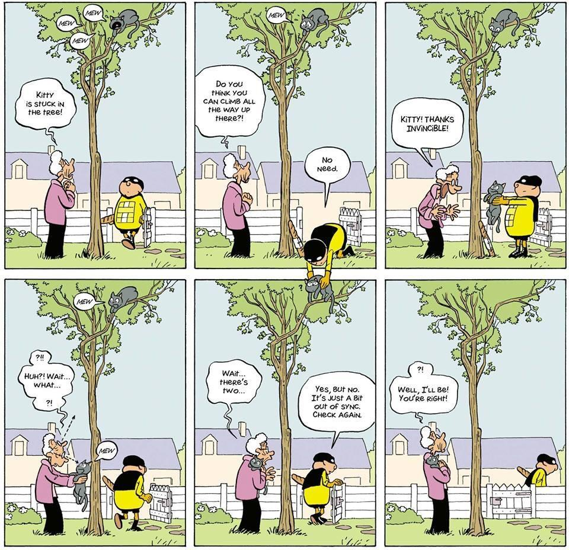

## 一个和“一致性”相关的天才漫画

这是一篇非常短的分享。

 

偶然间看到一副漫画，漫画的主题是：**数据一致性**。

越看越喜欢，越看越喜欢。

整幅漫画的排版不能乱，所以我不能把图片做重新的整理，以适合手机阅读。如果大家直接看看不清楚的话，可能需要点击图片放大看。

 

我喜欢这个漫画到什么地步呢？

我亲自打开了多年没有使用的 Photoshop，一点一点把图片中的文字做了翻译，好让不适应阅读英文的同学也能理解这个漫画的美妙：

 

整个漫画不仅仅非常巧妙地描述了“一致性”这个计算机世界的概念，更非常巧妙地利用了“漫画格子”这样的形式。

整个漫画的故事不是简单的一个格子一格子“一维线性前进”的，而是在一个二维的空间展开了。

时间不是在这些格子之间顺次流动的，而是同时发生的。而这本身，也是“一致性”问题出现的根源！

 

哦！更进一步去想，这像极了很多宇宙终极问题的模样。

比如：是先有鸡，还是先有蛋。

 

**大家加油！：）**

