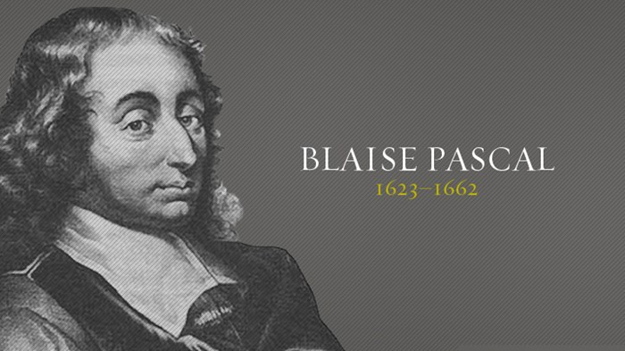
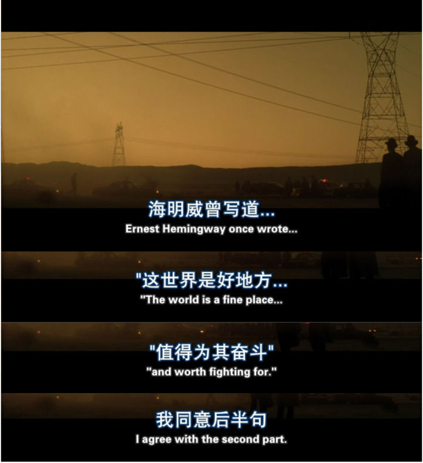
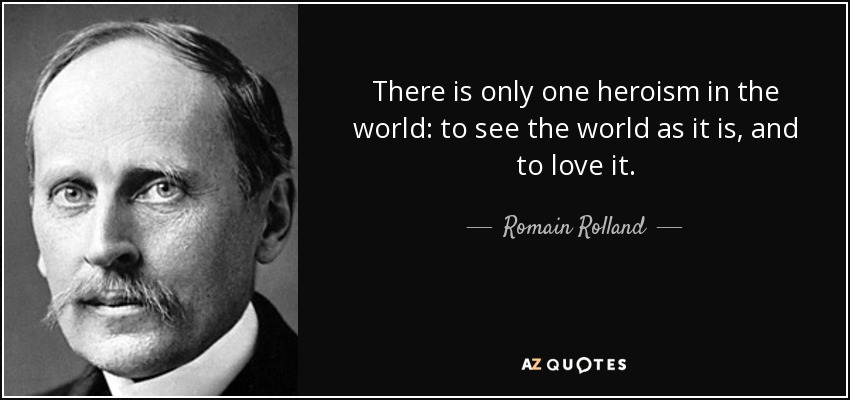
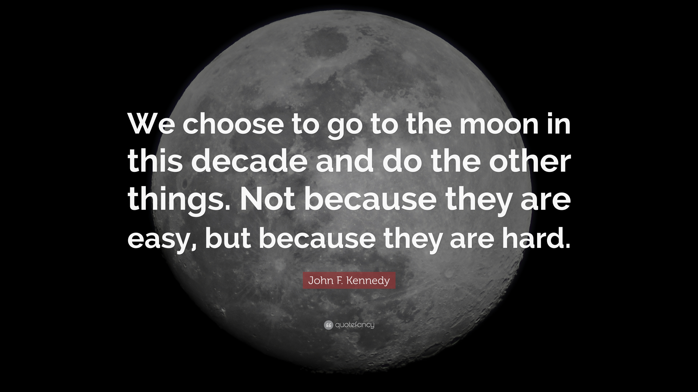
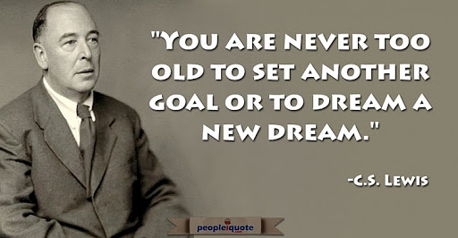

## 最喜欢的格言

在网上看到一个讨论，觉得很有意思。

**你最喜欢的格言是什么？**

---

扪心自问，对于这个问题，我觉得我没有非常特别的回答。

我的微信签名是“学无止境”，我在 [《大师和学徒》](https://mp.weixin.qq.com/s?__biz=MzU4NTIxODYwMQ==&mid=2247486372&idx=1&sn=70b0ef5ddd550117768cbab3e8b59847&chksm=fd8ca4e2cafb2df4b9918f672c74b8d473ac16fa348239283eedd1bf5d458bf500650eacb0c8&token=2105290525&lang=zh_CN#rd) 中说，我喜欢英雄联盟无极剑圣易大师的一句台词：**真正的大师，永远怀着一颗学徒的心。**

> A true master, is an eternal student.

但如果说这是我最喜欢的一句话，恐怕我不能肯定。

 

我的 qq 签名是“**给岁月以文明，给时光以生命**”。相信大家都知道，这是《三体》中的一句话。

但实际上，这句话并非大刘原创。这句话的灵感，来自大名鼎鼎的数学家帕斯卡：**给时光以生命，而不是给生命以时光。**

> To the time to life, rather than to life in time.

 

无独有偶，我的前投资老板经常提醒我的一句话，和这句话有异曲同工之妙。我在回答很多同学的问题的时候，都会引用这句话。

> 使人成熟的不是岁月，而是经历

---

 

我这个年代的同学，学习英语，阅读英文小说，可能都逃不过海明威。

海明威以其独特的语言风格著称：叙述简洁，凝练，无冗余；描写细致，却不浮夸；对话重情理，不矫饰。

这些语言特点，都是我写作的榜样。很多时候，当我写出一个句子以后，我都会想：是不是太浮夸了？是不是太矫情了？能不能更简洁？

甚至，这些原则，都慢慢融入到我做事的风格中。

海明威有一句非常简单的名言：

> The world is a fine place and worth fighting for.

我的翻译：**世界是美好的，值得我们为之奋斗**

著名的电影《七宗罪》巧妙地引用这句话，在后面加了一句：我同意后半句。

我第一次看《七宗罪》，或许是初中。当时这个台词给了我很大的震撼。

他并没有说自己不同意前半部分，但每个人都能感受到这份不同意。

换句话说，作者认为，这个世界并不是美好的。可是，再一转念，作者却在表达：我们还是值得为这个并不美好的世界奋斗。

在我看来，这个台词中隐含着无与伦比的逻辑美，而体验这逻辑美，并无太高的门槛，小学生都能理解。

它让你思考。原来，没有说出来的话，可以这样有深度。

 

相较而言，和这句话异曲同工的，是罗曼·罗兰的“**世界上只有一种真正的英雄主义，就是认清了生活的真相后还依然热爱它。**”

> There is only one heroism in the world: to see the world as it is and to love it.

他们表达了差不多的意思：世界或许并不美好，生活的真相或许是残酷，但我们还是要努力。

但我更喜欢《七宗罪》中基于海明威的句子的表达，含蓄而优美。

 

---

说回我看到的这个网络上的讨论。很多人分享的，并不是什么名人名言。

 

有人分享，他在年轻的时候，靠一辆自行车，骑行整个加拿大。在那期间，他认识了另一个“骑友”。

有一天，在整理装备的时候，有一张纸从这名“骑友”的钱包中掉了出来。他捡起来还回去，看见了上面的字。非常简单，六个词：

> Work hard. Be strong. Don't complain.

他的骑友说，这是他的祖父留给他的字条。

这六个词，或许就是他的祖父一生的生活哲学。他一直保存着。

 

有人说，他的奶奶有句话，让他印象深刻：

> Some bugger will always have a faster car, a flashier house, a glitzier watch - but you were the only kids that ever had me for a nana

我的翻译：有些家伙总能得到更快的跑车，更豪华的房子，更名贵的手表。但是，你是唯一一个，有我这个奶奶的孩子。

我尝试解读一下。这句话大概就是在说：那些物质的东西，其实并不宝贵。真正宝贵的，是你见到的人，遇到的事儿，拥有的经历和感悟。这些才让你成为你，值得你珍视一生。

但奶奶的这句话，却把这层意思说得无比温馨。

 

---

类似的分享还有很多。但看着看着，有一些人分享的格言，开始触及我的内心。

> If you keep doing what you've always done, you'll keep getting what you always got.

我的翻译：如果你只是做自己经常做的事情，你只会收获自己经常收获的东西。

这开始让我反思：最近的几年，我是不是一直在做自己经常做的事情？

 

> If you’re not willing to go too far, you’ll never go far enough.

我的翻译：如果你不想走得更远，你永远不会走得更远。

于是我开始反思：我是不是并没有想走得更远？

 

> We choose to go to the moon in this decade and do the other things, not because they are easy, but because they are hard.

这是约翰肯尼迪演讲中的名言：我们决定飞向月球，并且做其他的这类事情，**不是因为他们是容易的，而是因为他们是难的。**

我开始反思：我做的事情，是容易的？还是难的？

 

> What would you do if you were not afraid?

这句话出自大名鼎鼎的《谁动了我的奶酪》。我的翻译：**如果你无所畏惧，你会选择做什么？**

我开始反思：我现在做的事情，是不是我无所畏惧的时候的选择？或者，其实我在害怕什么？

 

> Dead fish go with the flow.

这似乎是一个民间谚语，我不确定该怎么翻译：死鱼才会顺其自然？随波逐流？

这让我想到了周星驰的：**做人如果没有梦想，跟咸鱼有什么分别?**

于是我开始思考，我还记得我的梦想吗？

 

无独有偶，就在昨天，我和一个好久不联系的朋友，因为新年祝福，在微信上又聊了起来，聊到很晚。我才猛然意识到：自己原来曾经有那么多有趣想法。他们真的遥不可及吗？我为什么不试一试呢?

 

我的前投资老板经常鼓励我去闯荡。他闯荡了一辈子，现在 60 多岁，还在寻找新的挑战。

今年，哦，不，是去年，我 35 岁的生日，他也不知道收到了哪里的提醒，突然给我发了一个“生日快乐”。

我的前投资老板姓黄，我管他叫“黄老师”。我说，黄老师，我都 35 啦！

他说：年轻人！刚才有一个 82 岁的人来给我修船！

他就是这样，60 来岁了，觉得自己年轻得不得了。至于我，他觉得简直就是个小娃娃，有着无限的可能。

35 岁，在这个时代，很多人觉得这个年龄，已经开始被社会嫌弃了吧。

但我突然觉得，35 岁，这是多么美好的年龄。**这是我新的起点。**

 

刘易斯有个名言：

> You are never too old to set another goal or to dream a new dream.

 

2019 年的新年，我告诉自己，要创造些什么；

2020 年的新年，我告诉自己，要关注那些 [不是诀窍的诀窍](https://mp.weixin.qq.com/s?__biz=MzU4NTIxODYwMQ==&mid=2247484875&idx=1&sn=23a0fd3411c035396d8f29058446fa3b&chksm=fd8caa8dcafb239b0711a6bb897eab9ac82591bae932e13afee5ad3e548efb1692e7c25a6fc2&scene=21#wechat_redirect)；

2021 年，我要告诉自己：

**dream a new dream, set another goal.**

 

至于这目标是什么？

在实现它之前，我不说；

在它失败之前，我不回头。

 

祝所有人 2021 年，也拥有自己新的梦想。

**大家加油！：）**

2021.1.1 于 Santa Clara