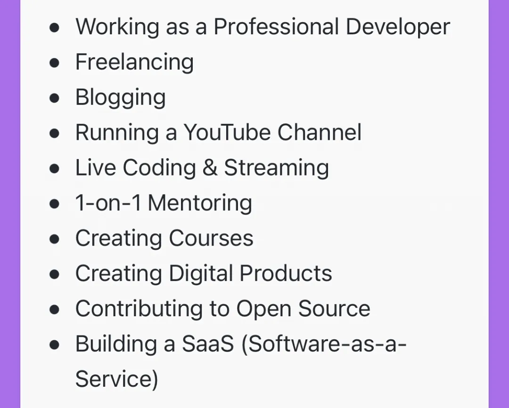
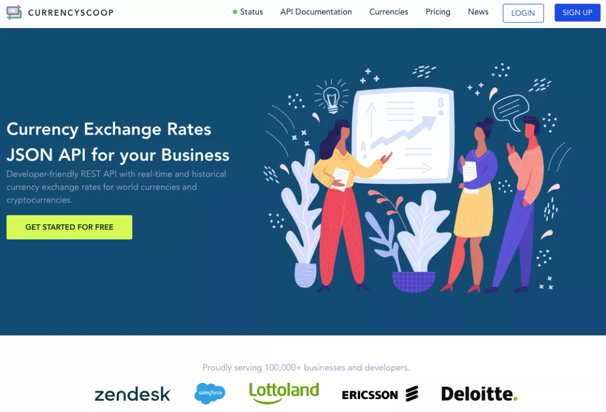

## 开发者赚钱方式总结

偶然间看到的国外的开发者总结的程序员（技术）赚钱方式总结。我觉得总结得挺好的，分享一下。

鉴于“赚钱”这件事儿有些敏感，有一些同学不喜欢看这类话题的讨论，所以错峰发布这篇文章。我的本意也并非引发焦虑，只是希望大家能够更多元化地看待这个世界。

毕竟，这个公众号的主旨是：**用技术人的眼光看世界：）**

---

 

这个总结很简单，就是一张图片。

一共十条。

详细地解读其中的每一条，可能都需要一篇很长的文章了。

比如其中的 Blogging，就是写博客。但如何做好自己的 Blog，显然有更多值得探讨的地方。比如如何选择平台；如何选题；写什么；怎么写；如何让更多人看到你的文章，等等等等。

这些具体内容，并不是这篇文章的主旨。感兴趣的同学，可以再去具体探索每一个方向里的各式各样的问题。网上相关的分享也挺多的。

这篇文章主要借这张图片，给大家提供一个方向和思路，结合我的经验和看到的一些情况，做一个简单的分享。

 

---

**1. Working as Professional Developer**

**全职开发者** 

看到第一条是这个，让我觉得这个总结分外靠谱。

现在很多文章都在鼓吹副业，当然，确实有很多人做副业很成功。但是我认为，更多的人还是靠主业成功的。这点我在我的文章：我们最终没有做海外电商 中总结过。

确实，我们能看到很多人做副业能年入几百万；但讲真，我也能看到很多人的主业，也是年入几百万的。而如果我们进一步关注成功率，稳定性等指标，大概率是主业占优。

很多同学可能比较年轻，所以身边的人大多职场刚起步，看不到这样的例子。**但是过十年二十年，就不一样了。**

有一份好的主业的优势在于，大家能有一个好的平台，**在一个大的平台上，直接去做更有影响力的事儿。**

自己去做微商，还在为多了几十几百的订单窃喜呢；但是在平台上，淘宝天猫抖音微信，聊的都是十几亿，几十亿的销售额，完全不一样。

当然，这些销售数字不是你的薪水，但是你在参与一件更大的事情。这件事情是自己单枪匹马搞副业永远接触不到的。

更何况，你不知道自己的这些经历，将来能给你带来怎样的机会。**很多所谓的副业，其成功的基础，是有牢固的主业根基。**

 

**2. Freelancing**

**自由职业**

在我看来，国外聊到 Freelancing，主要是指提供外包服务。当然，这里的“外包”不一定是给别人做一个网站或者 app 这类，很多时候，可能仅仅是提供一个技术支持，一次技术咨询，或者是解决一个具体的技术问题。

这个公众号之前转载的耗子叔的文章：努力就会成功？陈皓在文章中举的一些例子属于这一类。

 

**3. Blogging**

**博客**

国外的独立博客比较发达，当然，现在一些平台也做得不错，比如 medium。（虽然我觉得 medium 中的技术类博客做得不够好。）

相较而言，国内独立博客不够发达，但博客平台就很多了。最典型的就是公众号。除此之外，知乎，小红书，简书，掘金，等等等等，都算。

 

**4. Running a Youtube Channel**

**Youtube 主播**

这一条在我看来和 Blogging 是一样的，本质是提供内容，但主要是以视频的方式来提供。

视频方面，国外以 Youtube 为主。国内类似平台似乎更多一些，比如 B 站，抖音，微信的视频号，包括知乎，我看也开辟视频功能了。

 

**5. Living Coding & Streaming**

**Coding 直播**

这一条有一部分和 Youtube 主播是重合的；不重合的那一部分，在我看来国内似乎不太火。当然，我也没有特别关注国内的直播平台写代码的多不多，所以只是我的感觉。

对此，我有时间写一篇文章聊聊国外的 coding 直播是怎么个模式。

 

**6. One-on-One Mentoring**

**一对一的导师指导**

据我所知，这种模式在国内也不火。相较而言，在国外则普及很多。

比如如何转专业，可能是很多同学困惑的问题。在国内，基本上大家在网上查一查，就开始动手了。但很多同学的迷茫也来自于此：自己干一阵子，不能肯定自己的方向是不是正确的；自己的进度是不是合理的；自己的效率是不是最优的，等等。

此时，如果有一个有经验的过来人，能够定期帮助自己总结一下自己的现状，提一些建议，也给出一些肯定，其实能少走不少弯路。

同理，很多人在职场发展上也需要类似的职场导师；在创业上也需要类似的创业导师；乃至需要人生导师。

在国内，“人生导师”似乎有点儿贬义词的意味，但是我知道国外很多人都有人生导师，定期帮助自己审视一下自己的人生发展现状。甚至我认识一个外国朋友，创业就做这个项目，做得挺好。

怎么说呢？我能理解很多同学觉得这有点儿虚；但与此同时，我也能看到很多人其实对“导师”是有需求的。在这里，我不做 judge，只是对这个方向提及一下。

或许，这种形式将来在国内也会被慢慢接受，认可。反正对于很多大牛，我是愿意付费让他们来做我的导师的：）

 

**7. Creating Courses**

**制作课程**

现在国内在线教育这么火，这一条相信不用多说，大家都理解。其实我觉得制作课程和 Blogging 也差不了太多，本质也是提供内容。

这一条展开来讲，我能聊得就太多了。好多人，包括慕课网的工作人员都问过我，讲好一门课的诀窍是什么？

我不敢说我的课程真的那么好，但如果让我总结经验，我觉得就一条：**努力做到让你的受众范围里的人群，真正听懂，真正学到东西。**万一他们没听懂，提出了疑问，那就在问答区好好回答。

顺便一提，曾经有个同学问过我：怎样做好一个技术分享。我不确定他期望的答案是什么？怎么让分享的内容更有趣？怎么和大家做互动？怎么暖场？怎么收尾？怎么做出酷炫的 ppt？

但是，我的回答就一句话。这和我制作课程的理念是一样的。其他都是细枝末叶。

另：我告诉他这个答案以后，他不理我了...

 

**8. Creating Digital Products**

**制作一个产品** 

这个范围就很广了。从做一个 app；到做一个桌面应用；做一个游戏；做一个网站，都属于此类。

我认识不少独立开发者，收入都不错。我认识的人群以 iOS App 独立开发为主，一小搓人自己搞独立游戏或者网站服务。很多其实挺赚钱的。

我也曾经做过一阵子 iOS 的独立开发者，说实话，在 iOS 刚起来的时候，利润真的很高。

这些人大多喜欢闷声赚钱，这里就不得不感慨一下了，苹果的 App Store 引流能力真的强。大家不太用喊，只要产品够好，很多时候积累自然流量就挺够用。

网上很多文章都讨伐苹果税，但我知道的很多开发者，包括我自己，对苹果税真的意见挺小的。因为 App Store 真的对独立开发者很友好，不是只有大厂的 App 才能有一席之地。

现在，苹果税对于年收入低于 100 万美元的部分，从 30% 降到 15% 了，对开发者更友好了。再加上一个很显然的趋势是 macOS 和 iOS 平台的融合，使得苹果开发者施展拳脚的空间更大了。

我一直认为，别看 iOS 开发在工作市场没有那么大的需求，但是作为独立开发者的技术栈，是一点儿毛病都没有的。

当然，我比较了解 iOS 一些，对于其他技术栈相关的平台，可能机会也很多，只是我不了解而已。

在这里提醒大家，如果想做独立开发，一定要关注国际市场。再举个栗子，比如独立游戏开发方面，大家会看到网上很多文章抱怨 steam 的抽成高，但据我所知，国内很多平台的抽成比 steam 高得多得多，大家都是或者敢怒不敢言，或者直接放弃了。（更不用提现在国内游戏还有版号限制了。）

整体，国外大环境对独立开发比较友好，对于一个独立的产品或者服务，付费意愿也更强一些。

 

**9. Contributing to Open Source**

**建立开源项目**

这一条可能了解的人少一些。毕竟，对于大多数人来说，开源和免费差不多。但依托开源项目是可以有经济回报的。

有机会我再写一篇文章，介绍一下我知道的和开源项目相关的一些玩儿法。

 

**10. SaaS**

**建立 SaaS**

这一条和独立开发有点儿像，有一部分也是和独立开发重合的。但是，因为 SaaS 的目标用户可能不是终端用户，而有可能是开发者，或者是 toB 的，所以我看到的一些案例，有不一样的想象空间。

API 创业就是其中典型的一类。我在这个公众号的 【是不是很酷】开源资源 分享 | 第 5 期 中，曾经分享过 CurrentScoop，就是这类。

CurrencyScoop 只做汇率转换这一件事儿：将汇率转换包装成 JSON API，供开发者使用。

这么简单的一件事（当然，做好也不简单），这么一个看似平常的功能，CurrencyScoop 已经做到了在全球有 10 多万的客户。

CurrencyScoop 可以免费用，但每月超过一定的请求就需要收费。收费金额可以是每月 10 刀，每月 99 刀，最贵可达到 599 刀一个月，大家可以看一下他家的价目表。

还有很多 SaaS 的 idea，我觉得都挺有意思的，有机会再有针对性的和大家分享。

 

---

这就是我简单点评的这份总结中的十条，程序员可以使用技术赚钱的方向。

在写这篇文章的时候，我脑海中想到了我看到的更多案例，但或多或少都可以归类到这 10 条中。所以我觉得这 10 条总结得挺全的。

比如我还知道有同学靠给成熟的框架写插件，比如写 wordpress 插件或者电商插件；或者给成熟的产品写插件，比如 Chrome 插件或者 Unity 写插件，利润也很不错。这其实和独立开发差不多。

再比如，我还知道有同学靠竞赛，能把国外的学费赚回来。不过，一般利润丰厚的竞赛，基本都是和企业合作，把企业想要解决的问题以众包的形式发布出来。所以，这和文章中的 Freelancing 差不多。

至于还有一些方式，涉及到灰产，我就不想多聊了。

 

不管怎样，在这样一个时代，技术过硬，还是机会很多，大有可为的。

当然，如果你看到这里，觉得心浮气躁的话，**强烈建议再回头，看一遍第一条：）**

**大家加油！：）**
