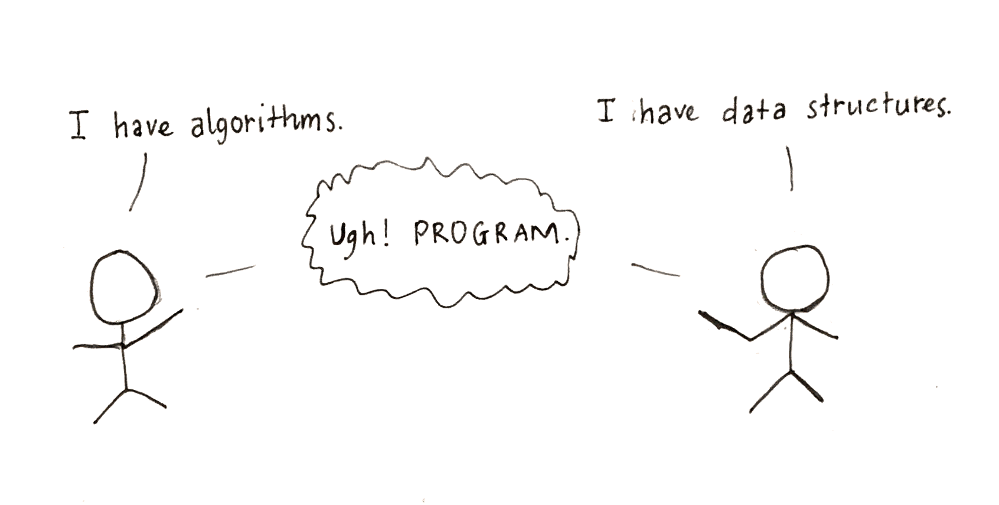

## 如何阅读源码

这是在我的知识星球上，一个同学问我的问题。

bobo老师，我现在在做一个区块链的项目，需要阅读 tendermint ( github 上的一个项目) 的源码。

这是我第一次读一个比较大项目的源码，我想请教下，阅读源码有没有什么技巧，或者有什么坑需要避免的？

---

 

**bobo 老师的回答：**

之前有很多同学问过我和源码阅读相关的问题。随便聊聊我的一些经验和想法。

 

首先，如果你想读懂一个项目的源码，你首先应该了解这个项目背后的基本技术原理。

举个简单的例子，如果你想读懂 Java 标准库里 TreeMap 的源码，你首先要明白红黑树是怎么回事儿，要想读懂 HashMap 的源码，你首先要明白哈希表是怎么回事儿，否则不可能读懂。

很多同学说学了我的课程，再去看 Java 源码，或者 C++ STL 源码就容易多了，就是这个道理。

当然，很多复杂的工业项目或者商业级别的实现，和基本原理之间还是有差距的。但**了解基本原理是基础中的基础。**

可能在真实的项目实现中，在基本原理的基础上，又套了很多别的东西，比如诸如迭代器的使用；一层一层的抽象设计和设计模式的使用；对更加广义的数据类型的处理，或者一些优化方案。

从某个侧面来讲，其实这些也是基本原理，只不过是不那么基本的基本原理而已。如果你知道什么是迭代器；知道它在使用什么设计模式；知道它还要处理什么数据；知道它在怎样优化，知道这些基本原理，那么看它的具体实现将会顺畅很多。

这个道理适用于读所有源码。要想读 Linux 源码，就要懂操作系统的基本原理。所以，所有科班学习操作系统，一上来都是在学习操作系统概念，就是这个原因。没有人学习操作系统，一上来就拿出内核源码看的。

同理，如果想读 sklearn 源码，就要懂机器学习的基本算法；想读一个编译器的源码，就要了解基本的编译原理。当然，有的时候，我们可能只专注于一部分实现的源码，比如只专注于 GC 回收部分，那至少 GC 回收的基本机制要懂。

**源码是原理的具体实现，而不应该反过来，通过源码理解原理。**

我甚至提倡，在时间充裕的情况下，自己先尝试实现一个小型的项目原型。所谓的造轮子。通过造轮子，我们才能更好的，通过实践去深刻理解原理，进而理解原理和具体实现之间的差距。再去看优秀的源码实现，才能更加深刻地理解这些优秀的源码的精巧之处。

 

---

在这个基础上，大多数时候，阅读源码的障碍，在我看来有三点。

 

**一，是抽象层次过高。**

所以，你可以看到，很多源码解析的书，都会先画一个源码的框架结构图，整个框架有哪些组件，涉及哪些类。哪些类最基本，在这个基础上又有哪些类；哪些层和哪些层是怎样的关系，等等等等，而不是一下子就深入到代码层，就是为了扫除这部分障碍。

通常，对于稍微有体量的项目，**理清架构都是第一件事。**

当然，如果你要看的源码不是教科书级别的，没有相应的系统书籍资料，就只能看源码的文档或者注释了，这本身也是好的开源项目的重要标准。

不过，一些常见的架构和设计模式，自己也要了解。因为文档和注释通常不会深入到原理层。

如果文档或者注释不够好，**你可以找对这个源码比较了解的人交流，或者直接和作者交流；**

当然，有的时候，好的文档可遇不可求，此时，我们只能自己做调试跟踪，来一点一点自己整理出来整个代码的运行结构了。这个过程可能涉及一些工具的使用，在这里，我就不对这些工具做具体介绍了。

 

**二，是数据的流动和变化**

所有的程序，归根到底，都是在处理数据的。

或者是对原始数据进行处理，计算出我们想要的结果，这就是所谓的**算法**；

或者是存储数据，以备未来快速的调取，这就是所谓的**数据结构**；

当然，数据结构还可以作为很多算法的核心支撑，这就是所谓的**算法和数据结构不分家**。

虽然 Niklaus Wirth 在 1976 年提出了著名的 **Programs = Algorithms + Data Structure**，即所谓的 **程序 = 算法 + 数据结构**。

但是，我的经验是，除非你要阅读的是算法实现的源码，否则，**对于大多数框架源码或者工程源码来说，数据结构比算法重要。**

为什么？因为算法非常容易被很完整地封装起来，即使我们不理解内部的原理，但只需要大体知道它在做什么事情就好。一个排序算法就是完成排序，具体怎么排序的，在源码阅读的层面，我们不去关心，影响不大（甚至是完全没有影响）。

但数据结构不同，**数据结构是和整个程序的结构联系在一起的。**

很多时候，我们都必须明确，数据在程序中到底是如何存储的，才能进一步理解他们是如何被调用的，如何流动的，如何被处理的。在这个过程中，核心数据结构的使用无处不在，分布在代码的各个地方。

如果说架构设计和设计模式的使用，是代码的结构设计，那么这种结构设计就是一种显性的结构设计；

而**数据结构，在我看来，则是一种隐性的结构设计。**

所以，Linus Torvalds 有这样的名言：

> Bad programmers worry about the code. Good programmers worry about data structures and their relationships.

翻译：烂程序员才关心代码，**好程序员关心的是数据结构和它们之间的关系。**

你看，Linus 作为系统内核的大神级领军开发者，会特意强调数据结构的意义，就是这个道理。

当然，很多时候，源码的文档和注释可能并没有重视对数据结构的使用说明，此时，可能你就需要**找对这个源码比较了解的人交流，或者直接和作者交流；**

 

**三，就是代码中各种函数或者变量的具体表意。**

好的源码，其文档或者注释的全面程度，甚至可以当做课本来读。相信大家都接触过这种教科书级别的源码：10 行代码，100 行注释。

大多数注释都在函数头，就是帮助你理清这个函数的语义到底什么，参数是什么意思，等等等等。

更不用说，好的源码，变量名和函数名起的也是足够 self-explanatory 的。

当然，如果你着手阅读的源码不是这样的话，你需要**找对这个源码比较了解的人交流，或者直接和作者交流。**

 

---

家可以看到，在上面的总结中，我近乎每条都在说：可以**找对这个源码比较了解的人交流，或者直接和作者交流。**

其实，大家如果在 github 随便找个不出名的源码，很难找到对这个源码熟悉的人；给作者发邮件或者提 issue，很有可能也不回。那我为什么老强调这一点？

因为，之前很多同学问我源码阅读的问题，并非是要学习某个源码用，而是在自己的企业，着手一个项目，首先需要阅读源码，遇到了困难。

此时，很多同学就觉得自己是不是哪里不太行？想提高“源码阅读能力”。

我认为不是这样的。

很多时候，大家阅读源码的困难，来源于没有提纲挈领地掌握整个项目的架构，没有掌握所使用的设计模式或者数据结构，而**不是能力问题**。

此时，大家就应该去找维护这个项目的老员工，或者 leader，让他们给你讲明白，这个源码的“基本结构，基本原理”。

当然，如果你能总结清楚自己到底卡在哪里，通过一个或者几个具体的问题，从一点出发，逐渐推导到全局，那就更好了。不过在我看来，这属于提问的艺术了。

不管怎样，**找到懂这个源码的人，甚至写这个源码的人，去交流，是正道；而不是想办法自己闭关修炼，提升所谓的“源码阅读能力”。**

 

最后提一句：从源码学习的角度，好的源码不见得使用的技术多么高深，而是文档完整，注释全面，函数名变量取得有意义，结构清晰的。

否则，如非必要，这个源码很可能并无阅读学习的价值。

这本身，也是我们写出好的代码标准。

**大家加油！：）**