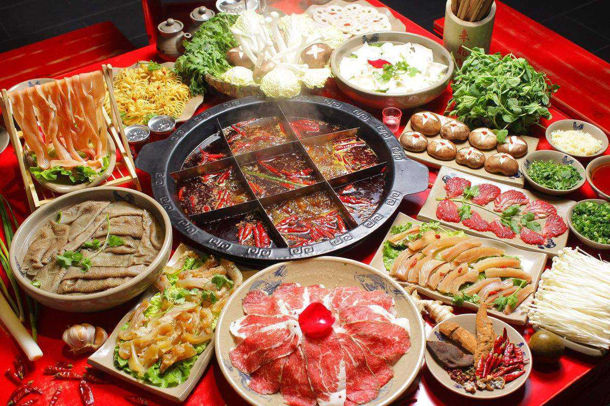
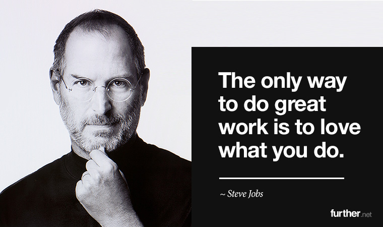

## 追求热，并不靠谱；追求热爱，则靠谱得多

这是在我的知识星球上，两个同学问我的，关于 Offer 选择的问题。

 

---

**匿名同学 A：**

bobo 老师你好，我最近面临找工作选择的问题。

我个人目前所从事 web 后端开发，工作 5 年左右了。我自己的兴趣点偏底层一点，比如 Linux / Unix，也非常喜欢计算机科学的所有知识，初二就开始自学 C 和 Basic 了。所以，我其实不是特别喜欢 web 后端开发。

目前，我面试了一些 A 轮 B 轮公司，也拿到一些 Offer。但我其实比较中意一家外企的 Offer。这是一家德国华人在德国创办的车联网企业，全球 400 人，上海 20 人+。

我的岗位是：C++ 和 JavaScript，入职后是去做一个他们和宝马合作的项目，工作地点也在宝马，面试官就是宝马的技术官。

我喜欢的原因有几点:

1. 没有任何加班，有时间做自己的事情；

2. 面试我的宝马技术是一位大牛，从他问我的技术问题我能感觉出来。我觉得我能学到很多东西，毕竟是在宝马；

3. 待遇也还 ok，是其他 Offer 里面最高的；

4. 他们目前在开发一个 lua 的解释器，用在车载系统里面，我比较感兴趣。正好我喜欢底层一点的东西。

我就是担心，我没有从事 web 方面的工作，以后出来不好找工作，把路给走窄了。

但是我又觉得在宝马里面接触到的技术都应该不会差。

想听听 bobo 老师您的意见。

 

---

**bobo 老师的回答：**

可以看出来，你很向往这家企业。整体，我是支持你去这家外企的。

如果我是你，我也会选择去这家外企。

除了你说的没有 996，对相关技术感兴趣等原因，我再说一些我考量的理由：

1）体验一下在一个跨国企业做事情的感觉；在一个全球化的时代，真的体验一下什么叫全球化；

2）体验外企的工作环境是怎样的。关键不是有没有 996 的问题，而是你的人生多了一份新的，不一样的经历；从此，你看待问题将更全面，也更深刻；

3）如果以后有机会能 transfer 到德国工作生活一段时间，那你的人生经历就更丰富了。我有一些同学在德国的，很好的国家；

4）在一个小的企业，体验成长。更何况，只有现在的小企业，才能有更高的增长预期。所有的大企业，都是曾经的小企业。搞不好，五年后十年后，你还财富自由了呢；

5）车联网也好，智能车也好；新能源也好；我都很看好。很显然，现在传统车企也罢，比如宝马奔驰保时捷；新兴技术公司也好，比如苹果谷歌特斯拉，都在进军这个领域。

我对这个领域本身无限看好。我不认为有巨大的行业风险，当然前提条件是你的技术水平能力过硬。

 

至于你说的担心把路走窄了。**为什么走 web 就不是把路走窄了呢？**

你担不担心以后遍地都是搞 web 的，但大厂都搞物联网，车联网，生物信息，人工智能，5G 技术，网络安全，等等等等；搞 web 的，没人要？

我不是说未来一定是这样，我只是说**每一个选择都有风险**。衡量风险没有问题，但**风险从来都是和机遇连在一起的**。

很多时候，**一个没有一丁点儿风险的决策，是最差的决策。**

什么叫年轻？年轻就是敢承担风险；明知山有虎，偏向虎山行；大不了浪费两年。

我年轻，才 35，两年算个屁，老子还能活 100 年。

我 35 了，是这个心态。我估计你比我年轻。勇敢一点儿。

更何况，摆在你面前的这个选择，在我看来，真不是什么虎山。

当然了，最终决策需要由你做出。我之前也说过，看好一个行业，和每一个个体的发展，关系也没有那么大。可以参考我的这篇文章后半部分：什么都懂，啥都不精，怎么办？

关键还是，要成长，要进步。只要能保持这一点，相信我，前途无量。

P.S. 这个回答只是针对你面临的这个选择，我的一些思考。具体这个企业靠不靠谱，会不会是骗子，这类问题，你还需要再做一下尽调。我简单查了一下，问题应该不大。

**加油！：）**

 

---

**匿名同学 B：**

波波老师好，想听听您的建议。

Offer 选择，是选择阿里内部系统部门？还是成都京东海外业务部门？

应届生，Java开发工程师。

阿里白菜价，13-16 +10w 人才补贴（一次性，第一年有）

成都京东 (16+4)*14 sp

理性告诉我应该选阿里，平台大，技术好，但是是内部系统

但是真正内心想选京东，因为成都会舒服一点，且没有那么大的心理压力。我在阿里实习过一段时间，每天都很压抑。

纠结的点在于：不知该遵循理性去阿里（算下来毕竟多个7-8w），还是应该遵从内心去京东？

害怕选了阿里，每天心里压抑；

害怕选了京东，钱少很多。而且自己也不是成都人，也不是绝对在成都定居。

我是湖北人。以后还是最想跳槽回武汉定居；其次 成都也在考虑范围；杭州 大概率不会。 

即将踏入社会，心中很多纠结和顾虑。特此发帖跪求指教。麻烦波波老师了！

 

---

**bobo 老师的回答：**

如果是我，我选择成都。

成都我喜欢得不得了；恰好，成都也是你喜欢的风格；

你并不考虑以后在杭州发展，但考虑可能在成都发展；就算你最终决定不在成都发展，这一条也是打平的；

你不喜欢阿里的工作环境，这是最关键的，也是最致命的。

**一个不喜欢的，抵触的工作环境，怎么能做出成绩？怎么能进步？怎么能有所发展？**

就因为每年多 8 万块钱吗？

因为刚刚学生毕业，我很能理解，8 万块钱似乎很多。但是，相信我，过 10 年后回头看，8 万块钱可能对你不值一提。

更重要的是，一个舒适的工作环境，愉悦的工作氛围，自己身心的健康，这些，是 80 万，800 万，都买不来的。

当然，我只是基于你提供的这些信息，根据我的偏好，做出的判断。只是供你参考。最终决定，还是要你做出。

 

很多时候，我有些害怕回答这种选择的问题。

因为选择之所以是选择，大概率的，就是因为两个选项，没有绝对的优劣，不管选择谁，都在舍弃一些东西。

但人，都是有损失厌恶的，谁都不愿意舍弃。

更重要的是，很多时候，过十年再看，这两个选择，可能真的一个远超另一个。但是，在当下，谁也看不透。

二十年前，谁也不知道诺基亚即将倒塌；而苹果会成为世界市值第一的企业。二十年前，如果你同时接到诺基亚和苹果的 Offer，理性的选择，近乎一定是诺基亚。

但后来发生了什么，大家也看到了。

 

所以我一直强调，**做选择的依据：永远是遵从自己的内心，而不是尝试预测未来。**因为，其实谁也预测不了未来。

去问自己：你到底喜欢什么？你愿意舍弃什么？**然后承认，这个世界，存在运气这么一个东西。**

我的经验是，这样做选择，至少内心还是平和的。如果运气眷顾你，皆大欢喜；如果运气没有青睐你，你也能坦然面对。

更何况，**所谓的好运，可能会以一种你现在想象不到的方式降临。**

可能你即将遇到的好运，不是有一个高薪的工作，

而是遇到一群志同道合的朋友；

遇到一个值得一生守候的人；

或者是无意中，发现了自己都不曾发现的兴趣和天赋。

而这些，恰恰是生活最有意思的地方。

 

不知道大家有没有看过 Shoe Dog。是 Nike 的创始人菲尔奈特 Phil Knight 的回忆录。

书的前半部分一直讲他的潦倒失意，终于，来到了改变他人生的时候。

Nike 的创始人改变人生的时刻是什么？肯定是创立了耐克，从此人生开挂，对不对？

不是的。

菲儿奈特说，他改变一生的时刻，是遇见了帕克斯小姐。

一段紧张又雀跃的时光后，最后终于成功地让她成为了奈特夫人。

**加油！：）**

 

---

**回答问题后的一些小思考：**

看到很多同学对选择这么纠结，我真的挺理解的。

但这又让我想起了最近，我和一个同学聊天儿的内容。

 

在最近的几年，我看见的所有转专业到 CS 的同学，尤其是海外的同学，近乎都是机械专业的。

我一直觉得很奇怪。前几天和一个转专业的同学聊天儿，才明白，因为大概 15 年 16 年一类的，国家吹过一阵子“工业 4.0” 的概念，使得机械专业是热门。在那几年，有很多优秀的的学生，选择了机械专业。

说实话，这种事情哪个时代都有。比如我上学的时候，比较热的是生物专业，各种声音都在告诉你，21 世纪是生物学的世纪。

我见过很多和我同龄的优秀同学，因此选择去读生物专业。

当然，生物专业也很好，但很显然，在近十来年，发展并没有大家想象的那么快，至少没有计算机，互联网等领域发展得好。我也见过不少生物的同学，最终决定转行。

转行虽然痛苦，但优秀的同学总归是优秀的。我见过很多牛人，转行到其他行业，甚至能碾压那个行业的科班。

经过这么多年，我总结下来，如果你不知道选择什么专业，做什么方向，去选择基础学科，大概率不会错。比如数学，比如物理。

我中学时代近乎 90% 最优秀的那波同学，都是去读基础学科，等着具体要选择一个方向的时候，转专业快的吓人，而且还能瞬间碾压一直学习那个专业的同学。我觉得一点儿不夸张。

这个路子不仅仅适用于专业的选择。放到计算机这个专业里，也适用。

如果你不很确定自己的技术方向，不知道劲儿往哪儿使的话，那就去学习基础，基本不会错。比如算法，比如数据结构，比如操作系统，比如网络，等等等等。

当然，大家在学习的过程中，最好还是能慢慢找到自己擅长的，喜欢的细分领域，才能扎进去。

但总之，**不要总想着哪个热，学哪个。**

我看过的很多事情都在告诉我：**追求“热”，并不那么靠谱；追求“热爱”，则靠谱的多。**

乔布斯曾说：

> The only way to do great work is to love what you do.

**大家加油！：）**